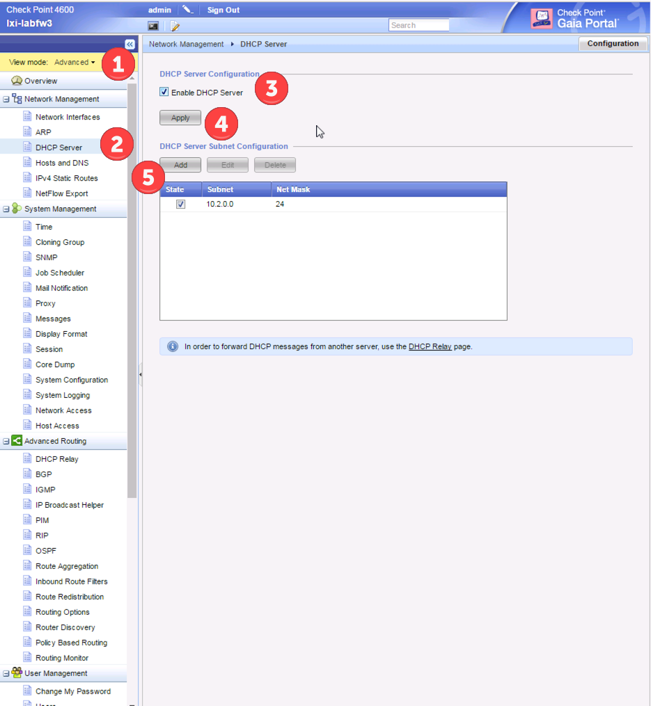
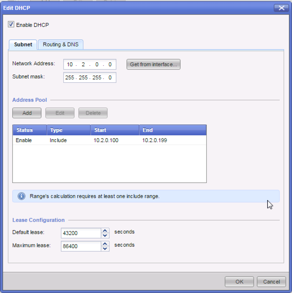
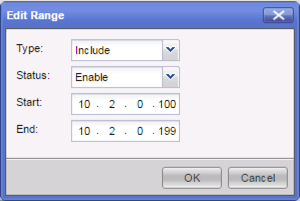
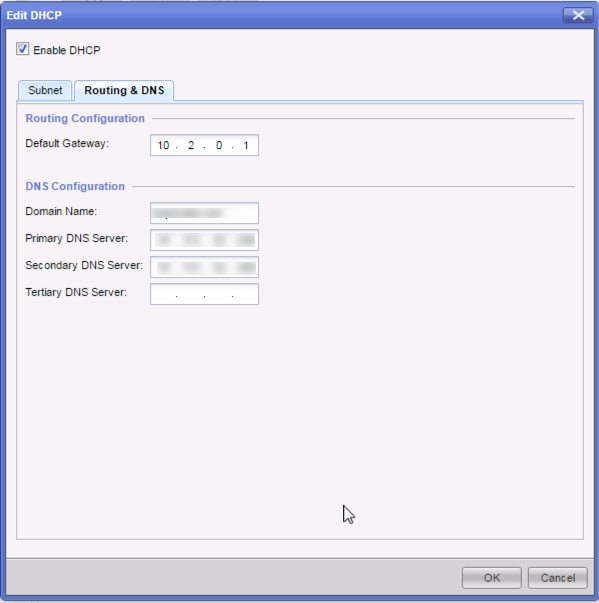

# DHCP Server

Login in directly to the firewall, and in the view mode (1) select advanced.  Then under Network Management, select DHCP Server(2).  Make sure you select Enable DHCP Server (3) and enable it (4).  Then select Add (5) to create a new scope.  

Make sure you select the Enable DHCP Checkbox, then enter the Network address and subnet mask for the network you want served.  This is not the firewall interface, but the actual network of that interface.   Under Address Pool, select Add to create the range to dish out.  

Enable the range, and select the IP range that IPs should be given

Then in the Routing & DNS tab, define what the default gateway will be, the domain, and what the DNS Servers should be.  

