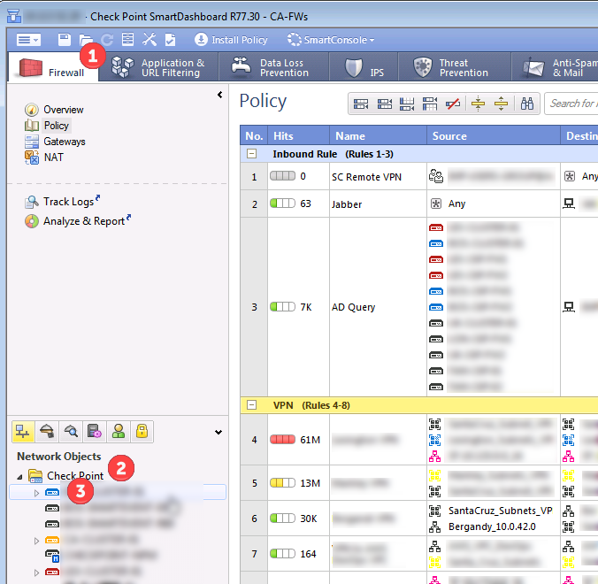
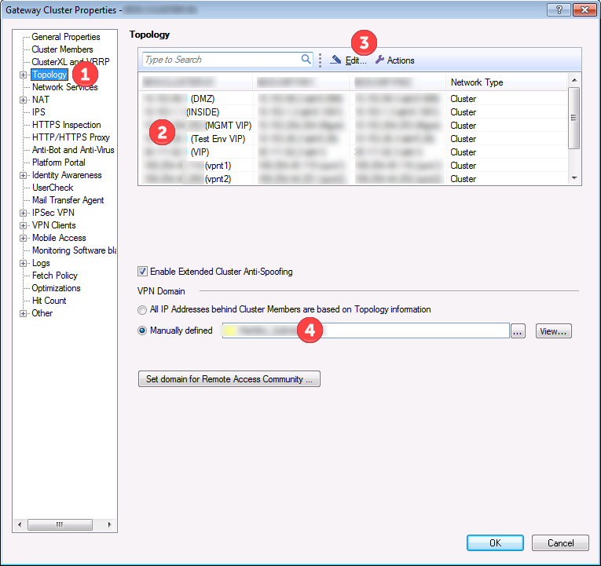
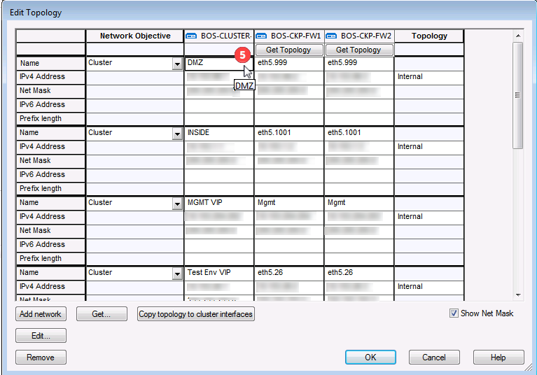
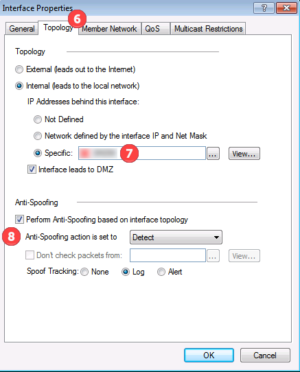
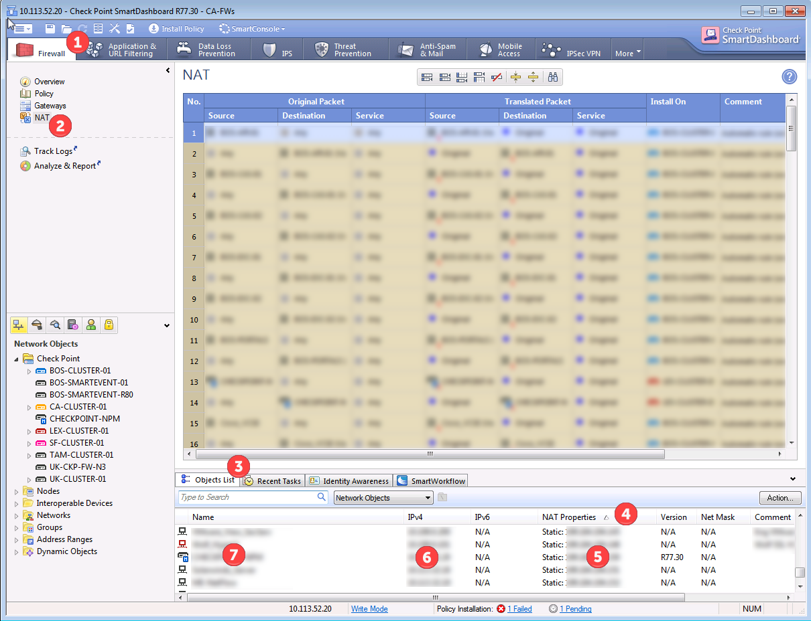

# Firewall Audit

## Firewall Interfaces: 
Confirm the interfaces for all the firewalls, make sure that they have the correct routes for behind the interfaces, and make sure that folks can't spoof traffic across the interfaces: 

From within SmartDashboard, Select Firewall (1), Network Objects : Checkpoint (2), and then double click on the specific firewall (3) that you would like to review. 



Within the Topology (1) tab, you will be able to view all the interfaces (2) for that firewall.  



If you select Edit (3) you will get the following edit page, and by double clicking on the whitespace next to an interface(5), you will get the Interface properties page



From the interface properties page, select the Topology Tab(6), and confirm that the network behind the interface(7) is correct.  That traffic will be what is allowed to be routed to via vpns.  Also confirm that anti spoofing is setup properly.  



## Routes via CLI: 
To get routes from the cli, you can use the following commands: 
```
netstat -rn
show route
```

or
```
clish -c "show route"
```

## Review NATs: 
To view all the inbound NAT rules go to the Firewall Tab (1) in SmartDashboard.  Then under NAT(2), go to the bottom tab Object List(3) and sort based on NAT Properties(4).  From there you will be able to see the external NAT IPs(5), what the internal IP is that they map to(6), and the description for that object(7).



