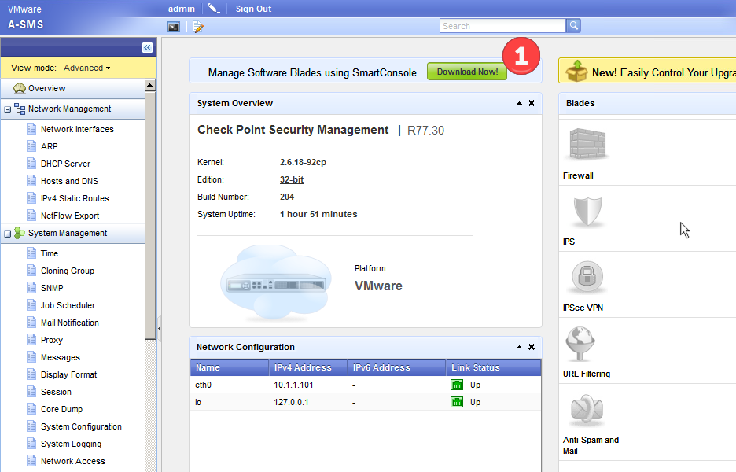
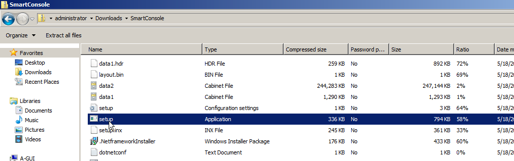
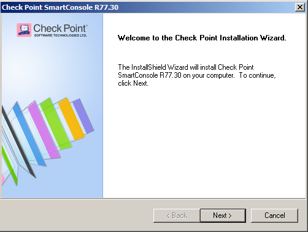
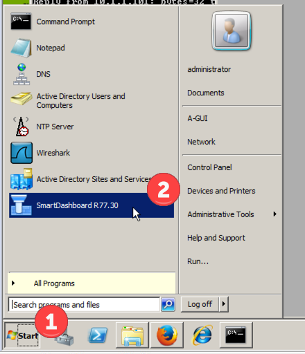
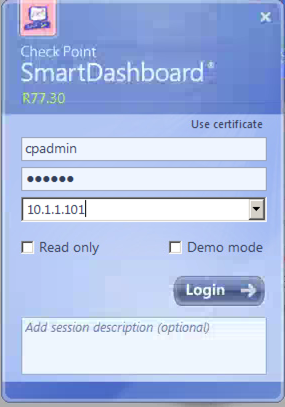
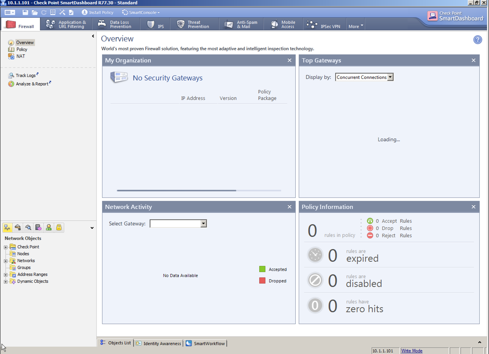

# Install SmartConsole

## Install Smart Console: 
From the web page of the management server, select the Download Now button to download the app directly to your local windows host (only works on windows).  

Find the app setup.exe on your local host and run it. 

Install the app including all of the default settings

Launch the smartdashboard app via the start menu, and selecting the app

then enter in the username, password and IP/hostname of the SMS (management database) to log in.  

If you get a fingerprint prompt, you can either simply "ok" it, or connect back into the SMS server and check the fingerprint to both the SMS and Smart Dashboard.  

Then the smartdashboard will pull up.  

