# setup via gui wizard

Login to the firewalls GUI to get to the wizard. 

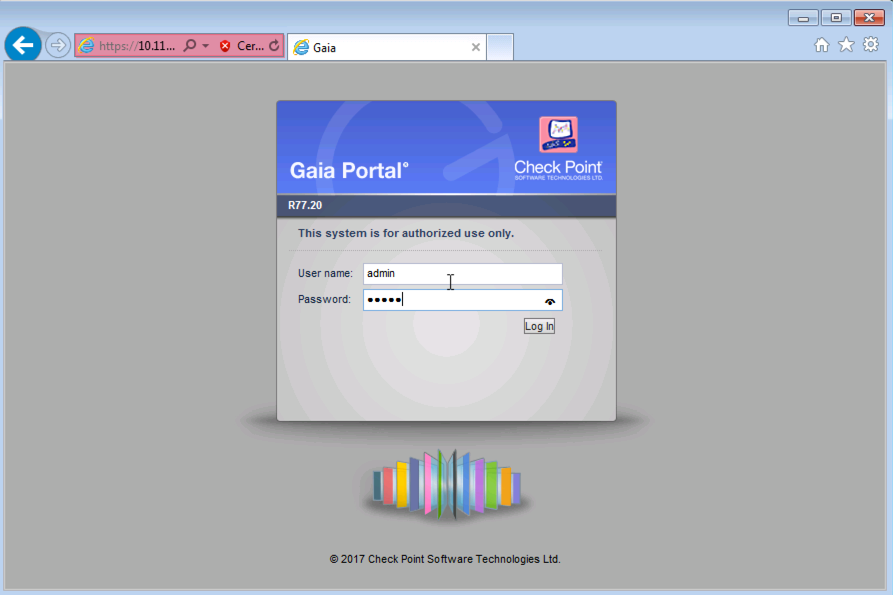

The first time wizard should immediately come online

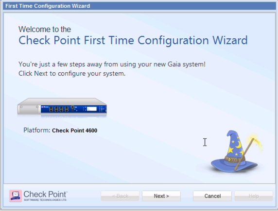

Install with the R77.20 OS version

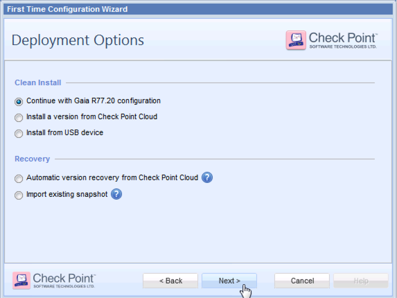

Enter in the new Admin Password

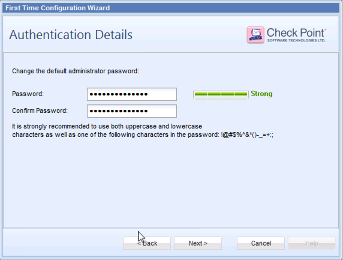

Define the management interface

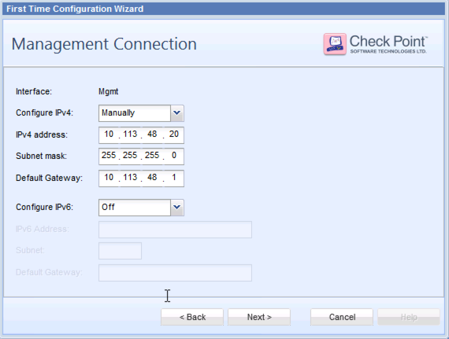

Define the external interface that can connect out to the internet, and download updates from checkpoint

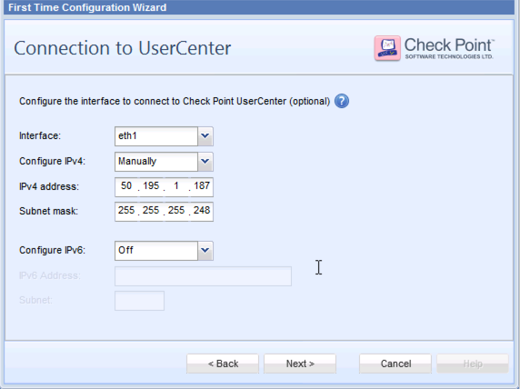

Define the firewalls name, domain and DNS 

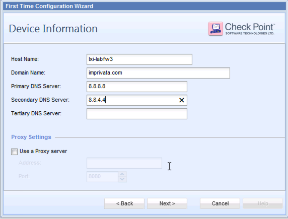

add NTP info: 

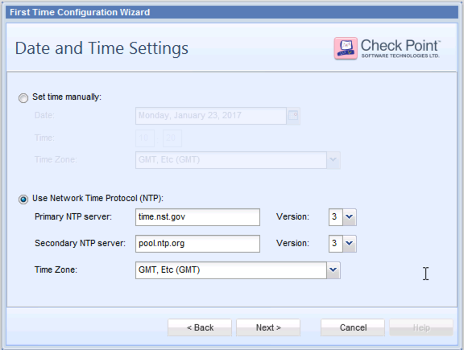

Define if the firewall should be a firewall, or a NPM (firewall manager), or if it should run both on the same platform.  Also define if this should be part of a cluster.  

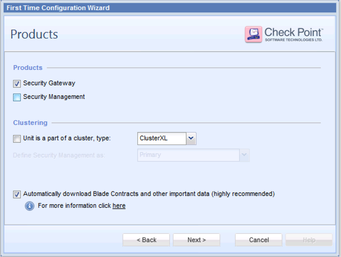

If you are setting up a firewall with static IPs, enter No

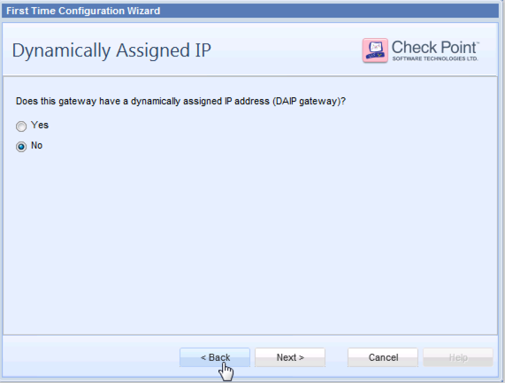

Enter in a temporary password that will be used to link this firewall with the NPM manager.  You will need to remember it and enter it into the NPM when you establish a connection between it and the firewall, but after that, it will not be needed anymore.  

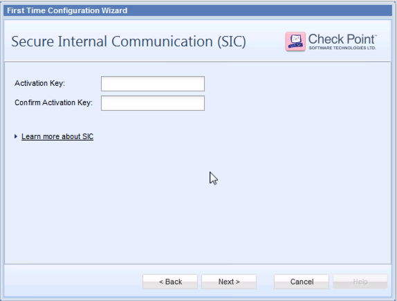

Don't worry about the activation at this point.  We will take care of this in a following step. 

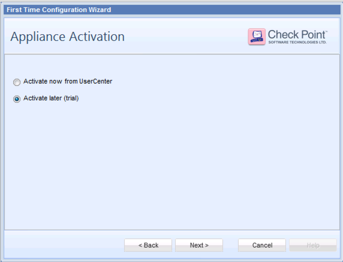

finish the config

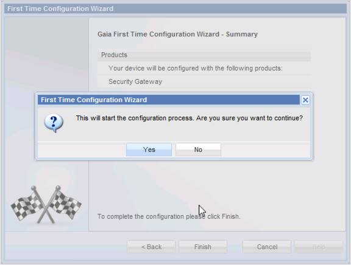

Wait for the update to be completed

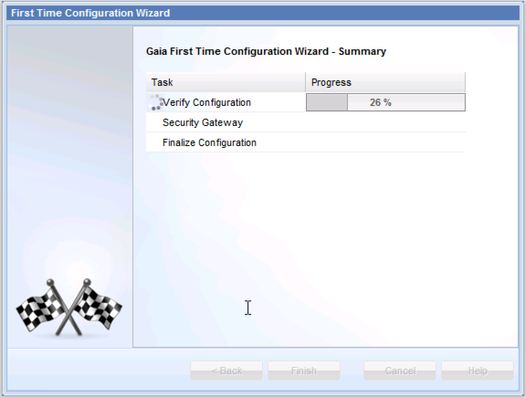

all done

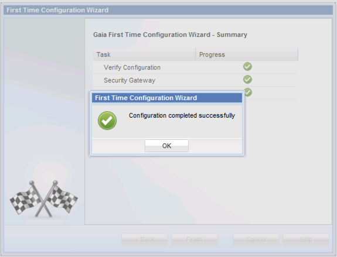

