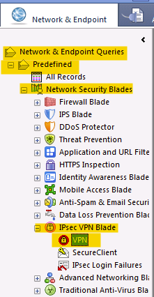
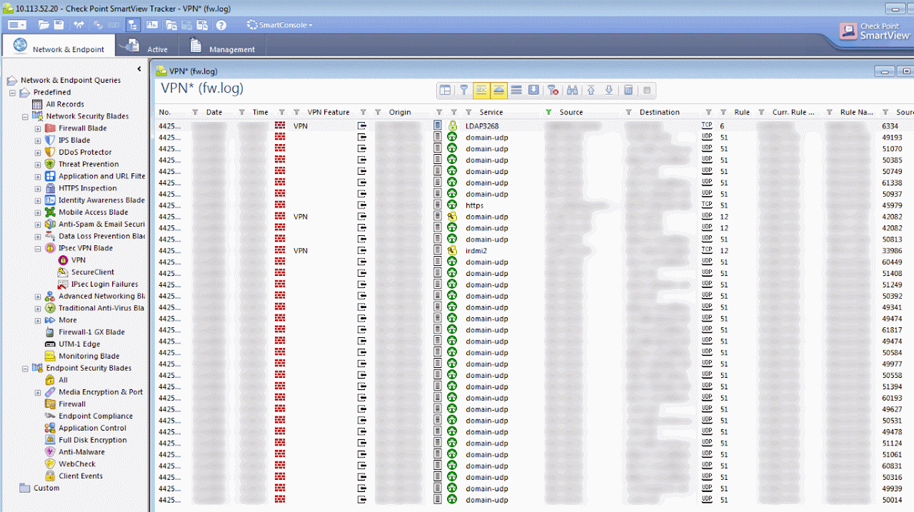

# Troubleshooting a VPN

## Overview: 
From the Firewall: 
There are a couple of commands you can make directly on the firewall to test the phase1/2 status of the vpn.  

### vpn tu command: 
This command gives you a lot of visibility on the vpn.  From the expert mode (not clish), run the command.  

```
[Expert@checkpoint:0]# vpn tu

**********     Select Option     **********
(1) List all IKE SAs
(2) List all IPsec SAs
(3) List all IKE SAs for a given peer (GW) or user (Client)
(4) List all IPsec SAs for a given peer (GW) or user (Client)
(5) Delete all IPsec SAs for a given peer (GW)
(6) Delete all IPsec SAs for a given User (Client)
(7) Delete all IPsec+IKE SAs for a given peer (GW)
(8) Delete all IPsec+IKE SAs for a given User (Client)
(9) Delete all IPsec SAs for ALL peers and users
(0) Delete all IPsec+IKE SAs for ALL peers and users
(Q) Quit
```

listing all ike SA's shows the following: 
```
1
Peer  4.14.89.4 SAs:
1. IKE SA <29bfdbbf26cee51a,e684f1d233dc045>:
Peer  50.200.61.120 SAs:
1. IKE SA <c8d2d9a5f3192c7,b51033ad6186654>:
2. IKE SA <5c7ec4ace28db0d,b10e98d279a6992>:
3. IKE SA <10a309afa5e15df,011ef0e5015cba2>:
Peer  17.18.13.219 SAs:
1. IKE SA <1f17a73b70d995f,cd8aba08578192f0>:
2. IKE SA <119ee6119340c5e,768843785d00b8a9>:
```

Looking at the phase 2 status shows: 
```
2
Peer  4.14.89.4 SAs:
1. SPI's related to IKE SA <29bfdbbf26cee51a,e684f1d233dc045>:
INBOUND:
    1. 0x400fd
OUTBOUND:
    1. 0xc88928a
```

### View dropped connections: 
You can see all the dropped connections on the firewall with the fw ctl debug command.  It will by default show you everything, so it's good to pipe the results to grep and search on just what you are interested in.  

In this case, we're filtering on the remote gateway and the errors we're seeing trying to connect to it. (are they dropping our connections?)

Step 1: Open up a capture to see dropped packets: 
```
[Expert@LEX-CKP-FW2:0]# fw ctl zdebug + drop | grep 4.14.89.4

;[cpu_3];[fw4_0];fw_log_drop_ex: Packet proto=6 19.14.14.12:36700 -> 4.14.89.4:80 dropped by vpn_encrypt_chain Reason: No error;
;[cpu_3];[fw4_0];fw_log_drop_ex: Packet proto=6 19.14.14.12:36700 -> 4.14.89.4:80 dropped by vpn_encrypt_chain Reason: No error;
```

Step 2: In another session, open up a connection to that open port to see what happens: 
```
[Expert@checkpoint:0]# telnet 4.14.89.4 80

Trying 4.14.89.4...
telnet: connect to address 4.14.89.4: Connection timed out
```

Step 2 will fillout the data in step 1 and provide you with some good information on why the link is failing or if the port is blocked.  

### System Diagnostics, and port analysis: 
If you want to make sure that your physical medium is ok, or if anything else is going on with the hardware, simply run a cpview command

```
Expert@LEX-CKP-FW2:0]# cpview

|------------------------------------------------------------------------------|
| CPVIEW.I/S.SXL                                            22Jul2016 10:47:34 |
|------------------------------------------------------------------------------|
| Overview SysInfo Traffic I/S Software-blades                                 |
|------------------------------------------------------------------------------|
| CPU Memory SXL CoreXL Streaming RAD                                          |
|------------------------------------------------------------------------------|
| Overview F2F-Reasons Drop-Reasons                                            |
|------------------------------------------------------------------------------|
| Accelerated Path                                                             |
|                                                                              |
| Accel packets                       208                                      |
| Accel bytes                       9,292                                      |
| Conns created                    77,125                                      |
| Conns deleted                    58,722                                      |
| C total conns                    13,341                                      |
| C templates                           0                                      |
| C TCP conns                      11,200                                      |
| C delayed TCP conns                   0                                      |
| C non TCP conns                   2,141                                      |
| C delayed nonTCP conns                0                                      |
| Conns from templates                  0                                      |
| Temporary conns                   1,117                                      |
| NAT conns                        66,113                                      |
| Dropped packets                   1,352                                      |
| Dropped bytes                       199KB                                    |
| NAT templates                         0                                      |
| Conns from NAT tmpl                   0                                      |
| Port alloc templates                  0                                      |
| Port alloc conns                      0                                      |
| Conns auto expired                3,945                                      |
| ---------------------------------------------------------------------------- |
| Accelerated VPN Path                                                         |
|                                                                              |
| C crypt conns                     1,200                                      |
| Encrypted bytes                     510MB                                    |
| Decrypted bytes                     130MB                                    |
| ESP encrypted pkts              702,660                                      |
| ESP encrypted err                   103                                      |
| ESP decrypted pkts              410,453                                      |
| ESP decrypted err                    11                                      |
| ESP other err                         0                                      |
| AH encrypted pkts                     0                                      |
| AH encrypted err                      0                                      |
| AH decrypted pkts                     0                                      |
| AH decrypted err                      0                                      |
|- More info available by scrolling down --------------------------------------|
```

## From the NPM: 

### SmartView Tracker: 
Within the SmartView Tracker, from the viewer, open up Network & Endpoint Queries, then Predefined, then Network Security Blades,  IPsec VPN Blade, and VPN.  



From there you can create a filter that only reviews issues to the destination firewall.  This will show you all the phase1/2 errors while the tunnel is being created.  



## References: 
- [vpn tu](https://sc1.checkpoint.com/documents/R76/CP_R76_Gaia_WebAdmin/12467.htm#o12627): Checkpoint commands, 2014
- [CHECK POINT VPN DEBUGGING GUIDE](http://digitalcrunch.com/check-point-firewall/check-point-vpn-debugging-guide/): Digital Crunch ~2011