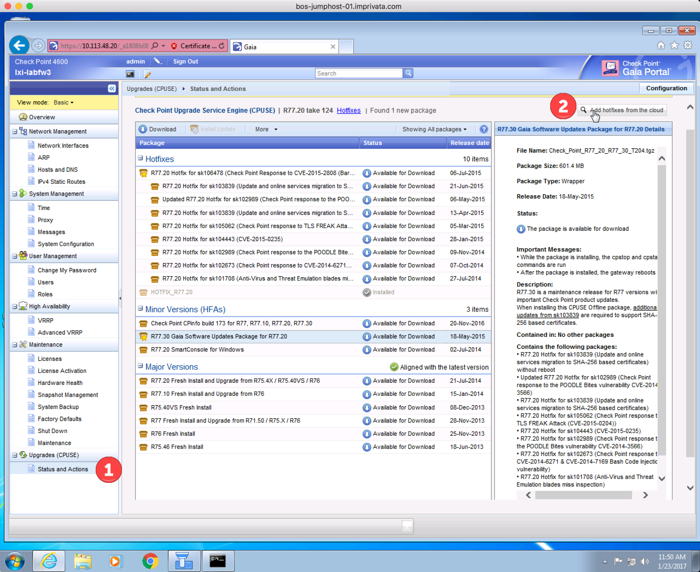
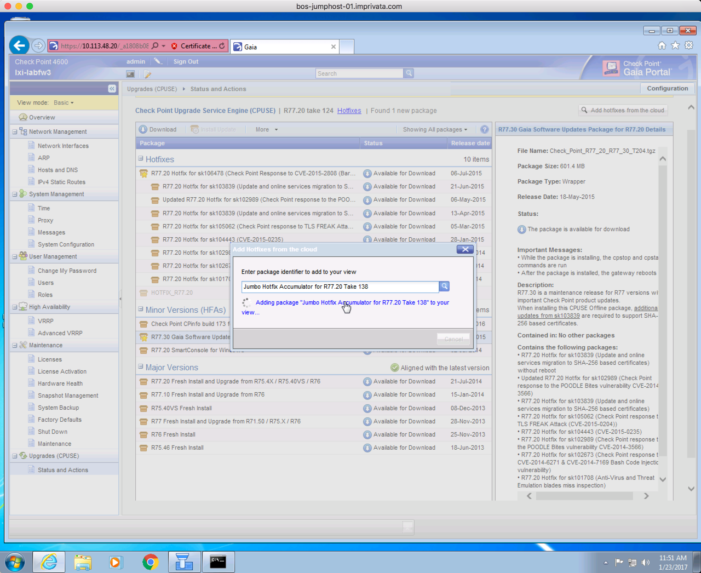
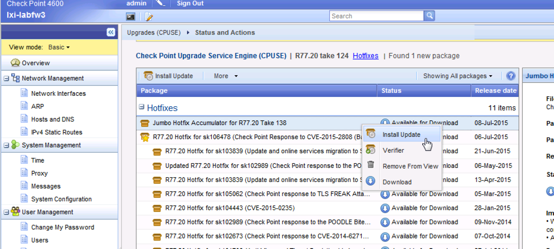
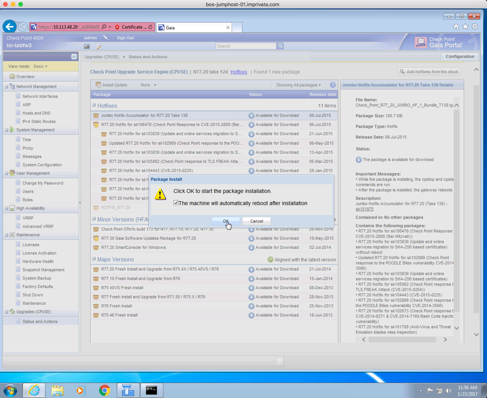

# Upgrade cpuse

## Set Expert Password
Make sure that you have an expert password set: 
```
lxi-labfw3> lock database override 
lxi-labfw3> set expert-password 
Enter new expert password: 
Enter new expert password (again): 
lxi-labfw3> save config
lxi-labfw3> 
```

With '20 (the os version) we need to start the upgrade from the CLI. 

Allow sshing to the host: 
```
lxi-labfw3> lock database override 
lxi-labfw3> set user admin shell /bin/bash
lxi-labfw3> save config
```

## Get the latest Deployment Agent

copy the download to your local host, and then copy it to the firewall
```
$ scp DeploymentAgent_000001130_1.tgz admin@10.113.48.20:/home/admin/.

The authenticity of host '10.113.48.20 (10.113.48.20)' can't be established.
RSA key fingerprint is SHA256:tnA/dqmub4QT0EuvpLhoVBQdo2LkguBxBez1nim5NGI.
Are you sure you want to continue connecting (yes/no)? yes
Warning: Permanently added '10.113.48.20' (RSA) to the list of known hosts.
This system is for authorized use only.
admin@10.113.48.20's password: 
DeploymentAgent_000001130_1.tgz  
```

then from the firewall explode it and install: 

```
[Expert@lxi-labfw3:0]#  -zvxf DeploymentAgent_000001130_1.tgz 

CPda-00-00.i386.rpm
[Expert@lxi-labfw3:0]#                  
[Expert@lxi-labfw3:0]# 
[Expert@lxi-labfw3:0]# 
[Expert@lxi-labfw3:0]# rpm -Uhv --force CPda-00-00.i386.rpm 
Preparing..
...
[Expert@lxi-labfw3:0]# $DADIR/bin/dastart
cpwd_admin: 
Process DASERVICE started successfully (pid=14489) 
[Expert@lxi-labfw3:0]# 
```

## install the Jumbo: 
Now confirm what os you are running on the rest of your systems, so that you install the correct jumbo on the new box: 
```
[Expert@lex-ckp-fw01:0]# installed_jumbo_take 

R77.20 Jumbo Hotfix Accumulator take_138 is installed, see sk101975.
[Expert@lex-ckp-fw01:0]# 
```

You would call support, and then they would tell you from this "take" you would use this string: 
```
Check_Point_R77_20_JUMBO_HF_1_Bundle_T138.tgz
```

Then from the GUI, under Status and Actions (1) select the Add Hot Fixes from the Cloud (2)



Paste in the "take" in the search: 


Then if you did it right, it will find the following: 


Select it and start downloading



once the image is done downloading, find the jumbo hotfix, and right-click to select Install Updates



You'll get a warning that you need to reboot when this is done.  



when the box comes back up, you can confirm from the cli: 
```
[Expert@lxi-labfw3:0]# installed_jumbo_take 
R77.20 Jumbo Hotfix Accumulator take_138 is installed, see sk101975.
[Expert@lxi-labfw3:0]#
```


## Reference: 
- [Reference doc](https://supportcenter.checkpoint.com/supportcenter/portal/role/supportcenterUser/page/default.psml/media-type/html?action=portlets.DCFileAction&eventSubmit_doGetdcdetails=&fileid=52064)

