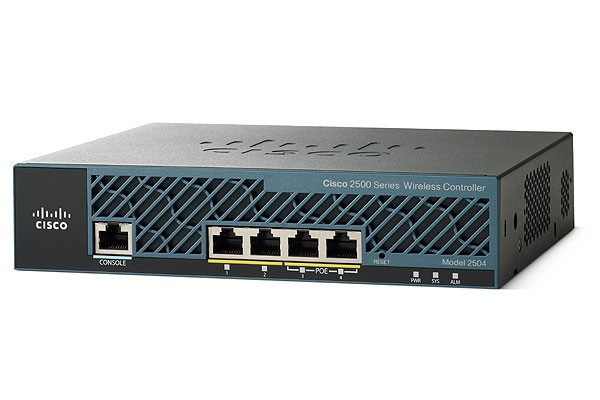

# 2500 WLC

 

## Basic Setup: 
- [Create Users](2500-create-users.md): how to add/delete users
- [Save and View configs](2500-save-and-view-configs.md): how to save your edits, and view the (messy) config file
- [SNMP OIDs](2500-snmp.md): what to look for

## Troubleshooting: 
- Default Password and Password Reset: How to get in when you don't know the password. 
- [Virginise the box](2500-virginise-the-box.md): How to bring the box back to its factory settings

## References: 
- [Cisco 2500 Series Wireless Controllers](http://www.cisco.com/c/en/us/support/wireless/2500-series-wireless-controllers/tsd-products-support-series-home.html): 
- [Cisco 2500 Series Wireless Controller Deployment Guide](http://www.cisco.com/c/en/us/support/docs/wireless/2500-series-wireless-controllers/113034-2500-deploy-guide-00.html): 

