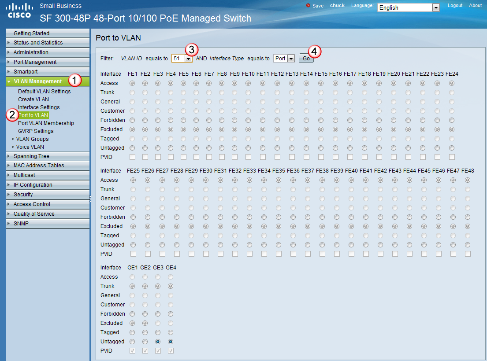
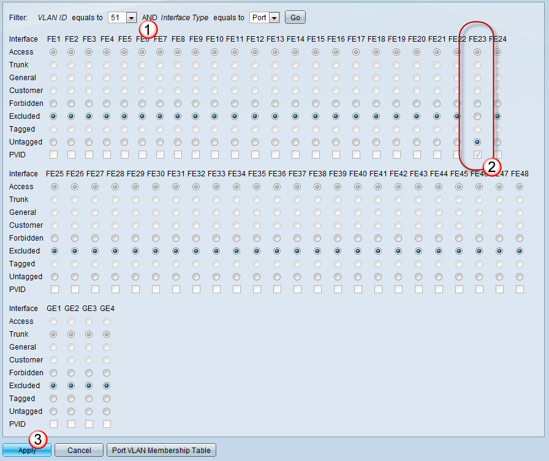
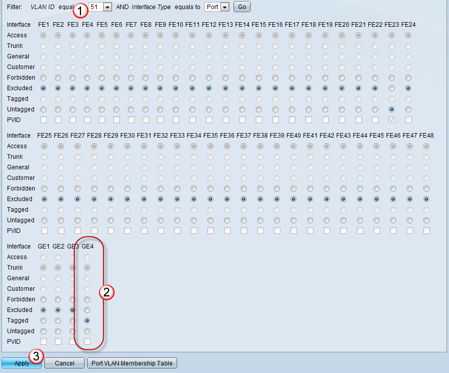
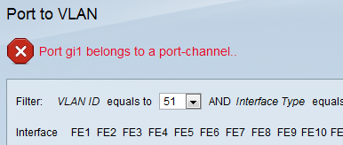
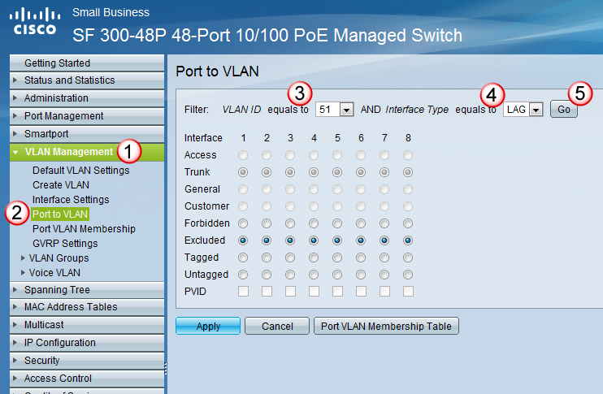
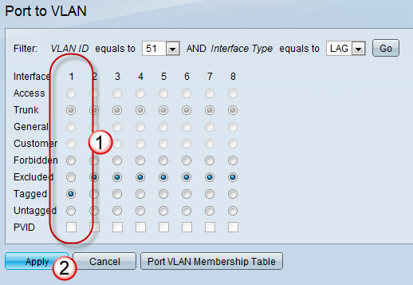

# Assigning VLANs

## Add VLAN to a Port
To add a vlan to ports, go to the VLAN Management section, select Port to VLAN, and in the pull down, select the VLAN ID (number) you would like to add to the ports.  Then select Go. 

 

## Setting ports to join a VLAN:
If you want a port to be on a specific VLAN (with out tagging) make sure that the VLAN has been selected (previous step) simply set the port to Untagged.  (as I did for port 23) and then select Apply.

 

## Setting Trunks to carry (TAG) a VLAN:
If you want to add the vlan to be carried across a trunk, again, make sure that the vlan is defined from the initial step, then on that trunk interface select Tagged (as shown on port GE4).  Then select Apply.

 

## Adding VLAN to a Port channel:
If you have any port channels setup (two ports which behave as one), then the previous step will not work, and you will get the following message:

 

In that case, while still in the VLAN Management, Port to VLAN section, select the VLAN ID (number) and instead of selecting "port", select LAG and press GO. 

 

Then add the VLAN to the correct Port channel (in this case channel 1) by selecting Tagged.  Then enter the changes by pressing the Apply button. 

 

