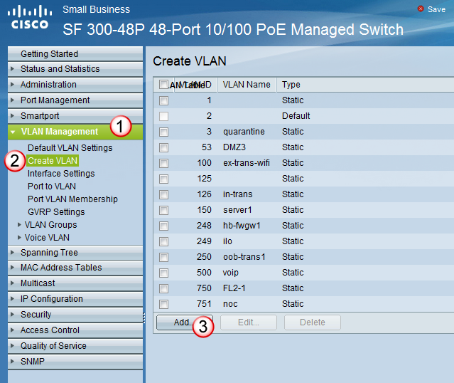
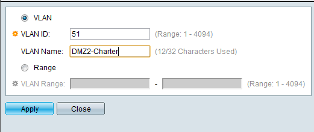
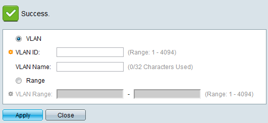

# Creating VLANs
To create a new vlan,

under VLAN Management, select Create VLAN and select the ADD button.

 

then in the Add Vlan window, enter the VLAN ID and the VLAN Name, and select Apply.

 

When the new vlan has been created, you will get a Success check icon, and you can either repeat this for a new vlan, or select close to get out of the Add Vlan window. 

 

