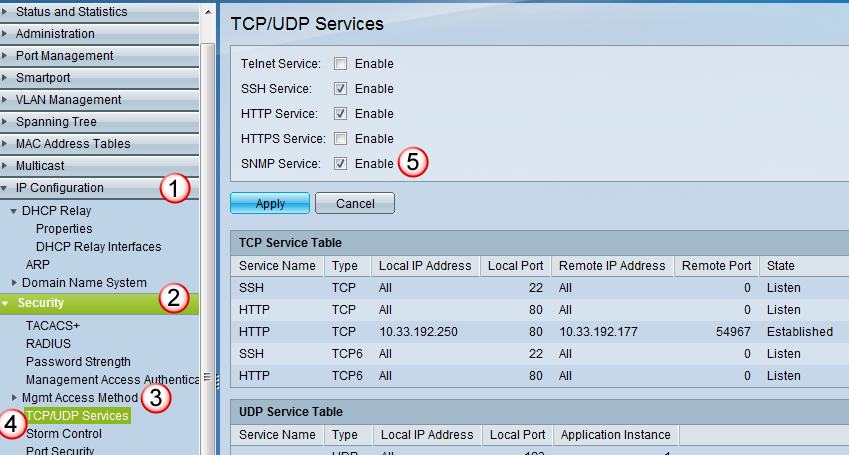
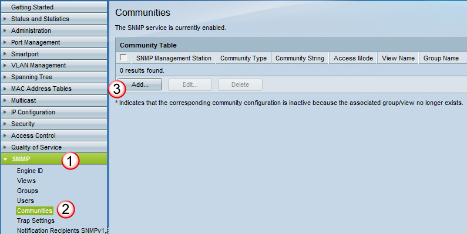
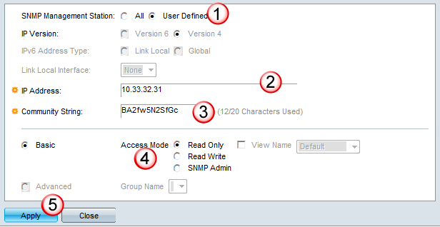

# Enabling SNMP/Syslog

## Enable SNMP: 
In this example we will be enabling snmp v2c polling of the switch. 

 

## Start SNMP: 
Start the SNMP service by going to the IP Configuration(1) menu, and selecting the Security(2), Mgmt Access Method(3), and TCP/UDP Settings(4).  In the TCP/UDP Settings window, check off the SNMP Service(5) and select Apply to enable snmp.  

## Define your Community String: 
To enable snmp polling, you need to allow specific IP's to be allowed to poll the switch, and you need to provide a "password" for snmp (which is called a community string).  To do this, unde the SNMP(1) menu, select Communities(2). In the Communities window, select the Add(3) button.  

 

Then in the add Communities popup window, enter in the following: 
1. SNMP Management Station = "user defined".  (You can either set this to "all", and any IP can poll the switch, or "user defined" and you can specify what this IP addresses are that can poll the switch)
2. IP Address = {server_ip}.  This is simply the IP address or IP range of the servers that are allowed to poll the switch. 
3. Community String = {password}.  This is the password that snmp uses to allow polling.  The transmissions are in plaintext, so understand that if there is any host within the segments that the traffic is being passed, they will be able to see what the password is.  As always, use a good string for your passwords.  
4. Basic, Access Mode = Read Only.  Don't allow snmp to make any changes to the switch, only monitor it.  (You can also create groups of servers, and assign them access to different areas of the snmp tree.)

then select Apply(5) to save the changes.  

 

When you are done, make sure you Save your Changes.  