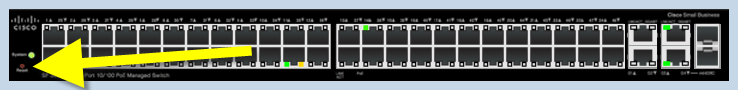

# Password Reset
Not your standard Cisco method, but remember, this is a 1/2 step up from a linksys:

 

1. press and hold the reset button for 30 seconds with the Power cable connected,
2. then leave the unit unplugged and wait for 1 minute and re-connect the power cable
3. all ports will be set to the default vlan and the management interface will be listening on the ip 192.168.1.254/24 with user/pass - cisco/cisco