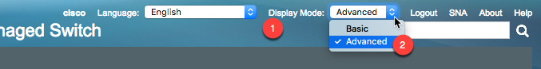

# Port Mirroring and SPAN ports

## Overview
If you need to monitor traffic between two systems, you can monitor them from either end of the traffic flow (like monitor from the destination), but this can be difficult to do depending on the configuration of the endpoints, and it might not see all the traffic because of the switch and servers configuration.  

A great way to solve this is to get out of band, and monitor all the traffic of that vlan, or all the inbound and outbound traffic from a specific switch port. 

One thing to point out is that the cisco SMB switches are not all built the same, and their GUIs are setup such that setting up this monitoring can be different for different switches.  

## SG200
Under Administration (1), select Diagnostics (2) and Port and VLAN Mirroring (3).  Then press the Add (4) button to add a source and destination for port mirroring.  

 

In this example, there is already a mirror setup (from vlan 40 to port GE10).  This switch can only support one destination setting, but you can add to it multiple sources.  

Select the destination port (5) where the sniffer is located, and then the source interface (6) which should be either a port or an entire vlan.  If it's a port, then you can also filter out (7) if it should be all traffic, or only traffic going out or into the switch port.  

 

## SG300
The 300 series switches will not only allow you to port monitor, but to also view remote port monitoring (get port monitor data from a remote switch pushed though your local switch to get to you).  

First make sure that your display mode (1), which is a the top right of the main page, is set to advanced (2).  

 

Then under Status and Statistics (3) you will be able to get to the SPAN & RSPAN (4) menu where you should start by selecting Session Destinations (5) and then select New(6) to define what port the sniffer is connected to.  

 

Since you can have multiple destination ports, define the Session ID(7) which links the source to the destination.  Then set the type to Local Interface (8) (for a port mirror - rather then a RSPAN), and than list what port (9) you want to sent the traffic to.  Make sure Network Traffic (10) is not selected, so that this is just a span port, and save by pressing Apply (11). 

 

Then define a what will be collected and sent to the sniffer port by selecting Session Sources (12), and then the Add button (13). 

 

Match up the session ID (14) with the same number that you set for the destination port above, and then define if you will sniff a port or vlan (15) (and if a port, which flow of traffic), and then save by pressing apply (15) and close. 

 

## Reference
- [Cisco Sx350, SG350X, SG350XG, Sx550X & SG550XG Series Managed Switches](https://www.cisco.com/c/dam/en/us/td/docs/switches/lan/csbms/350xg/admin_guide/AG_Tesla_350_550.pdf), Firmware Release 2.2.5.x: Cisco Press, 2016