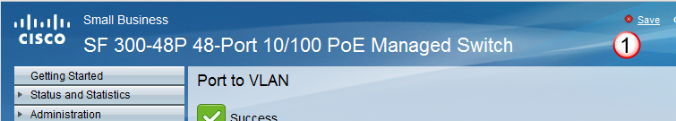
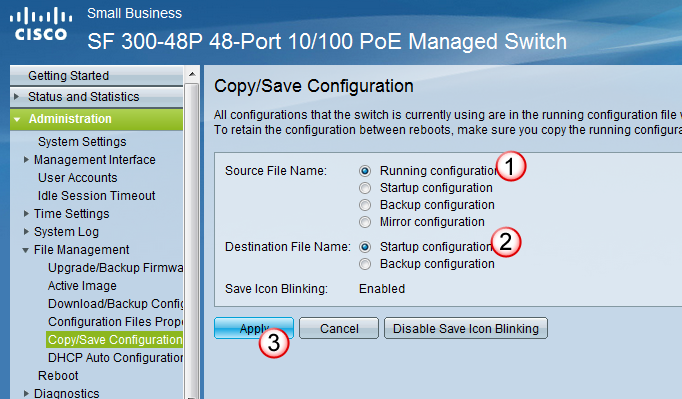
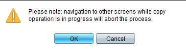
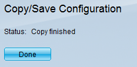
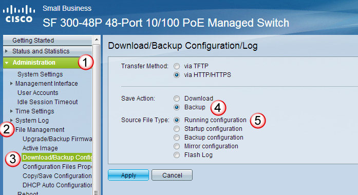
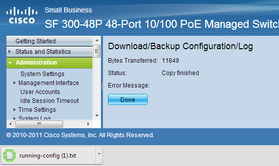

# Save the Changes

## Save Changes: 
When you have modified any configurations on the switch, you will see the "save" button flash.

 

Either select it, or select Administration, File Management, and Copy/Save Configuration. 

Then Save the configuration by selecting the Running Configuration, and the Startup configuration radio buttons, and then select Apply.

 

You will get a few alerts that pop up, and a final alert letting you know the changes were made. 

 

 

 

## Copy Configs
You will want to download a copy of the switch config for a backup.  To do this 

under Administration(1), and under File Management(2) select Download/Backup Configs(3) and then choose Backup(4) and Running Configuration(5)

 

it will then download the running config to your browser. 

 