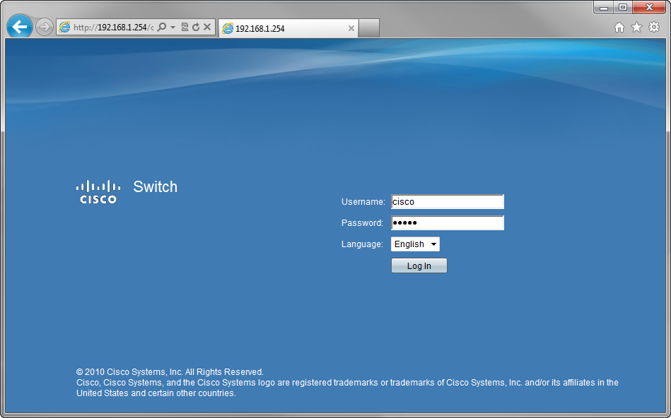
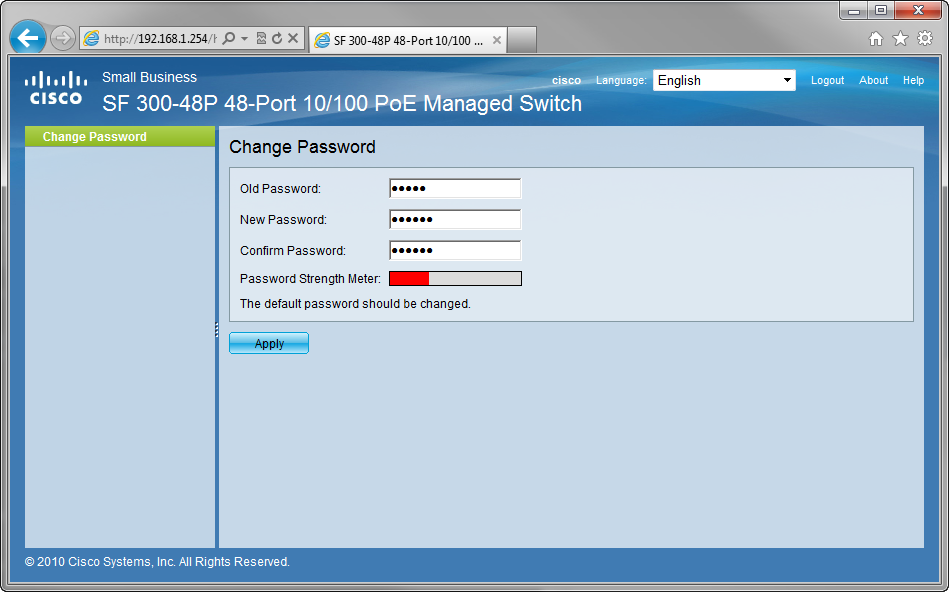
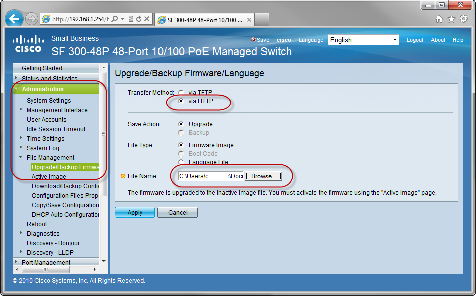
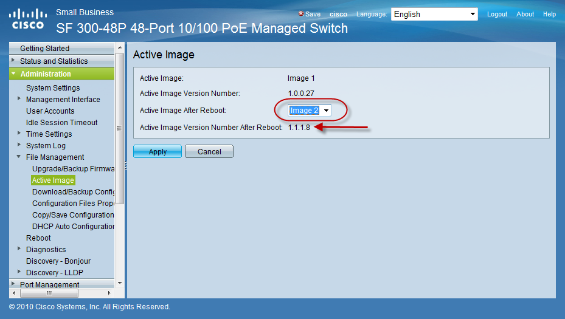
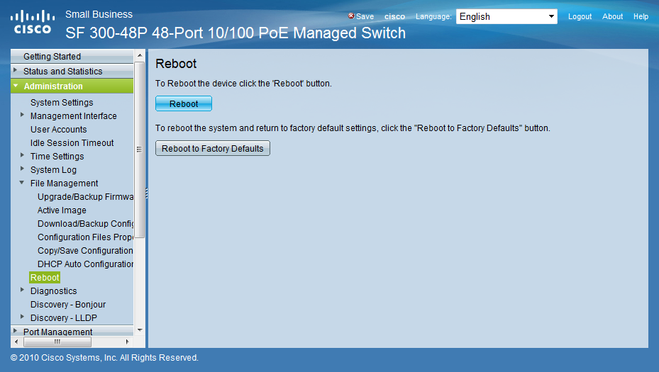

# Upgrade the switch

## Via web browser:
for arguments sake, lets assume that the box is factory defaulted.  set your IP to something in the 192.168.1.0/24 network, and connect to 192.168.1.254.  Your default user/pass will be cisco cisco. 

(Microsoft IE seems to do the best job at drawing all the screens, so I will suggest using that)

 

then reset your password regardless if you want to or not.  (new default: cisco1)  Auggg!!!!

 

Under Administration, File Management, Upgrade/Backup Firmware, use the HTTP transfer method to pull the new os file directly from your pc.  (no need for a local tftp server!)

 

It will take a few minutes to download the image, then under Administration, File Management, Active Image, set the "Active Image After Reboot" to be the new os you downloaded.

 

Then under Administration, Reboot, select the reboot button to have the new image take hold.

 

note, that the box is a bit slow before the webpage comes back up online. 