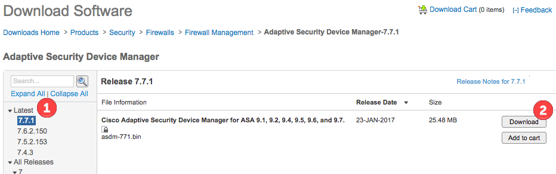
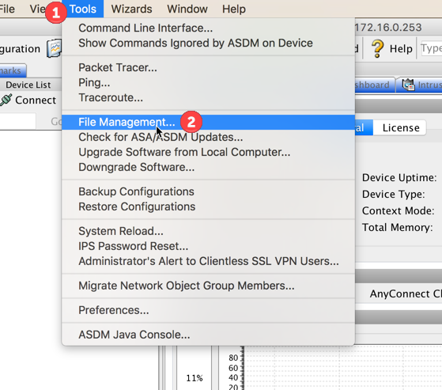
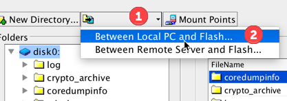
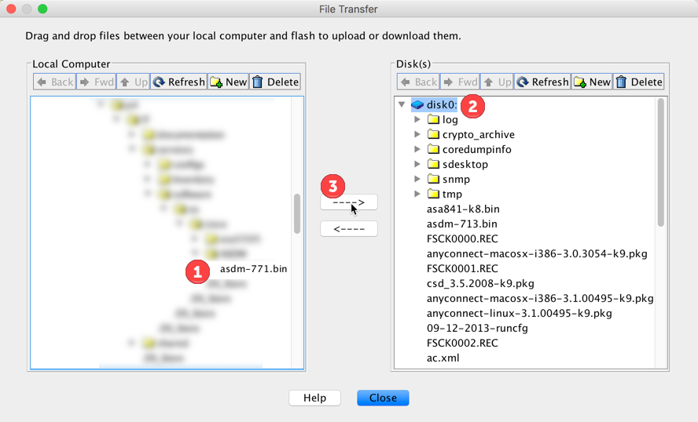

# Upgrading the ASDM
Go to cisco's download page, and select the latest ASDM image
- https://software.cisco.com/download/release.html?mdfid=279513399&softwareid=280775064



Open ASDM, click on **Tools** (1), then **File Management** (2), 



Under **File Transfer** (1), select **Between Local PC and Flash** (2)



and transfer the **ASDM x.x.x** image (1) to the **Disk0** (2) or the pertinent Disk, then **transfer the file**(3).



Save the configuration

From the Command Line interface of the ASA

```
asdm image disk0:/asdm-xxx.bin
wr mem
```

shut down the current ASDM, go to the firewalls web page and download the new ASDM to run.

Also in the following link you can see the asdm compatibility information
- sahttp://www.cisco.com/c/en/us/td/docs/security/asa/compatibility/asamatrx.html