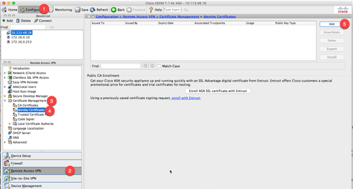
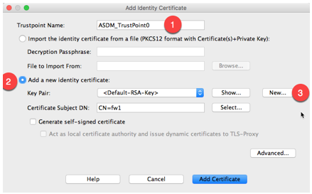
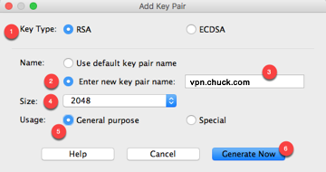
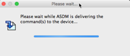
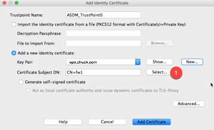
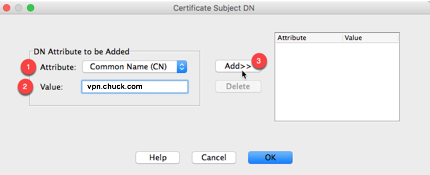
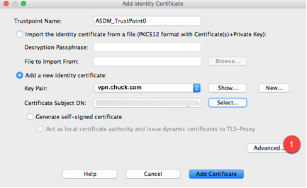
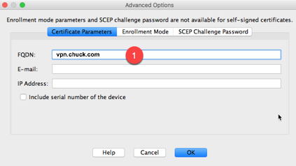
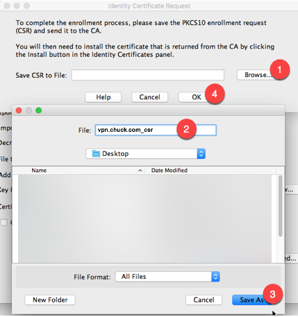
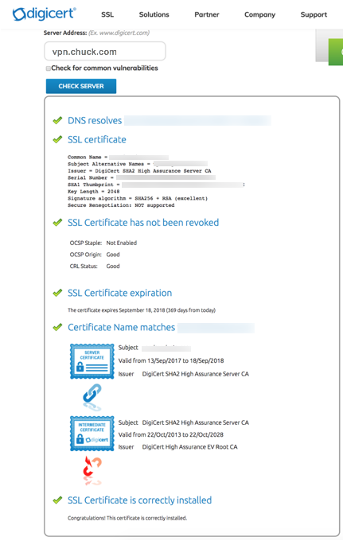

# Adding new Certs

<details open>
    <summary><b>Table of Contents</b></summary>

- [Adding new Certs](#adding-new-certs)
  - [Create the CSR](#create-the-csr)
  - [Install SSL Cert on ASA](#install-ssl-cert-on-asa)
    - [Install the Cert](#install-the-cert)
    - [Install the Intermediate Cert](#install-the-intermediate-cert)
    - [Export the Cert](#export-the-cert)
    - [Import the Cert on an additional firewall](#import-the-cert-on-an-additional-firewall)
    - [Enable cert on other firewall](#enable-cert-on-other-firewall)
    - [Enable cert on primary firewall](#enable-cert-on-primary-firewall)
    - [Confirm validity of the cert](#confirm-validity-of-the-cert)
  - [References](#references)

</details>

## Create the CSR
Open up ASDM, and log into the firewall

Select:
- Configuration :: Remote Access VPN :: Certificate Management :: Identity Certificates :: Add



Enter in the Trustpoint Name =  `vpn.chuck.com-2017`

Then Select : 
- Add a new identity certificate :: New



Select:
1. Key Type = RSA
2. Name  = Enter New Key pair name
3. Key Pair name = vpn.chuck.com-2017
4. Size = 2048
5. Usage = General purpose



Wait a bit



Click Select



Use the Certificate Subject window and enter the following by selecting the attribute (1), entering in the value (2), and then adding it to the table (3)

- Common Name (CN) = vpn.chuck.com
  - Company Name (O) = chuck, Inc.
- Country (C) = US
- State (St) = CA
- Location (L) = Sunnyvale
- Organizational Unit (OU) = Information Technology

When complete, select OK.



Click the Advanced button



update the FQDN with the firewalls hostname vpn.chuck.com



When you get back to the identity certificate window, select Add Certificate


Then Save the file to your laptop somewhere, and name the file vpn.chuck.com_csr.txt



 

## Install SSL Cert on ASA

### Install the Cert

### Install the Intermediate Cert

### Export the Cert
Now that the cert is fully installed on the firewall.  It’s NOT active, but it is fully installed. 

You can export it and copy the entire cert to the other firewall to test.

Run the following command on the cli of the firewall, and save the output in a text file. 

```
nee-fw3b01/act(config)# crypto ca export vpn.chuck.com-2017 pkcs12 changeme

Exported pkcs12 follows:
-----BEGIN PKCS12-----
MIINBwIBAzCCDMEGCSqGSIb3DQEHAaCCDLIEggyuMIIMqjCCDKYGCSqGSIb3DQEH
BqCCDJcwggyTAgEAMIIMjAYJKoZIhvcNAQcBMBsGCiqGSIb3DQEMAQMwDQQIZdkc
xBQ6soQCAQGAggxgsd/8GKxkfhEoWUAjWIKTanq67Tc4paz+IPFrtkyV13GzJ9b2
[...]
igQUYrwnOuY3sdqQJONCYHZZ+IxNjb0CAgQA
-----END PKCS12-----
nee-fw3b01/act(config)#
```

View the trustpoint on the firewall as well

```
nee-fw3b01/act(config)# sh run crypto ca trustpoint vpn.chuck.com-2017

crypto ca trustpoint vpn.chuck.com-2017
 enrollment terminal
 fqdn vpn.chuck.com
 subject-name CN=vpn.chuck.com,OU=Information Technology,O="chuck, Inc.",C=US,St=CA,L=Sunnyvale
 keypair vpn.chuck.com-2017
 crl configure
nee-fw3b01/act(config)#
```

### Import the Cert on an additional firewall
On the other firewall, enter the following on the cli to
 
```
ASA-FW1/act(config)# crypto ca import vpn.chuck.com-2017 pkcs12 changeme

Enter the base 64 encoded pkcs12.
End with the word "quit" on a line by itself:
```
 

And then paste the contents of the `sh run crypto ca trustpoint vpn.chuck.com-2017` command above.  Note, that you need to paste the contents, but NOT the “begin” or “end” lines.  (just the section in blue.) 

Make sure to not add any carriage returns or any spaces before or after you paste

 
```
-----BEGIN PKCS12-----
MIINBwIBAzCCDMEGCSqGSIb3DQEHAaCCDLIEggyuMIIMqjCCDKYGCSqGSIb3DQEH
BqCCDJcwggyTAgEAMIIMjAYJKoZIhvcNAQcBMBsGCiqGSIb3DQEMAQMwDQQIZdkc
xBQ6soQCAQGAggxgsd/8GKxkfhEoWUAjWIKTanq67Tc4paz+IPFrtkyV13GzJ9b2
[...]
DHjHh8GbSP/K2N3WZKtILik9xwrCOk2xORY1U2Jgl4cdD1MWk+B1/F8OUWV3iafN
BPH0E05/FvzsBC2kMD0wITAJBgUrDgMCGgUABBTsQb/62vfkT3Qd68E/2snyAUmC
igQUYrwnOuY3sdqQJONCYHZZ+IxNjb0CAgQA
-----END PKCS12-----
```
 

Confirm that the new cert uploaded properly:

```
ASA-FW1/act# sh crypto ca cert vpn.chuck.com-2017

Certificate
  Status: Available
  Certificate Serial Number: 0d5071b836d633aa3asb253s801e6d97
  Certificate Usage: General Purpose
  Public Key Type: RSA (2048 bits)
  Signature Algorithm: SHA256 with RSA Encryption
  Issuer Name:
    cn=DigiCert SHA2 High Assurance Server CA
    ou=www.digicert.com
    o=DigiCert Inc
    c=US
  Subject Name:
    cn=vpn.chuck.com
    ou=Information Technology
    o=chuck Inc
    l=Sunnyvale
    st=CA
    c=US
  OCSP AIA:
    URL: http://ocsp.digicert.com
  CRL Distribution Points:
    [1]  http://crl3.digicert.com/sha2-ha-server-g1.crl
    [2]  http://crl4.digicert.com/sha2-ha-server-g1.crl
  Validity Date:
    start date: 20:00:00 EDT Sep 12 2017
    end   date: 08:00:00 EDT Sep 18 2018
  Associated Trustpoints: vpn.chuck.com-2017

ASA-FW1/act#
```

### Enable cert on other firewall
Then confirm what the current cert is that is enabled on the outside interface

```
ASA-FW1/act# sh run ssl
ssl server-version tlsv1-only
ssl encryption aes256-sha1 aes128-sha1 3des-sha1
ssl trust-point ASDM_TrustPoint1 outside
ASA-FW1/act#
```
 

To enable the new cert, you need to undo the old cert, and then enable the new cert.  Do this with the following command:

```
conf t
no ssl trust-point ASDM_TrustPoint1 outside
ssl trust-point vpn.chuck.com-2017 outside
end
```
 

And confirm it took with the following command:

```
ASA-FW1/act# sh run ssl
ssl server-version tlsv1-only
ssl encryption aes256-sha1 aes128-sha1 3des-sha1
ssl trust-point vpn.chuck.com-2017 outside
ASA-FW1/act#
```
 

Next, confirm the cert is good by going to the website directly and checking the cert in a web browser. 

You will need to modify your host file so that “vpn.chuck.com” points to 199.184.194.34 

```
199.84.14.34  vpn.chuck.com
```
 

Then from your browser, go to https://vpn.chuck.com and then in the menu bar, select View :: Developer :: Developer Tools and then select “view certificate”.  From there you will see the cert, and confirm that the end date for the cert is correct

### Enable cert on primary firewall
Back on the needham firewall, first confirm the current cert config:

```
nee-fw3b01/act# sh run ssl
ssl server-version tlsv1-only
ssl encryption aes256-sha1 aes128-sha1 3des-sha1
ssl trust-point ASDM_TrustPoint1 outside
nee-fw3b01/act#
```
 

Then enable the new cert with the same command as before:
```
conf t
no ssl trust-point ASDM_TrustPoint1 outside
ssl trust-point vpn.chuck.com-2017 outside
end
```

and confirm again that the cert is good using the same method as before.  

### Confirm validity of the cert
Goto the url: https://www.digicert.com/help/

And enter in “vpn.chuck.com” in the server address to confirm that the cert is correct.  



## References
- Configure ASA: SSL Digital Certificate Installation and Renewal: https://www.cisco.com/c/en/us/support/docs/security-vpn/public-key-infrastructure-pki/200339-Configure-ASA-SSL-Digital-Certificate-I.html
- Certificate Signing Request (CSR) Generation Instructions for Cisco ASA 5510: https://knowledge.symantec.com/support/ssl-certificates-support/index?page=content&actp=CROSSLINK&id=SO6495
- SSL Certificates Support – Enrollment: https://knowledge.symantec.com/support/ssl-certificates-support/index?page=content&actp=CROSSLINK&id=INFO774
- SSL Certificate Installation for Cisco ASA 5500 VPN: https://www.digicert.com/ssl-certificate-installation-cisco-asa-5500.htm
- DigiCert® SSL Installation Diagnostics Tool: https://www.digicert.com/help/
- How to view SSL Certificate details on Chrome? https://superuser.com/questions/1160502/how-to-view-ssl-certificate-details-on-chrome