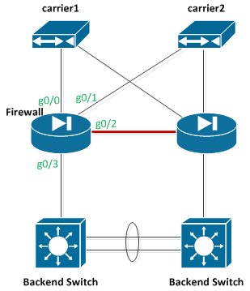
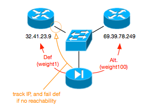

# Interfaces and Routes

- [Interfaces and Routes](#interfaces-and-routes)
  - [To Trunk or not to Trunk:](#to-trunk-or-not-to-trunk)
  - [Routing:](#routing)
    - [Inbound Routing:](#inbound-routing)
    - [Outbound Routing:](#outbound-routing)


For the layout depicted in the following diagram, we will make the config changes as noted. It has a few assumptions that make it a bit interesting:

1. two HA (redundant) firewalls
2. two external wan links and no BGP routing.  (so traffic can not be simply balanced between the two links)



```
conf t
!
int Gi0/0
  des DMZ1 - carrier 1
  nameif dmz1
  security-level 0
  ip address 32.41.23.14 255.255.255.248 standby 32.41.23.13
  no shut
!
int Gi0/1
  des DMZ2 - carrier 2
  nameif dmz2
  security-level 0
  ip address 69.39.78.254 255.255.255.248 standby 69.39.78.253
  no shut
!
int Gi0/2
  des heartbeat link only - no data
  nameif heartbeat
  security-level 50
  ip address 10.33.8.1 255.255.255.240
  no shut
!
int Gi0/3
  des office networks
  nameif inside
  security-level 90
  ip address 10.33.16.1 255.255.255.240 standby 10.33.16.2
  no shut
!
route inside 10.33.0.0 255.255.0.0 10.33.16.14
!
end
```

Where:
- security-level # defines which interfaces are more secure then others.  The lower the number, the lower the security level.  Traffic by default, can travel from higher security zones to lower ones.  Traffic also by default, can not travel between the same security zones.
- `route <ifname> <net> <mask> <dest> #` sets up static routes, with "#" being the weight given to equal paths.  Lower weight wins.

See also: [ASA/PIX 7.x: Redundant or Backup ISP Links Configuration Example](http://www.cisco.com/en/US/products/hw/vpndevc/ps2030/products_configuration_example09186a00806e880b.shtml) (Cisco 2008): For another way to have dual def routes.

## To Trunk or not to Trunk:
A normal interface would look like the following:

```
int Gi0/3
  des office networks
  nameif inside
  security-level 90
  ip address 10.33.16.1 255.255.255.240 standby 10.33.16.2
  no shut
!
```

The same interface over a tagged network would look as such:
```
int Gi0/3.16
  des office networks
  vlan 16
  nameif inside
  security-level 90
  ip address 10.33.16.1 255.255.255.240 standby 10.33.16.2
  no shut
!
```

## Routing: 
Routing is a bit tricky, as we have two different public networks to connect to inbound, and two routes outbound.  Normally, we would use BGP with dual providers, and then routing would be a snap, since we would keep one set of IP's and advertise them out either route.  This technique is a bit more hackery, but will work the same (ish). 

### Inbound Routing:
We have two internal servers (10.33.128.10-11) that need to be connected to from the outside. 

The base config above will take care of the routing, and the internal NAT/PATing will take care of the nat statements (getting it from the public to private ips).

The other challenge is that fact that you now have two public IP's for each of the servers, since we have two carriers, and they both are providing us different IP's.  To get traffic to the servers, we need to use some kind of global load balancing, where we use DNS to send traffic through either the primary wan link, or if it goes down, then to the secondary link. 

### Outbound Routing:
Outbound routing is a bit tricky, as there are two paths and knowing which links are up is difficult.  If the interface is up on the firewall, by default, it will assume that routes to the remote IP is up and good as well. 



To get around this problem, we use the "sla monitor" process which will actively monitor an IP (local or remote) and if it is unreachable, will use a different route. 

```
!
route dmz1 0.0.0.0 0.0.0.0 32.41.23.9 1 track 1
route dmz2 0.0.0.0 0.0.0.0 69.39.78.249 100
!
sla monitor 7
  type echo protocol ipIcmpEcho 32.41.23.9 interface dmz1
  num-packets 3
  frequency 10
sla monitor schedule 7 life forever start-time now
track 1 rtr 7 reachability
!
```

Where:
- `1 track 1`: in the first line is <weight> track <track#> and says "route weight should be 1 (most preferred) as long as track 1 is good."  The second line says that that route should be weighted at 100, or much less important then the first (unless the first does not exist, which is the case when "track1" is bad.)
- `type echo protocol ipIcmpEcho 32.41.23.9 interface dmz1` and below says: ping 32.41.23.9 over the "dmz1" interface, every 10 seconds, and each time ping 3 times. 
- `sla monitor schedule 7 life forever start-time now`: says to start the sla monitor now and keep runing forever.
- `track 1 rtr 7 reachability`: says to tie "sla monitor 7" to "track 1".  this will make the "route  dmz1" fail if track1 fails.

This sets us up with a system that by default sends all traffic out the primary wan link "dmz1".  In the meantime it also pings the default gateway, and confirms that the device is responding.  If not, it routes traffic to the alternative wan link "dmz2". 

Outbound PATting will still be needed to get the traffic through the firewall, and that is explained below. 