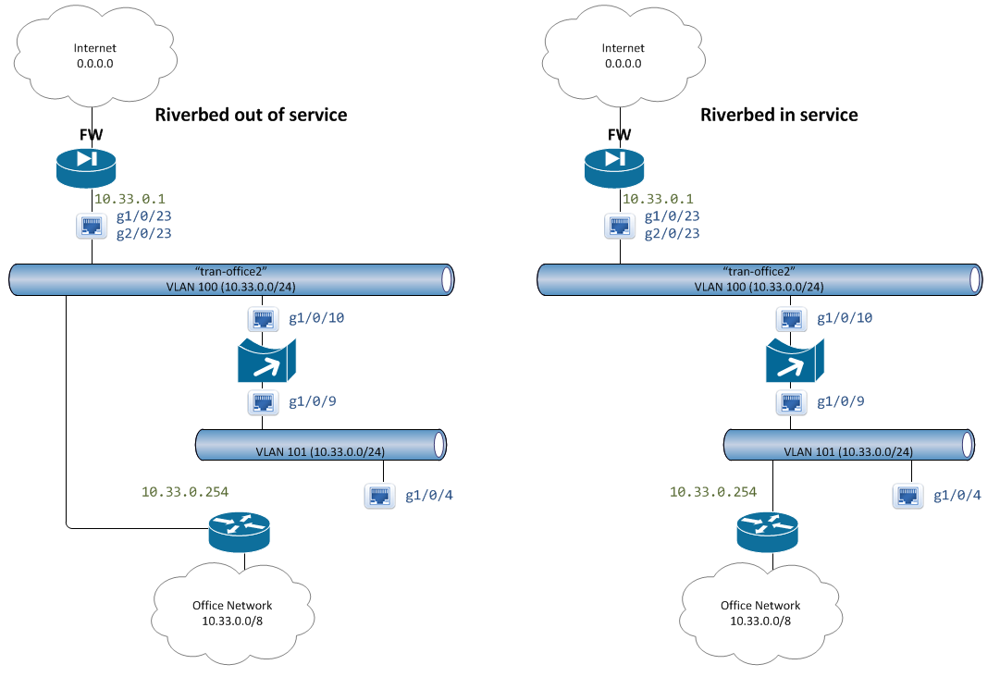

# bridging vlans

## Overview: 
If you want to install a wan speed-up device into your network, the vendor will nicely tell you to physically unplug your link between your switch and firewall, and place the accelerator in between the two.  

This causes two issues: (1) it means that you now have to take a downtime while someone physically disconnects the link and installs the accelerator in the middle, and (2) it means that if something goes wrong, you can't remove the accelerator remotely.  

The obvious solution is to connect both the front and the back of the accelerator to the switch, and simply route all traffic though it.  If you ever need to remove the accelerator, you can do it with a simple command at the switch.  

This doc goes over one way to do this, and the following diagram describes how we will do this by bridging VLANS.  

 

In this case, without the accelerator, the router with all the office VLANS behind it, connects to the firewall via VLAN100.  If you want to force traffic though the accelerator, you simply remap the routers interface on VLAN100 to VLAN101, and the accelerator bridges the two VLANs.

## Initial Switch Configs: 
the initial configs, before the accelerator is in the path, look as such. 

```
interface GigabitEthernet1/0/10
 description speed01 [e1]
 switchport access vlan 100
 switchport mode access
 spanning-tree portfast
!
interface GigabitEthernet1/0/9
 description speed01 [e0]
 switchport access vlan 101
 switchport mode access
 spanning-tree portfast
!
interface Vlan100
 description tran-office
 ip address 10.33.0.254 255.255.255.0
 no ip redirects
 no ip unreachables
 no ip proxy-arp
!
ip route 0.0.0.0 0.0.0.0 10.33.0.1
```

Where the interface vlan100 is the SVI on the router, and ports 9 and 10 are what the speed-up device is plugged into.  

## Setting it up: 
The problem with this plan is that we are bridging two vlans, and this will cause some confusion for the switch (even though both vlans are on the same broadcast domain).  

To solve this problem, we need to adjust the switch ports that the accelerator uses.  

We need to disable spanning tree on the interfaces with the following changes: 

```
interface GigabitEthernet1/0/10
 no spanning-tree portfast
!
interface GigabitEthernet1/0/9
 no spanning-tree portfast
 spanning-tree bpdufilter enable
!
interface GigabitEthernet1/0/10
 shut
 no shut
!
interface GigabitEthernet1/0/9
 shut
 no shut
```

We also need to remove cdp messages on one of the interfaces to prevent VLAN mismatch errors.

```
interface GigabitEthernet1/0/9
 no cdp enable
```

## Enabling: 
To push the traffic though the speed-up device, simply remove the SVI on VLAN100 and enable it on VLAN101. 

```
no interface Vlan100
interface Vlan101
 description tran-office
 ip address 10.33.0.254 255.255.255.0
 no ip redirects
 no ip unreachables
 no ip proxy-arp
```

## Testing: 
Here are a few commands to use to confirm that the link is working: 

Confirm that the interfaces are up/up: 

```
sh int g1/0/9
sh int g1/0/10
```

Make sure that the interfaces are on the right vlans and connected: 

```
sh int statu | in 1/0/(9|10)
```

Make sure that the ports are not blocking "BLK"

```
sh spanning-tree vlan 100-101
```
