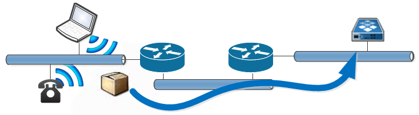

# Broadcast Forwarder

## Overview:
If you have dhcp clients on one network segment, and a dhcp server located somewhere else, you can have the cisco router forward the dhcp broadcast message to the server over a layer 3 network.

 

This will work for any layer-2 broadcast message, not just DHCP requests, and it is accomplished with the `ip helper-address` command.

This command will encapsulate a layer 2 broadcast message into a layer 3 UDP package and unicast forward it to a servers IP address. 

## ip helper-address
The ip helper-address command is specific to an interface, and should be bound only to interfaces with hosts that will submit broadcast messages that you want forwarded. 

## Basic Example:
The following example allows hosts on the fa0/1 interface (on the 10.1.1.0/24 network) to get dhcp services from a remote server with the IP address of 10.0.2.131

```
interface fa0/1
  ip address 10.1.1.1 255.255.255.0
  ip helper-address 10.0.2.131
!
```

### Enabling/Disabling Protocols:
IP helper does not forward ALL broadcast messages by default.  If running in default mode, it only will only forward the following 8 protocols:

Service                     | Port
----------------------------|------
Time                        | 37
TACACS                      | 49
DNS                         | 53
BOOTP/DHCP Server           | 67
BOOTP/DHCP Client           | 68
TFTP                        | 69
NetBIOS name service        | 137
NetBIOS datagram service    | 138


If you want to change the defaults, either by adding or deleting them, you would do that with the global `ip forward-protocol` command as such.

```
no ip forward-protocol udp 137
no ip forward-protocol udp 138
ip forward-protocol udp 321
!
interface fa0/1
  ip address 10.1.1.1 255.255.255.0
  ip helper-address 10.0.2.131
!
```

Here we are disabling forwarding of the NetBios protocols, and enabling the udp  port 321.

### Unicast or directed broadcast:
You can send ip helper messages to a single host, multiple hosts, or all hosts on a different segment.  When you send messages to more then one host, all messages go to all hosts, you can not focus some types of protocols to some servers, and other types to others.

#### Forwarding to a single host:

This is done as show in the previous example.  There is simply one ip helper address for each segment. 

```
interface fa0/1
  ip address 10.1.1.1 255.255.255.0
  ip helper-address 10.0.2.131
!
```

#### Forwarding to multiple hosts:

If you have two servers that need broadcast messages forwarded to them, you would have two ip helper commands for each interface.  This might be needed if you had one server that was the DHCP server, and another that was handling NetBIOS messaging.  You can not direct specific packets to specific servers, so your DHCP server will get all dhcp messages as well as netbios, and the NetBIOS server will get all netbios as well as all dhcp messages. 

```
interface fa0/1
  ip address 10.1.1.1 255.255.255.0
  ip helper-address 10.0.2.131
  ip helper-address 10.2.3.241
!
```

#### Forwarding to all hosts on a segment:

You can send all your broadcast messages to be broadcasted to a different network.  This might be helpful if you setup one segment where you would put all of your servers that would support all of your broadcast type services.  To do this, you would set the IP address of the ip helper address to the broadcast IP, and enable IP directed broadcasts on that specific interface. 

```
interface fa0/1
  ip address 10.1.1.1 255.255.255.0
  ip helper-address 10.0.2.255
interface fa0/2
  ip address 10.0.2.1 255.255.255.0
  ip directed-broadcast
!
```

Where fa0/2 is the interface with the servers, where the broadcast messages should be reproduced.

## References:
- [Cisco IOS DHCP Relay Agent Support for Unnumbered Interfaces](http://www.cisco.com/en/US/docs/ios/12_1t/12_1t2/feature/guide/dt_dhcpu.html): Cisco IOS Software Release 12.1T
- [Configuring DHCP](http://www.cisco.com/en/US/docs/ios/12_2/ip/configuration/guide/1cfdhcp.html#wp1010278): Cisco IOS IP Configuration Guide, Release 12.2
- [Helper Addresses](http://www.ciscopress.com/articles/article.asp?p=330807&seqNum=9): CCNP 1: Advanced Routing Companion Guide (Cisco Networking Academy Program), 2nd Edition
- RFC's: 
  - [951](http://tools.ietf.org/html/rfc951) Bootstrap Protocol (bootp), 
  - [1542](http://tools.ietf.org/html/rfc1542) Clarification and Extensions of the Bootstrap Protocol, 
  - [2131](http://tools.ietf.org/html/rfc2131) Dynamic Host Configuration Protocol, 
  - [2132](http://tools.ietf.org/html/rfc2132) DHCP Options and Bootp Vendor Extensions. 