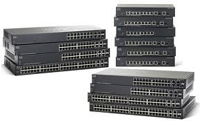

# Cisco Small Business 300 Series Managed Switches

 

## Overview:
The Cisco 300 series switches are basically linksys switches with an (almost) ios interface. 

When you get one out of the box, make sure to check the os version.  It might ship with a 1.0 version, but IOS-like support only is available for version 1.1 and above.

## Start Clean
- [L2 or L3 devices](300-l2-or-l3-devices.md).  They can act as a simple switch or have some routing functionality.  you can set this right at the beginning.  
- [Password Reset](300-password-reset.md).  how to break in when poop happens
- [Virginise the System](300-virginise-the-system.md): Its like a nice clean bath for the switch.
- [Upgrade the switch](300-upgrade-the-switch.md): how to stick a new config on the system.
- [RS232 Settings](300-rs232-settings.md): what to set your serial link

## Configuring the switches:
- [Creating VLANs](300-creating-vlans.md): How to make an new one. 
- [Assigning VLANs](300-assigning-vlans.md) on trunks or as default on an interface.  
- [Save the Changes](300-save-the-changes.md): How to save your config changes on the switch. 
- [Enabling SNMP/Syslog](300-enabling-snmpsyslog.md): How to get your switch to be pollable, and to send logging data out.
- [Port Mirroring and SPAN ports](300-port-mirroring-and-span-ports.md): how to tap the switches to monitor network traffic

## References:
- [Cisco Small Business 300 Series Managed Switch Administration Guide Release 1.1](http://www.cisco.com/en/US/docs/switches/lan/csbms/sf30x_sg30x/administration_guide/78-19308-01.pdf)  (pdf) 
- [Cisco Small Business 300 Series Command Line Interface Administration Guide Release 1.1](http://www.cisco.com/en/US/docs/switches/lan/csbms/sf30x_sg30x/administration_guide/CLI_300_1.1.pdf) (pdf)
- [300 config builder](bin/cisco300Builder.xlsx): excel spreadsheet for quickly making configs for multiple switches