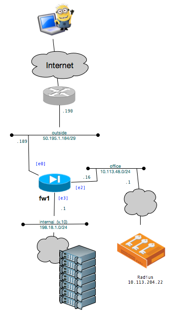

# Client VPN with Radius Auth

## Overview: 
Cisco ASA is used as a VPN concentrator allowing users on the internet to connect into the corporate network, and have access to the inside networks.  Authentication is done via an external RADIUS server who the ASA auths to.  



## Virginize the firewall
Start with a clean firewall by doing the following: 

```
write erase
reload
```

## Base Config: 
This is the base configs required to get the firewall to work.  

```
conf t
! 
# 1. Define the vlans: 
interface vlan 501
 des Internet
 nameif outside
 security-level 0
 ip address 50.195.1.189 255.255.255.248
interface vlan 10
 des internal network
 nameif inside
 security-level 70
 ip address 198.18.1.1 255.255.255.0
interface vlan 48
 des backend
 nameif office
 security-level 71
 ip address 10.113.48.16 255.255.255.0
! 
# 2. Define the interfaces
int e0/0
 des Internet 
 switchport access vlan 501
 no shut
int e0/3
 des internal network 
 switchport access vlan 10
 no shut
int e0/2
 des access to radius systems
 switchport access vlan 48
 no shut
! 
# 3. Define the routes: 
route outside 0 0 50.195.1.190 
route office 10.0.0.0 255.0.0.0 10.113.48.1
route office 192.168.30.0 255.255.255.0 10.113.48.1 1
!
# 4. Include some ACLs: 
access-list outside-in extended permit icmp any any
access-group outside-in in interface outside 
!
object network SITENET
 subnet 198.18.1.0 255.255.255.0
 description test network
access-list outside-in remark basic acl
access-list outside-in extended permit icmp any any 
access-list VPNable_routes standard permit 198.18.1.0 255.255.255.0 
!
icmp permit any inside
icmp permit any office
!
# 5. host config
hostname fw1
domain-name imprivata.com
enable password DPTRntgiI3hbGopW encrypted
ntp server 18.7.63.43
!
dns domain-lookup inside
dns domain-lookup office
dns domain-lookup outside
dns server-group DefaultDNS
 name-server 10.113.32.121
 domain-name imprivata.com
!
# 6. Include a base admin account
username techops password r1WtfJc1TuYOz8.g encrypted privilege 15
username techops attributes
 service-type admin
!
# 7. Allow SSH access to firewall
ssh 10.0.0.0 255.0.0.0 office
ssh 192.168.30.0 255.255.255.0 office
ssh timeout 30
management-access office
crypto key generate rsa modulus 2048
end
```

## VPN Configs: 
The following will take the firewall and allow it to be a vpn concentrator that auth's to a radius server.  

```
conf t
# 1. IKE: 
crypto ikev2 remote-access trustpoint testsetup-ca
!
crypto ikev1 enable outside
crypto ikev1 policy 10
 authentication crack
 encryption aes-256
 hash sha
 group 2
 lifetime 86400
!
# 2. Crypto ACLs
# n/a
!
# 3. Transform Sets: 
crypto ipsec ikev1 transform-set ESP-AES-256-MD5 esp-aes-256 esp-md5-hmac
# 4. IPSec Client Setups: 
crypto dynamic-map DEFAULT_CRYPTO_MAP 65535 set ikev1 transform-set ESP-AES-256-MD5 ESP-3DES-MD5 ESP-DES-SHA ESP-DES-MD5
!
crypto map outside_map 65535 ipsec-isakmp dynamic DEFAULT_CRYPTO_MAP
crypto map outside_map interface outside
!
# 5. Object Groups: 
object network SITENET
 subnet 198.18.1.0 255.255.255.0
 description test network
!
# 6. VPN Pool: 
ip local pool vpnclient2lan 198.18.1.41-198.18.1.43 mask 255.255.255.0
!
# 7. VPN Access ACL: 
#    n/a
!
# 8: VPN Route ACL: 
access-list VPNable_routes standard permit 198.18.1.0 255.255.255.0
!
# 9 Auth Servers: 
aaa-server ConfirmID-test protocol radius
aaa-server ConfirmID-test (office) host 10.113.204.22
 timeout 60
 key easypeasy
 authentication-port 1812
 accounting-port 1813
!
# 10. Group Policy: 
group-policy GroupPolicy1 internal
group-policy GroupPolicy1 attributes
 vpn-tunnel-protocol ssl-client   
 split-tunnel-policy tunnelspecified
 split-tunnel-network-list value VPNable_routes
!
# 11. Tunnel Group: 
tunnel-group labfw-aaa-test type remote-access
tunnel-group labfw-aaa-test general-attributes
 authentication-server-group ConfirmID-test
 default-group-policy GroupPolicy1
 address-pool vpnclient2lan
tunnel-group labfw-aaa-test webvpn-attributes
 group-alias ConfirmID-labfw enable
 group-url https://50.195.1.189 enable
!
# 12. User Accounts: 
# n/a
!
# 13. Double NAT for VPN Pool: 
!
# 14. anyconnect clients
webvpn
 anyconnect image flash:/anyconnect-win-2.5.2014-k9.pkg 1
 anyconnect image flash:/anyconnect-macosx-i386-2.5.2014-k9.pkg 2
 anyconnect image flash:/anyconnect-linux-2.5.2014-k9.pkg 3
 enable outside
 anyconnect enable
 tunnel-group-list enable
!
# 15. Allow asdm access to firewall: 
http server enable 
http 10.0.0.0 255.0.0.0 office 
asdm image flash:/asdm-711-52.bin
aaa authentication http console LOCAL 
end
```

## Overview of the above configs:

1. Phase 1 configuration
2. ACL's to block access to the firewall
3. crypto sets for phase 1
4. phase 2 encryption
5. aliases or groups to summarise networks 
6. internal IP addresses to be given out for vpn clients 
7. block access to where clients can go
8. list of internal routes given to clients
9. the radius server and how to connect to it
10. defines that the tunnel will be split, and to use the routes defined in #8
11. tunnel group that binds everything together.  
    1. the group-alias is the name that will show up when you vpn in *if* you have more than one group defined for that address.  (see below)
    2. general attributes links the group policy (10), auth server (9), and the vpn pool (6)
12. no need for user accounts (other then the local admin account created in the base account), since all the users are auth'ed via radius
13. add in double nats as needed
14. when you connect with the anyconnect client, you need to define what clients can connect and make sure that you have the correct images on the vpn.  They will download to the client if they don't have the newest client. 
15. allows web access and the ability to run the asdm client. 


Confirming the anyconnect clients in step #14.  If you don't have any clients, or want to upgrade any of the clients, just copy the newest versions into flash, and then repoint in the configs.  

```
fw1# show flash                            
--#--  --length--  -----date/time------  path
  136  27260928    Feb 25 2016 07:57:44  asa901-k8.bin
  137  24827904    Feb 08 2017 10:02:40  asa846-k8.bin
  138  2048        Jan 01 1980 00:00:00  FSCK0000.REC
  139  17790720    Feb 25 2016 08:01:00  asdm-711-52.bin
    2  2048        Feb 25 2016 08:02:48  log
    5  2048        Feb 25 2016 08:03:06  crypto_archive
  142  4096        Jan 01 1980 00:00:00  FSCK0001.REC
  143  12998641    Feb 25 2016 08:08:00  csd_3.5.2008-k9.pkg
  144  2048        Feb 25 2016 08:08:02  sdesktop
  165  1462        Feb 25 2016 08:08:02  sdesktop/data.xml
  145  6487517     Feb 25 2016 08:08:08  anyconnect-macosx-i386-2.5.2014-k9.pkg
  146  6689498     Feb 25 2016 08:08:12  anyconnect-linux-2.5.2014-k9.pkg
  147  4678691     Feb 25 2016 08:08:18  anyconnect-win-2.5.2014-k9.pkg

128573440 bytes total (26972160 bytes free)
fw1# 
```

## Creating a VPN client template
You can create the xml config that will automatically be pushed to all the clients after the first time they connect to the VPN.    This is done within the ASDM client.

under Configuration (1), Remote Access VPN (2), select Network (client) Access (3) and AnyConnect Client Profile (4).  Then select the Add (5) button to create a new client profile 


The profile name (1) describes the new profile that we will create.  


When you complete the profile page, Apply (1) the change, and select edit (2) to make further changes to that profile.  


Then within the AnyConnect Client Profile (1) select Server List (2) and select add (3) to define the external IP/DNS name/url of the firewall.


The hostname (1) is the name that users will see from the anyconnect client, and the Host Address (2) is the IP or url to connect to when  they select it.  


Confirm that the new profile is created (1) and select ok (2) to save.  


Then again select the profile (1) and select Change Group Policy (2) to further modify.  


From the available Group Policies (1) window, select the applicable groups, enable (2) them and confirm that they are properly placed in the Selected Group Policies (3) window, and then save by pressing ok (4) 


In the main window select Apply (1) and then in the main menu, select Save (2) to push the configs to the firewall.  


## Debugging: 
Confirming that users are authorising: 

```
fw1# sh vpn-sessiondb anyconnect 
Session Type: AnyConnect
Username     : chuck                  Index        : 9
Assigned IP  : 198.18.1.41            Public IP    : 19.14.14.13
Protocol     : AnyConnect-Parent SSL-Tunnel DTLS-Tunnel
License      : AnyConnect Premium
Encryption   : RC4 RC4 AES128         Hashing      : SHA1 SHA1 SHA1
Bytes Tx     : 19438                  Bytes Rx     : 5538
Group Policy : GroupPolicy1           Tunnel Group : labfw-aaa-test
Login Time   : 13:13:03 UTC Tue Feb 14 2017
Duration     : 0h:00m:10s
Inactivity   : 0h:00m:00s
NAC Result   : Unknown
VLAN Mapping : N/A                    VLAN         : none
fw1# 
```

Confirming the version of the anyconnect clients:

```
fw1# sh run webvpn 
webvpn
 enable outside
 anyconnect image disk0:/anyconnect-win-2.5.2014-k9.pkg 1
 anyconnect image disk0:/anyconnect-macosx-i386-2.5.2014-k9.pkg 2
 anyconnect image disk0:/anyconnect-linux-2.5.2014-k9.pkg 3
 anyconnect profiles lab-2fa-test disk0:/lab-2fa-test.xml
 anyconnect enable
 tunnel-group-list enable
fw1# 
```

Testing the radius server and user auth: 

```
fw1# test aaa authentication ConfirmID-test host 10.1.2.2                 
Username: chuck
Password: *********
INFO: Attempting Authentication test to IP address <10.1.2.2> (timeout: 62 seconds)
INFO: Authentication Successful
fw1# 
```

