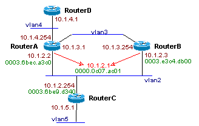
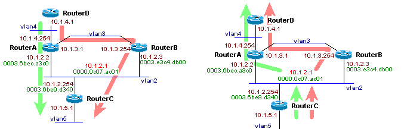
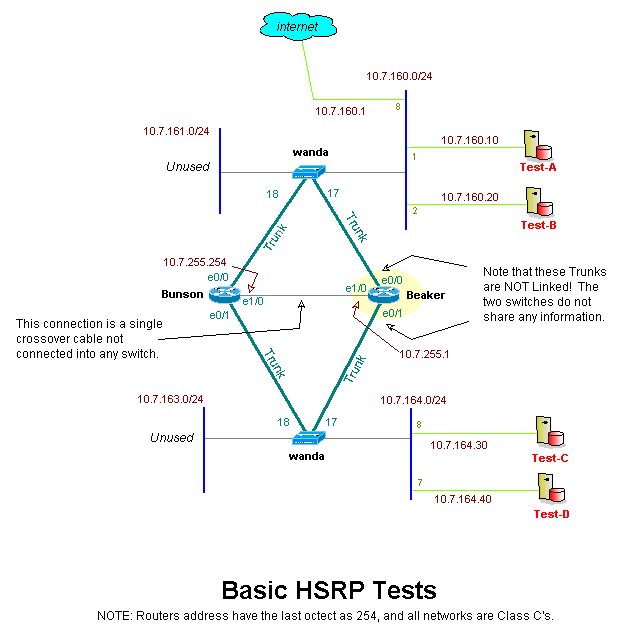
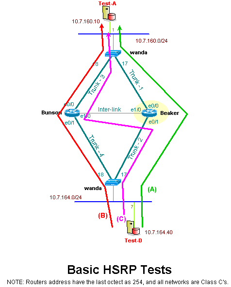

# HSRP and Weighted Static Routes

## Overview:
This lab explores two different basic routing topics, Weighted Static Routes and HSRP.With weighted static routes, we can have two different static routes to one destination, but they have different weights, or preferences. The first route is weighed less, and is the preferred route. If the primary route goes away (switch/link failure) then the secondary route, with the larger weight is used.

With Hot Standby Routing Protocol, or HSRP, we create a single ip that is shared between routers on a shared segment (broadcast domain). One router is assigned a higher priority and thus gets to accept traffic for that shared ip. If that router or routers interface goes down, then the other router takes over, and accepts traffic destined for that address.

## Network Layout:
In the general layout, we are sending icmp from router D to the backside interface on router C.

The preferred static route to RouterC is only through routerA (`int fa0/0.4`). On the return trip, traffic from routerC goes to the HSRP shared ip, 
```
standby 1 ip 10.1.2.1
standby 1 timers 1 4
standby 1 priority 200
standby 1 preempt
standby 1 authentication BLABLA
standby 1 track fa0/0.3 75
```
which is managed by router A, thus the return trip only goes through RouterA as well.

If there is a link failure on routerA's interface connected to vlan2 (10.1.2.2), then traffic to router C will go through routerB first via the higher weighed static route (`encapsulation dot1Q 4`). On the return trip, router B will be managing the shared hsrp ip 
```
standby 1 ip 10.1.2.1
standby 1 timers 1 4
standby 1 priority 150
standby 1 preempt
standby 1 authentication BLABLA
standby 1 track fa0/0.3 75
```
thus traffic will flow through B as well on the return trip.

## Wiring Diagram 
This is the wiring diagram for the network. The green numbers are the mac addresses for the interfaces (used below in sniffing data), and the red IP is the HSRP shared IP.



## System Configs
The following are the configs on the four cisco routers. The red text are configs that are directly related to HSRP or static routes.

### Router A

```
hostname routerA
logging on
logging buffered
!
int fa0/0
no shut
!
int fa0/0.2
encapsulation dot1Q 2
ip address 10.1.2.2 255.255.255.0
standby 1 ip 10.1.2.1
standby 1 timers 1 4
standby 1 priority 200
standby 1 preempt
standby 1 authentication BLABLA
standby 1 track fa0/0.3 75
!
int fa0/0.3
encapsulation dot1Q 3
ip address 10.1.3.1 255.255.255.0
!
int fa0/0.4
encapsulation dot1Q 4
ip address 10.1.4.254 255.255.255.0
!
ip route 10.1.5.0 255.255.255.0 10.1.2.254
ip route 10.1.5.0 255.255.255.0 10.1.3.254 2
!
```

### Router B

```
hostname routerB
logging on
logging buffered
!
int fa0/0
no shut
!
int fa0/0.2
encapsulation dot1Q 2
ip address 10.1.2.3 255.255.255.0
standby 1 ip 10.1.2.1
standby 1 timers 1 4
standby 1 priority 150
standby 1 preempt
standby 1 authentication BLABLA
standby 1 track fa0/0.3 75
!
int fa0/0.3
encapsulation dot1Q 3
ip address 10.1.3.254 255.255.255.0
!
ip route 10.1.5.0 255.255.255.0 10.1.2.254
ip route 10.1.5.0 255.255.255.0 10.1.3.1 2
ip route 0.0.0.0 0.0.0.0 10.1.3.1
!
```

### Router C

```
hostname routerC
!
int fa0/0
no shut
!
int fa0/0.2
encapsulation dot1Q 2
ip address 10.1.2.254 255.255.255.0
!
int fa0/0.5
encapsulation dot1Q 5
ip address 10.1.5.1 255.255.255.0
!
ip route 0.0.0.0 0.0.0.0 10.1.2.1
!
```

### Router D

```
hostname routerD
!
int fa0/0
no shut
!
int fa0/0.4
encapsulation dot1Q 4
ip address 10.1.4.1 255.255.255.0
!
ip route 0.0.0.0 0.0.0.0 10.1.4.254
!
```

## Test Results

### Expected Traffic Flows
As mentioned above, the traffic from D to C will go through A if there are no problems with the network (as shown in the Green Line). The static route on routerA (`ip route 10.1.5.0 255.255.255.0 10.1.2.254`) to router C has a default weight is 1, and thus is higher then the static route to routerB (`ip route 10.1.5.0 255.255.255.0 10.1.3.254 2`).

The return route from C to D only goes though RouterA also, because RouterA "owns" the HSRP ip 10.1.2.1, since it has a higher HSRP standby priority (`standby 1 priority 200`) then the priority on routerB (`standby 1 priority 150`)

 

If the vlan2 interface goes down on RouterA, then traffic will follow the red line, and use the higher weighed static route (`ip route 10.1.5.0 255.255.255.0 10.1.3.254 2`) to routerC.

On the return trip, router B will "own" the HSRP ip 10.1.2.1, and thus traffic will flow up through routerB to get to D.

## Examining Traffic
The following data was recorded from vlan2 as traffic was traveling between RouterD (10.1.4.1) and routerC (10.1.5.1). 
### Sniff output from VLAN2

```
! -- Before RouterAs .2 interface went down
14:56:56.842076 0:3:6b:ec:a3:c0 0:3:6b:e9:d3:40 ip 114: 10.1.4.1 > 10.1.5.1: icmp: echo request 
14:56:56.843061 0:3:6b:e9:d3:40 0:0:c:7:ac:1 ip 114: 10.1.5.1 > 10.1.4.1: icmp: echo reply 
14:56:56.845513 0:3:6b:ec:a3:c0 0:3:6b:e9:d3:40 ip 114: 10.1.4.1 > 10.1.5.1: icmp: echo request 
14:57:02.724762 0:3:6b:ec:a3:c0 0:3:e3:c4:db:0 ip 114: 10.1.4.1 > 10.1.5.1: icmp: echo request 
! -- After RouterAs .2 interface went down
14:57:02.726425 0:3:e3:c4:db:0 0:3:6b:e9:d3:40 ip 114: 10.1.4.1 > 10.1.5.1: icmp: echo request 
14:57:02.727448 0:3:6b:e9:d3:40 0:0:c:7:ac:1 ip 114: 10.1.5.1 > 10.1.4.1: icmp: echo reply 
14:57:02.732694 0:3:e3:c4:db:0 0:3:6b:e9:d3:40 ip 114: 10.1.4.1 > 10.1.5.1: icmp: echo request 
14:57:02.733621 0:3:6b:e9:d3:40 0:0:c:7:ac:1 ip 114: 10.1.5.1 > 10.1.4.1: icmp: echo reply 
14:57:02.737789 0:3:e3:c4:db:0 0:3:6b:e9:d3:40 ip 114: 10.1.4.1 > 10.1.5.1: icmp: echo request 
14:57:02.738751 0:3:6b:e9:d3:40 0:0:c:7:ac:1 ip 114: 10.1.5.1 > 10.1.4.1: icmp: echo reply
```

Lines 
```
! -- Before RouterAs .2 interface went down
14:56:56.842076 0:3:6b:ec:a3:c0 0:3:6b:e9:d3:40 ip 114: 10.1.4.1 > 10.1.5.1: icmp: echo request 
14:56:56.843061 0:3:6b:e9:d3:40 0:0:c:7:ac:1 ip 114: 10.1.5.1 > 10.1.4.1: icmp: echo reply 
14:56:56.845513 0:3:6b:ec:a3:c0 0:3:6b:e9:d3:40 ip 114: 10.1.4.1 > 10.1.5.1: icmp: echo request 
14:57:02.724762 0:3:6b:ec:a3:c0 0:3:e3:c4:db:0 ip 114: 10.1.4.1 > 10.1.5.1: icmp: echo request 
```
show the traffic flowing through routerA (green MAC) to routerC. When RouterA's vlan2 interface is shutdown, traffic then must travel through RouterB (red MAC) before it gets to C, as show in lines:
```
! -- After RouterAs .2 interface went down
14:57:02.726425 0:3:e3:c4:db:0 0:3:6b:e9:d3:40 ip 114: 10.1.4.1 > 10.1.5.1: icmp: echo request 
14:57:02.727448 0:3:6b:e9:d3:40 0:0:c:7:ac:1 ip 114: 10.1.5.1 > 10.1.4.1: icmp: echo reply 
14:57:02.732694 0:3:e3:c4:db:0 0:3:6b:e9:d3:40 ip 114: 10.1.4.1 > 10.1.5.1: icmp: echo request 
14:57:02.733621 0:3:6b:e9:d3:40 0:0:c:7:ac:1 ip 114: 10.1.5.1 > 10.1.4.1: icmp: echo reply 
14:57:02.737789 0:3:e3:c4:db:0 0:3:6b:e9:d3:40 ip 114: 10.1.4.1 > 10.1.5.1: icmp: echo request 
14:57:02.738751 0:3:6b:e9:d3:40 0:0:c:7:ac:1 ip 114: 10.1.5.1 > 10.1.4.1: icmp: echo reply
```

Note that since the static routes are not evenly weighted, traffic is NOT load balanced between them, rather it is sent to one route or the other.


## Lab Setup
HSRP, or Hot Standby Routing Protocol, is a protocol enabled on a router that allows two routers to work in a failover mode. Thus, if one router breaks down, then the second can take over, preventing a traffic outage.

In the most simple example, two routers share a single IP and MAC, and when the primary router breaks, the second router assumes the role of the primary.

Cisco's website discusses this very well, so I will refrain from a more detailed discussion, and instead refer you to their site "http://www.cisco.com/univercd/cc/td/doc/cisintwk/ics/cs009.htm".

Rather than going into details of how HSRP works and how to use it, we will instead, discuss how it was setup in a lab, and what it did.

 

### Bunson's configs: 

```
hostname Beaker
!
interface FastEthernet0/0
 description trunk to wayne
 no ip address
 duplex auto
 speed auto
!
interface FastEthernet0/0.160
 encapsulation isl 160
 ip address 10.7.160.253 255.255.255.0
 no ip redirects
 standby 1 timers 1 4
 standby 1 priority 150 preempt
 standby 1 authentication chuck
 standby 1 ip 10.7.160.254
 standby 1 track Fa0/1.164 100
!
interface FastEthernet0/0.161
 encapsulation isl 161
 ip address 10.7.161.254 255.255.255.0
 no ip redirects
 no cdp enable
!
interface FastEthernet0/1
 description trunk to wanda
 no ip address
 duplex auto
 speed auto
!
interface FastEthernet0/1.163
 encapsulation isl 163
 ip address 10.7.163.254 255.255.255.0
 no ip redirects
!
interface FastEthernet0/1.164
 encapsulation isl 164
 ip address 10.7.164.253 255.255.255.0
 no ip redirects
 standby 1 timers 1 4
 standby 1 priority 150 preempt
 standby 1 authentication chuck
 standby 1 ip 10.7.164.254
 standby 1 track Fa0/0.160 100
!
interface Ethernet1/0
 description router-router link
 ip address 10.7.255.254 255.255.255.0
!
ip route 0.0.0.0 0.0.0.0 10.7.160.1
ip route 0.0.0.0 0.0.0.0 10.7.255.1 150
!
```

### Beaker's configs: 

```
hostname Bunson
!
interface FastEthernet0/0
 description link to wayne
 no ip address
 duplex auto
 speed auto
!
interface FastEthernet0/0.160
 encapsulation isl 160
 ip address 10.7.160.252 255.255.255.0
 no ip redirects
 standby 1 timers 1 4
 standby 1 priority 140 preempt
 standby 1 authentication chuck
 standby 1 ip 10.7.160.254
 standby 1 track Fa0/1.164 100
!
interface FastEthernet0/0.161
 description outside test network
 encapsulation isl 161
 ip address 10.7.161.252 255.255.255.0
 no ip redirects
!
interface FastEthernet0/1
 description link to wanda
 no ip address
 duplex auto
 speed auto
!
interface FastEthernet0/1.163
 encapsulation isl 163
 ip address 10.7.163.252 255.255.255.0
 no ip redirects
!
interface FastEthernet0/1.164
 encapsulation isl 164
 ip address 10.7.164.252 255.255.255.0
 no ip redirects
 standby 1 timers 1 4
 standby 1 priority 140 preempt
 standby 1 authentication chuck
 standby 1 ip 10.7.164.254
 standby 1 track Fa0/0.160 100
!
interface Ethernet1/0
 description router-router link
 ip address 10.7.255.1 255.255.255.0
!
ip route 0.0.0.0 0.0.0.0 10.7.160.1
ip route 0.0.0.0 0.0.0.0 10.7.255.254 150
```

### Examples of fail overs

 

## References:
- [Understanding and Troubleshooting HSRP Problems in Catalyst Switch Networks](http://www.cisco.com/c/en/us/support/docs/ip/hot-standby-router-protocol-hsrp/10583-62.html): Cisco, May, 2009