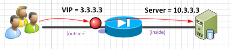
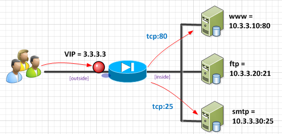

# Inbound NATing

For inbound traffic, we will use NATting so that the one external VIP address maps exactly to one internal IP of a server or load balancer. 

## Basic 1-1 Natting:

All traffic to the VIP 3.3.3.3 goes to actual internal webserver 10.3.3.3



"Static" is the buzz word here.  It lets the pix know that that this is a 1-1 inbound vip.  Also "(inside,outside)" is also important because it tells the pix that the VIP is still on the outside interface, and to relate it with traffic on the inside interface.

```
object network WWW
  host 10.3.3.3
  nat (inside,outside) static 3.3.3.3
```

## NAT/PAT Thingie...

Not sure what to call this, but it is really useful.  If you want to break out your FTP, mail and web servers into different servers on the backend, but want to keep everything all on the same public VIP, we can tell the PIX to route to different servers based on the incoming ports. 



Note that the "service http http" format relates to "service {server_port} {vip_port}" allowing you to switch ports around in transit.  (In this case, we are keeping things the same, which is why the port is repeated.)

```
object network WWW
  host 10.3.3.10
  nat (inside,outside) static 3.3.3.3 service tcp http http
object network FTP
  host 10.3.3.20
  nat (inside,outside) static 3.3.3.3 service tcp ftp ftp
object network MAIL
  host 10.3.3.30
  nat (inside,outside) static 3.3.3.3 service tcp smtp smtp
```
