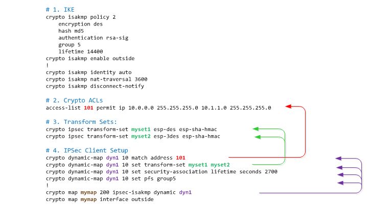
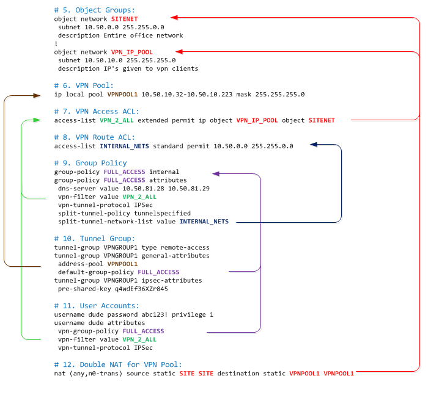

# IPSEC VPN Client Setup

- [IPSEC VPN Client Setup](#ipsec-vpn-client-setup)
  - [IKE Setup](#ike-setup)
  - [Define ACL's for the Crypto Maps](#define-acls-for-the-crypto-maps)
  - [Create the Crypto Transform Sets:](#create-the-crypto-transform-sets)
  - [IPSEC Client Setup](#ipsec-client-setup)
  - [Object Group](#object-group)
  - [VPN Pool](#vpn-pool)
  - [Access List for Accounts:](#access-list-for-accounts)
  - [Access List for VPN Policy:](#access-list-for-vpn-policy)
  - [Group Policy](#group-policy)
  - [Tunnel Group](#tunnel-group)
  - [User Accounts](#user-accounts)
  - [Double Nat Statements for VPN Pool](#double-nat-statements-for-vpn-pool)
    - [Viewing the Pre shared key in the config file](#viewing-the-pre-shared-key-in-the-config-file)
  - [Cisco Client Setup:](#cisco-client-setup)
  - [Debugging](#debugging)
    - [Monitoring VPN Sessions](#monitoring-vpn-sessions)
    - [Monitoring SSH Sessions](#monitoring-ssh-sessions)
  - [References:](#references)


The breakout of the configs, and how they relate to each other is outlined here: 



<br>



##  IKE Setup
An example of a IKE setup is as follows.  You can have many versions of the policies, each is numbered (this one is numbered "2"), and the lower the number the higher the priority (first) to be used or matched against.

```
crypto isakmp policy 2
    encryption des
    hash md5
    authentication rsa-sig
    group 5
    lifetime 14400
crypto isakmp enable outside
!
crypto isakmp identity auto
crypto isakmp nat-traversal 3600
crypto isakmp disconnect-notify
```

Review of the IKE commands are
- Encryption method: `aes`, `ase-192`, `aes-256`, `des`, or `3des`.  "des" is not used anymore as it has already been hacked.
- Hash algorithm: `md5`, or `sha`.  
- Authentication method is `pre-share`, `crack`, or `rsa-sig`  
- [diffie-helman](http://en.wikipedia.org/wiki/Diffie%E2%80%93Hellman_key_exchange) group identifier can be `1`, `2` or `5`.  group 1 has been cracked and should not be used anymore.  
- The SA lifetime (in seconds), with the default of 1 day (`86400` seconds)
- Enabling the firewall to listen to ISAKMP traffic on the outside interface
- The peer identity method could be `address`, `hostname`, `key-id`, `id-string`, or `auto`.
- "NAT-T lets IPsec peers establish a connection through a NAT device. It does this by encapsulating IPsec traffic in UDP datagrams, using port 4500, thereby providing NAT devices with port information. NAT-T auto-detects any NAT devices, and only encapsulates IPsec traffic when necessary. This feature is disabled by default." The keep alive range is from `10` to `3600` seconds with the default being `20` seconds.  
- You can ensure that clients are alerted to being disconnected with the disconnect-notify command. 

## Define ACL's for the Crypto Maps

```
access-list 101 permit ip 10.0.0.0 255.255.255.0 10.1.1.0 255.255.255.0
```

## Create the Crypto Transform Sets:

```
crypto ipsec transform-set myset1 esp-des esp-sha-hmac
crypto ipsec transform-set myset2 esp-3des esp-sha-hmac
crypto ipsec transform-set aes_set esp-md5-hmac esp-aes-256
```

## IPSEC Client Setup

```
crypto dynamic-map dyn1 10 match address 101
crypto dynamic-map dyn1 10 set transform-set myset1 myset2
crypto dynamic-map dyn1 10 set security-association lifetime seconds 2700
crypto dynamic-map dyn1 10 set pfs group5
crypto map mymap 200 ipsec-isakmp dynamic dyn1
crypto map mymap interface outside
```

- You can optionally include an acl, to define what traffic should be encrypted or not
- Define what transform sets are allowed on this dynamic crypto map
- you can optionally define the max life of the SA.  this is either in `seconds` or in `kilobytes`.
- You can also optionally ask for PFS when requesting new SA's.  PFS types are `group1`, `group2`, `group5` and `group7`. (In IPsec negotiations, Perfect Forward Secrecy (PFS) ensures that each new cryptographic key is unrelated to any previous key. Either enable or disable PFS on both the tunnel peers, otherwise the L2L IPsec tunnel is not established in PIX/ASA.)
- create a static crypto map (mymap200) and refernce the the dynamic map (dyn1)

## Object Group

```
object network SITENET
 subnet 10.50.0.0 255.255.0.0
 description Entire office network
!
object network VPN_IP_POOL
 subnet 10.50.10.0 255.255.255.0
 description IP's given to vpn clients
```

## VPN Pool

```
ip local pool VPNPOOL1 10.50.10.32-10.50.10.223 mask 255.255.255.0
```

## Access List for Accounts:

```
access-list VPN_2_ALL extended permit ip object VPN_IP_POOL object SITENET
```

## Access List for VPN Policy:

```
access-list INTERNAL_NETS standard permit 10.50.0.0 255.255.0.0
```

## Group Policy

```
group-policy FULL_ACCESS internal
group-policy FULL_ACCESS attributes
 dns-server value 10.50.81.28 10.50.81.29
 vpn-filter value VPN_2_ALL
 vpn-tunnel-protocol IPSec
 split-tunnel-policy tunnelspecified
 split-tunnel-network-list value INTERNAL_NETS
```

## Tunnel Group

```
tunnel-group VPNGROUP1 type remote-access
tunnel-group VPNGROUP1 general-attributes
 address-pool VPNPOOL1
 default-group-policy FULL_ACCESS
tunnel-group VPNGROUP1 ipsec-attributes
 pre-shared-key q4wdEf36XZr845
```

## User Accounts

```
username dude password abc123! privilege 1
username dude attributes
 vpn-group-policy FULL_ACCESS
 vpn-filter value VPN_2_ALL
 vpn-tunnel-protocol IPSec
```

## Double Nat Statements for VPN Pool
nat (any,n0-trans) source static SITE SITE destination static VPNPOOL1 VPNPOOL1

### Viewing the Pre shared key in the config file

Normally if you do a sh run, you will only view the stared out version of the keys. 

```
pixfirewall#show running-config
[...]
tunnel-group mytunnel ipsec-attributes
 pre-shared-key *
[...]
```

To see the keys, you need to view the config with the "more system" command:

```
pixfirewall#more system:running-config
[...]
tunnel-group mytunnel ipsec-attributes
 pre-shared-key cisco
[...]
```

## Cisco Client Setup:
(what do you enter where in the client software)

## Debugging

### Monitoring VPN Sessions
```
sh vpn-sessiondb
sh vpn-sessiondb remote (IPSec Remote VPN Clients)
sh vpn-sessiondb l2l (L2L Tunnels)
sh vpn-sessiondb svc (SSL VPN / Anyconnect Clients)
```

### Monitoring SSH Sessions

```
sh ssh sessions (show users connected to ASA via SSH)
```

## References:
- [Cisco ASA 5500 Series Command Reference, 8.3](http://www.cisco.com/en/US/customer/docs/security/asa/asa83/command/reference/cmdref.html)   
- [Cisco ASA 5500 Series Configuration Guide using the CLI, 8.3](http://www.cisco.com/en/US/docs/security/asa/asa83/configuration/guide/config.html)   