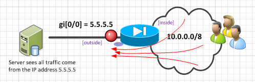
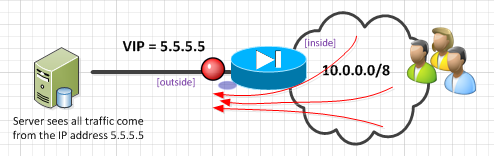

# Outbound PATing
Firewall's are not normally transparent.  That is, normal they hide the IP's on one side from the devices on the other.  For example the office network has a private 10/8 network, and all there traffic is hidden between a few IP's on their firewall. There are two ways of "hiding" the IP's and that is either through NAT (network address translation) or PAT (port address translation). 

The following section covers how to setup different PAT methods on the new cisco pix/asa version 8.3 OS (which is different then the previous versions). 

## PAT on Outside Interface

You can simply have all outbound traffic appear to come from the IP address of the firewalls external interface.  The good part of this is that you don't need to burn up any additional external IP's, the bad part is that you don't want ~too~ much traffic to go through this, as you only have ~65,000 different flows that can be translated over one interface.  (it all has to be PATted over one of the 65K ports.)



Having all corporate traffic (10.0.0.0/8) network all appear to come from the outside interface is done with the following command:

```
object network BIG_PAT
  subnet 10.0.0.0 255.0.0.0
  nat (inside,outside) dynamic interface
```

## PAT with IP Overflow:

The above example is good unless you have too many users on the inside network.  When that happens, the single outside interface gets overloaded, and runs out of spare ports to use to PAT traffic with.  In that case, it's good to have a few IP's to use instead off just the single firewall external IP. 


Here, rather then using the variable "interface" we use the object "VIPS".

```
object network VIPS
  range 6.6.6.4 6.6.6.7
object network PAT_ROLLOVER
  subnet 10.0.0.0 255.0.0.0
  nat (inside,outside) dynamic VIPS
```

## PAT on one VIP

Maybe you don't want to use the interface for the outbound traffic, or maybe you don't want to do the overflow either.  Or maybe you want to do all the above, each for different internal networks.  Well either way, you can also have all outbound traffic pat to ONE specific VIP: 



The only difference here, is that you specify the VIP ip address instead of using the key word "interface" or using a object like "VIPS".

```
object network VIP_PAT
  subnet 10.0.0.0 255.0.0.0
  nat (inside,outside) dynamic 5.5.5.5
```
