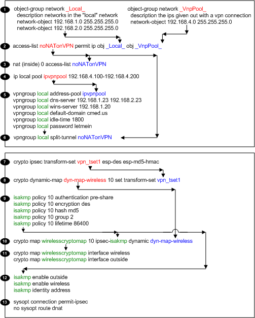

# Setting up your PIX as a VPN Server
The goal in this HowTo is to setup a pix firewall as a vpn server that can be connected to via any laptop properly configured running cisco's vpn client software.

- [Setting up your PIX as a VPN Server](#setting-up-your-pix-as-a-vpn-server)
  - [Get SSH working](#get-ssh-working)
    - [Get 3DES installed](#get-3des-installed)
    - [Enable sshd on Pix](#enable-sshd-on-pix)
    - [ssh To the Pix](#ssh-to-the-pix)
  - [Setting up VPN (client - pix)](#setting-up-vpn-client---pix)
    - [Define Object groups with ACL](#define-object-groups-with-acl)
    - [NATs and IP Pools](#nats-and-ip-pools)
    - [Defining the VpnGroup](#defining-the-vpngroup)
    - [Define Encryption Types](#define-encryption-types)
    - [Define VPN Client Encryption Polices](#define-vpn-client-encryption-polices)
    - [Define Crypto Maps](#define-crypto-maps)
    - [Allow Specific Traffic to Pix](#allow-specific-traffic-to-pix)


## Get SSH working
First step is to simply get sshd working on your pix. With this you will be able to ssh to the pix rather then accessing it through telnet. The sshd suite also needs to be configured and installed properly before the pix can encrypt/decrypt vpn sessions.

### Get 3DES installed
You will first want to get 3DES installed on the pix. This is a rather simple process. You need to go to a cisco webpage, enter in your pixes serial number, and your email address. They will send you a new activation key with you then need to install into your pix.

So first log into your pix and get your serial number.

Get Serial #
```
01  ! -- view the pixes serial #
02  pixfirewall# sh ver
03  
04  Cisco PIX Firewall Version 6.3(1)
05  
06  [...]
07  
08  Serial Number: 123456789 (0x75bcd15)
09  Running Activation Key: 0x12345678 0x123456781 0x12345678 0x12345678
10  Configuration last modified by enable_15 at 12:54:16.272 UTC Fri Jul 4 2003
11  pixfirewall#
```

Then go to cisco's [Customer Registration](http://www.cisco.com/cgi-bin/Software/FormManager/formgenerator.pl) page, and apply for the 3DES Activation Key for your pix. In a few minutes, they will email you a new registration key.

The email will include some links for how to install the key, but if you are running 6.x code, it is really simple. In this case, while you are in conf t, enter the new activation key with the activation-key command.

Enter Activation Key for pixos >6.0
```
01  ! -- entering activation key on pixos 6.x
02  pixfirewall# conf t
03  pixfirewall(config)# activation-key 12345 12345 12345 12345 12345
```

### Enable sshd on Pix
Once the pix has a good activation key, then we can enable ssh on it.

First off, we need to make sure that we have a password and enable password set, then we need to set a domain for the pix, and finally you need to create a rsa key and save it.

Config sshd
```
01  ! -- entering activation key on pixos 6.x
02  pixfirewall# conf t
03  pixfirewall(config)# passwd letmein
04  pixfirewall(config)# enable password dude!letmein
05  pixfirewall(config)# domain-name cmed.us
06  pixfirewall(config)# ca generate rsa key 1024
07  For <key_modulus_size> >= 1024, key generation could
08    take up to several minutes. Please wait.
09  Keypair generation process begin.
10  Success.
11  
12  pixfirewall(config)# ca save all
13  ! -- allow ssh access
14  pixfirewall(config)# ssh 192.168.1.0 255.255.255.0 inside
15  pixfirewall# wr mem
16  Building configuration...
17  Cryptochecksum: 12345678 12345678 12345678 12345678
18  [OK]
```


### ssh To the Pix
In this example, we setup 3DES encryption, so when you ssh to the pix, use protocol ssh1, and cipher 3DES. You will also need to set the user as "pix", and the password as you low level password (in this example, it would be "letmein").

Using a standard unix ssh app, you could simply enter: ssh pix@pix.cmed.us (assuming that your pix has a dns record pix.cmed.us). More explicitly, you could enter: ssh -c 3des -1 pix@pix.cmed.us.

## Setting up VPN (client - pix)
There are a bunch of configs that need to be made to get the pix to work as a vpn server. You need to create special ACL's, special NAT groups, and ip pools and configs for the vpn clients, as well as configuring the crypto, and isakmp settings as well. This chapter will go through all those steps, hopefully in a way that is clear and easy to understand.

The diagram below outlines the 14 steps necessary to configure th pix properly. It is laid out in such a way to show how the different commands are associated with each other.

The following chapter will be presented in this fashion in hopes to be easier to follow.

In the diagram, the red text defines variable, the blue text is calling those variables, and the green text are groups being defined and called.



The following sections will delve more into each section, but here is a very brief overview.:

1. Define Object Groups - This allows us to make "aliases" for networks, so rather then referring to a network using it's IP, we can refer to it by its object group name. (makes things easier to read.)
2. ACL for VPN ip's - Create an ACL that allows traffic from all internal hosts to the ip's given to each vpn connection.
3. Allow traffic to VPN - Allow outbound traffic out according to the ACL, and do not nat traffic
4. Define IP Pool - This specifies the group of ip's that will be given to all vpn connections.
5. Define VPN Client Attributes - As a newly created vpn client is created, it needs to be given info about the new network that it has connected to.
6. Allow Split Tunnel - Allows traffic to go either through tunnel, or out normal ethernet connection.
7. Transform Set - Define a transform set for a crypto ipsec tunnel
8. Dynamic Map - Define a dynamic crypto map
9. Create isakmp policy -
10. Define the crypto map -
11. Link Crypto Map to interfaces -
12. Link isakmp to interfaces -
13. Allow multiprotocols - allow both encrypted and non-encrypted traffic to pass through firewall interfaces without needing specific access lists.

Note that sections 1-6 are mostly about how the client and firewall will link together, where as sections 7-13 are how the firewall will encrypt/decrypt traffic between between it and the client.

### Define Object groups with ACL
Object groups are this great way to simplify you acl in pixos. They allow you to refer to a set of hosts, networks, or protocols, with a single variable or phrase. This can make your acl's smaller and much more easy to read.

In this step we are defining two different object groups and then using them with an ACL. The first group "_Local_" is all the networks behind the firewall. This is both the networks on the inside interface, and the ones on the "web" interface. The second group "_VpnPool_" are all the possible ips that would be given out to hosts as they receive vpn connections.

When we create the ACL, our ID number can also be a name, so to make referring back to it easier, we can label it something that makes it easier to remember what it is.

Object Groups + ACL
```
2a01  ! -- (1) Define the object groups
2a02   object-group network _Local_
2a03     description networks in the "local" network
2a04     network-object 192.168.1.0 255.255.255.0
2a05     network-object 192.168.2.0 255.255.255.0
2a06   object-group network _VnpPool_
2a07     description ips given out with a vpn connection
2a08     network-object 192.168.4.0 255.255.255.0
2a09  ! -- (2) Specify the ACL
2a10  access-list noNATonVPN permit ip obj _Local_ obj _VnpPool_
```


### NATs and IP Pools
These are two separate but simple basic steps that I am grouping together. The first step is to create a cisco nat command that will allow traffic to leave an interface, and the second step creates an ip pool so the vpn server will know what ips to give out for the vpn clients.

Cisco NAT statements are away for pixes to globally allow traffic out a specific interface. In our example, they are allowing traffic to leave the inside interface, as long as it matches the "noNATonVPN" ACL. This nat statement is also part of the "0" group, which specifies that all traffic on this nat will not be PATed. (yea, cisco made the wording a bit confusing.) This means that traffic leaving the nat statement will retain it's ip information, rather then the source ip being changed to an ip on the firewall.

The local ip pool simply defines the ip range that the pix vpn server should give to new vpn sessions when they are established. When a vpn client connects to the vpn server, it is connecting with some random, outside ip address. The vpn server then needs to give it another ip that refers to traffic traveling to and from it's vpn connection. This defined ip pool is what the pix uses to get these ip's.

NAT + Local Pool
```
2a11  ! -- (3) Define nat 
2a12  nat (inside) 0 access-list noNATonVPN
2a13  ! -- (4) Define local ip pool 
2a14  ip local pool ipvpnpool 192.168.4.100-192.168.4.200
```


### Defining the VpnGroup
When a client connects to the vpn server and a vpn tunnel is created, it needs to know a few things about the network it is connecting to. The

VPNGroup
```
2a15  ! -- (5) 
2a16  vpngroup home address-pool ipvpnpool
2a17  vpngroup home dns-server 192.168.1.23 63.200.115.40
2a18  vpngroup home wins-server 192.168.1.20
2a19  vpngroup home default-domain cmed.us
2a20  vpngroup home idle-time 1800
2a21  vpngroup home password vpn-home-ass
2a22  ! -- (6) 
2a23  vpngroup home split-tunnel noNATonVPN	
```


### Define Encryption Types

```
2a24  ! -- (7) Phase 2 encryption type
2a24  crypto ipsec transform-set vpn_tset1 esp-des esp-md5-hmac
2a24  ! -- (8) 
2a24  crypto dynamic-map dyn-map-wireless 10 set transform-set vpn_tset1
```


### Define VPN Client Encryption Polices

```
2a01  ! -- (9) ISAKMP Policy for 3000 VPN client running 3.0 code
2a24  #  isakmp policy 10 encryption 3des
2a24  isakmp policy 10 authentication pre-share
2a24  isakmp policy 10 encryption des
2a24  isakmp policy 10 hash md5
2a24  isakmp policy 10 group 2
2a24  isakmp policy 10 lifetime 86400
```


### Define Crypto Maps

```
2a01  ! -- (10) 
2a02   crypto map wirelesscryptomap 10 ipsec-isakmp dynamic dyn-map-wireless
2a01  ! -- (11) Binding the IPSec engine on the outside interface
2a24  crypto map wirelesscryptomap interface wireless
2a24  crypto map wirelesscryptomap interface outside
```


### Allow Specific Traffic to Pix

```
2a01  ! -- (12) Enabling ISAKMP key-exchange
2a24  isakmp enable outside
2a24  isakmp enable wireless
2a24  isakmp identity address
2a01  ! -- (13) The sysopt command avoids conduit on the IPSec encrypted traffic
2a24  sysopt connection permit-ipsec
2a24  no sysopt route dnat
```

