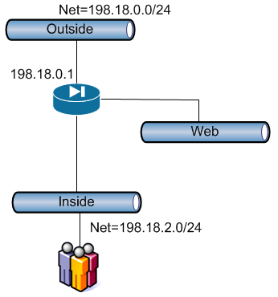
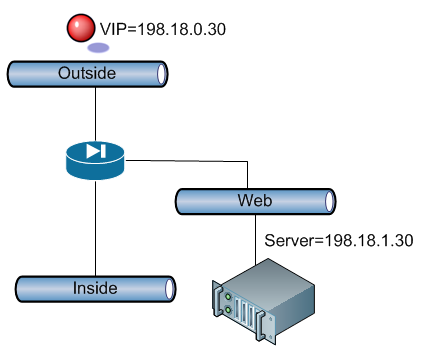

# Basic Pix Config

- [Basic Pix Config](#basic-pix-config)
  - [Configure the interfaces](#configure-the-interfaces)
    - [Notes](#notes)
  - [Allow the Traffic:](#allow-the-traffic)
    - [Outbound PAT's](#outbound-pats)
    - [Inbound NAT's](#inbound-nats)
  - [Define General Standards:](#define-general-standards)
  - [References:](#references)


## Configure the interfaces
- First define the port settings (100 full/auto/etc),
- then name the interfaces, and set their security zones (100= secure, 0= dmz)
- Then define the mtu's for the interfaces
- And finally specify the IP's and masks for each interface.

```
interface ethernet0 100full
interface ethernet1 100full
interface ethernet2 100full
interface ethernet3 auto shutdown
interface ethernet4 auto shutdown
interface ethernet5 auto shutdown
nameif ethernet0 outside security0
nameif ethernet1 inside security100
nameif ethernet2 wireless security50
nameif ethernet3 web security60
nameif ethernet4 intf4 security20
nameif ethernet5 intf5 security25
mtu outside 1500
mtu inside 1500
mtu wireless 1500
mtu web 1500
mtu intf4 1500
mtu intf5 1500
ip address outside 198.18.0.254 255.255.255.0
ip address inside 198.18.1.1 255.255.255.0
ip address web 198.18.2.1 255.255.255.0
no ip address intf3
no ip address intf4
no ip address intf5
```

### Notes

for ip address settings, other then static ip's you can also set the interface to pickup an IP via dhcp, and can also set it to be the def route via the command

```
ip address outside dhcp setroute
```

You'll also need to add a route statement like such:

```
route outside 0.0.0.0 0.0.0.0 198.18.0.1 1
```

## Allow the Traffic:

### Outbound PAT's
To allow (unestablished) traffic outbound you need to use the global and nat statements. 



```
! Define id "2"  to the outside interface
global (outside) 2 interface
! Define source net, and bind to id "2"
nat (inside) 2 198.18.2.0 255.255.255.0 0 0
```

In the global statement, the "interface" variable states that all outbound traffic will use the defined "outbound" interface IP for all outbound traffic.  (in this case 198.18.0.254)

In the nat statement, we are allowing all traffic from 198.18.2.0/24 into the "inside" interface, and let it go out any global interfaces bound to the "2" id.

### Inbound NAT's
To allow the traffic inward, you need to allow the route with a static command, and then allow the traffic with what was the conduit command, but is now an ACL bound to an interface.  So for the following example, our outside pix interface has a vip ip of 198.18.0.30, and we want to allow web traffic to the webserver with the ip of 198.18.1.30.



```
! Allow outside to route to web
static (web,outside) tcp 198.18.0.30 www 198.18.1.30 www netmask 255.255.255.255 0 0
! Define alias:
object-group service _PORTS-WWW_ tcp
 port-object eq www
 port-object eq https
! Define ACL
access-list world-in permit tcp any host 198.18.0.30 object-group _PORTS-WWW_
access-list world-in permit icmp any any
! Bind ACL to interface
access-group world-in in interface outside
```

The access-group binds the ACL "world-in" to the outside interface, with the vip 198.18.0.30.

The access-list is titled "world-in", and it allows any TCP source from the outside interface through with ports defined in the alias "_PORTS-WWW_"

The static command allows routes between the outside interface on vip 198.18.0.30 to the web interface on 198.18.1.30

The rules read this way:
```
         /----to domain
         |     /----from domain
         |     |      /--- proto
         |     |      |      /--- vip ip
         |     |      |      |        /---vip port
         |     |      |      |        |       /--- dest ip
         |     |      |      |        |       |       /---dest port
         |     |      |      |        |       |       |               /--- only 1 vip thus /32
         |     |      |      |        |       |       |               |
static (web,outside) tcp 198.18.0.30 www 198.18.1.30 www netmask 255.255.255.255 0 0

                /--- ACL name
                |                     /--- interface to apply acl on
     *          |     *    *          |
access-group world-in in interface outside

               /--- ACL Name
               |       /--- (permit/deny)
               |       |     /--- proto allowed
               |       |     |   /-- source address
               |       |     |   |               /--- dest vip ip
               |       |     |   |               |                   /--- dest port
               |       |     |   |               |                   |                             
access-list world-in permit tcp any host 198.18.0.30  object-group _PORTS-WWW_
```

## Define General Standards:

```
enable password EfdfdfdsklQkipa encrypted
passwd 6V6kdfsdoijoF encrypted
hostname pix520
domain-name chuck.com
pager lines 24
logging on
logging timestamp
logging standby
logging buffered warnings
logging facility 19
ip audit info action alarm
ip audit attack action alarm
pdm history enable
arp timeout 14400
timeout xlate 3:00:00
timeout conn 1:00:00 half-closed 0:10:00 udp 0:02:00 rpc 0:10:00 h225 1:00:00
timeout h323 0:05:00 mgcp 0:05:00 sip 0:30:00 sip_media 0:02:00
timeout uauth 0:05:00 absolute
snmp-server host inside 198.18.1.31 poll
no snmp-server location
no snmp-server contact
snmp-server community c1d413210a8e4d9e
no snmp-server enable traps
no floodguard enable
sysopt connection permit-ipsec
service resetinbound
telnet timeout 5
ssh 198.18.2.0 255.255.255.0 inside
ssh timeout 15
console timeout 0
terminal width 80
```

## References:

- Cisco's Pix Tech Notes](http://www.cisco.com/en/US/products/hw/vpndevc/ps2030/prod_configuration_examples_list.html): Lots of different examples and notes on how to config pixes.
- PixOS v6.3 Config Guide](http://www.cisco.com/en/US/docs/security/pix/pix63/configuration/guide/config.html): Specific notes on v6.3
- Pix 500 Overview Page](http://www.cisco.com/en/US/products/hw/vpndevc/ps2030/tsd_products_support_eol_series_home.html):