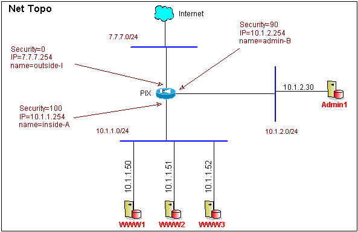

# Example PIX Layout

## Overview
Say you have a network layout as such



So all the webpages are on the servers on 'inside-A', and all the traffic goes between 'outside-I' and 'inside-A'. We also have admin servers on 'admin-B' that need to get to 'inside-A'. But no traffic should be able to get to or from 'admin-B' from the internet. Here's how the configs would have to be setup on the PIX:

## PIX Config
```
:  defining the security levels of the interfaces on the pix
nameif ethernet0 outside-I security0
nameif ethernet1 inside-A security100
nameif ethernet2 admin-B security90

:  Defining the ip's of the interfaces on the pix
ip address outside-I 7.7.7.254 255.255.255.0
ip address inside-A 10.1.1.254 255.255.255.0
ip address admin-B 10.1.2.254 255.255.255.0


:  defining the PAT rules on the pix
:   (this would be for allowing 'A' to go out to 'I' and 'B') 
:   (higher security to lower  security)
global (outside-I) 2 7.7.7.10 netmask 255.255.255.0
global (admin-B) 2 10.1.2.10 netmask 255.255.255.0
nat (inside-A) 2 0.0.0.0 0.0.0.0


:  Defining the NAT rules on the pix
:   (this would be how 'I' gets to 'A' (lower security to higher security)
static (inside-A,outside-I) 7.7.7.50 10.1.1.50 netmask 255.255.255.255
static (inside-A,outside-I) 7.7.7.51 10.1.1.51 netmask 255.255.255.255
static (inside-A,outside-I) 7.7.7.52 10.1.1.52 netmask 255.255.255.255

conduit permit tcp 7.7.7.50 255.255.255.255 eq www any
conduit permit tcp 7.7.7.51 255.255.255.255 eq www any
conduit permit tcp 7.7.7.52 255.255.255.255 eq www any

:   (this would be how 'B' gets to 'A' (lower security to higher security)
static (admin-B,outside-I) 10.1.2.50 10.1.1.50 netmask 255.255.255.255
static (admin-B,outside-I) 10.1.2.51 10.1.1.51 netmask 255.255.255.255
static (admin-B,outside-I) 10.1.2.52 10.1.1.52 netmask 255.255.255.255

conduit permit tcp 10.1.2.50 255.255.255.255 eq www any
conduit permit tcp 10.1.2.51 255.255.255.255 eq www any
conduit permit tcp 10.1.2.52 255.255.255.255 eq www any

:  Making sure everything can get to everything
route outside-I 0.0.0.0 0.0.0.0 7.7.7.254
route admin-B 10.1.2.0 255.255.255.0
route inside-A 10.1.1.0 255.255.255.0
```

Note the PAT rules have been defined as such


Note that the NAT rules have been configured as such.


