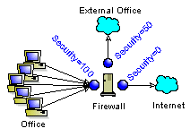

# PIX Theory of Operations

## Daily Maintenance and Changes
Not that a firewall needs to have its configurations changed daily, but the following is the commands you would use to add new hosts to the firewall and how to tighten down security.

The PIX works in a very basic fashion. There are two different concepts that an administrator needs to work with. They both have to do with hiding the IP addresses of hosts on the back side of a firewall. One has to do with grouping a large aggregate of IP's together, and having all their outbound traffic travel out of the firewall as one IP. The other has to do with swapping IP's on either side of a firewall so that connections outside can access a device on the backside, but not go directly to its ip.

These two different concepts are called PATing and NATing.

- Setting up PATing: PAT allows multiple IP's to be mapped to a single IP. This is useful when many hosts need to access the internet with one IP.
- Setting up NATing: NAT allows one IP to be mapped, or redirected, to another IP. This is useful to add security by making it harder to get directly to the server.

## Setting up PATing

### Overview
PAT, or Port Address Translation, is used when you want many hosts one one side of a firewall to look like they are really one host on the other side of the firewall. It is mostly used with an office on one side of the firewall and the internet on the other. This is useful for two reasons. First it saves real IP's, because the entire office can have access to the internet with only one IP. Secondly, it adds security by hiding the original host. All the office's traffic leaves the firewall from the same real ip, thus the destination only sees the address of the firewall, and can not decipher anything beyond that.
The other thing to note about PAT is that it is a "one-way" mux. All the office can go out of the firewall (and their traffic can return back to them), but you can not really have servers on the office side of the firewall, and have them accessible by the internet. (Theoretically this is not true, but for the PIX it is.)


With PAT, the firewall translates both the port and the ip address, and it keeps a table to keep track of these translations.

### Cisco's Implementation
You need to juggle three different values when setting up PAT on a PIX.
- Port Security (nameif)
- Output Rules (global)
- Input Rules (nat)

The PAT rules are separated by input and output rules. This allows us to control what traffic can come into the firewalls PAT rules at multiple interfaces, and what can leave through which firewall interfaces. Port Security sets a more global rule for direction of traffic. Since PATing can only travel from higher security ports to lower, this adds an extra level of security.

#### Port Security (NAMEIF)
First off, the PIX rates interfaces with a security level. You can only setup a PAT from a higher security level to a lower level. This means that the office needs to be connected to an interface on the PIX that has a higher security level than that of the internet. If there are multiple interfaces, and you want to setup a PAT to go out them, all the output ports must be a lower security. For example, say we had a PIX has three interfaces, with the first connected to the office, the second connected to a T1 that links to another branch of the company, and the third to the internet. The first interface would be the highest security and the last would be the lowest. All the traffic going out the second and third interfaces would appear to leave from one ip in each interface. Also no traffic from the other office or the internet could start a connection to anything in the office.



```
nameif ethernet0 outside security0
nameif ethernet1 otheroffice security50
nameif ethernet2 inside security100
```

Here the inside interface, which is connected to the office, has the highest security (100). Because of this we can setup a PAT from it to the lower security interfaces; outside and otheroffice.

#### Output Rules (GLOBAL)
Next, we need to setup what ports will allow PAT traffic out, and what the ip addresses will be that the traffic will come from. With this command we setup a "PAT group" called a nat_id. Each group is defined by a number from 1 to two million. We also need to specify the port that the traffic will leave from. This is done by specifying the PIX's interface's name. Finally we need to specify an IP that all the PATed traffic will flow out through, and the subnet mask for that IP on its network. This just needs to be a dedicated IP that the PIX can clam on the interface that is named and the subnet mask on that interface. An example of this would be the following.
```
global (outside) 1 64.14.82.1 netmask 255.255.255.0
global (otheroffice) 1 10.10.1.1 netmask 255.255.255.0
global (otheroffice) 2 10.10.1.2 netmask 255.255.255.0
```

Here we have setup two different "PAT groups" (1 and 2). Group (1) can go out both the outside interface and the otheroffice interface. Group (2) can go out only the otheroffice interface and NOT the outside interface. This might be useful if you want to prevent some hosts from being able to access the internet. We also specify what IP address the traffic should flow out through, and the subnet mask that IP address should have.

#### Input Rules (NAT)
Finally, we need to define what interfaces and hosts or networks the firewall will accept traffic to be PATed, and also what "PAT group" to send that traffic to. The traffic from the office networks will all enter the Firewall on an interface. We need to specify what interface will be looking for traffic to be PATed. We also can specify what IP addresses are allowed to go to different "PAT groups". Thus we can allow all of the office PC's to go out to the internet, but the database servers can not, by only allowing the office PC to one "PAT group" and the DB servers to the other "PAT group". An example of this is as follows:
nat (inside) 1 192.168.1.0 255.255.255.0
nat (inside) 2 0.0.0.0 0.0.0.0

This sets up two nat groups that are both listening for traffic on the inside interface. Group 1 will only accept traffic from the ip addresses 192.168.1.0-255, but Group 2 will allow everything. Once the traffic is put into a group, then the ports that it can leave from are defined above with the GLOBAL command.

#### Final Example Configuration
The total configuration would be for the example mentioned for PATing, would look like this.
```
nameif ethernet0 outside security0
nameif ethernet1 otheroffice security50
nameif ethernet2 inside security100
#
global (outside) 1 64.14.82.1 netmask 255.255.255.0
global (otheroffice) 1 10.10.1.1 netmask 255.255.255.0
global (otheroffice) 2 10.10.1.2 netmask 255.255.255.0
#
nat (inside) 1 192.168.1.0 255.255.255.0
nat (inside) 2 0.0.0.0 0.0.0.0
```


Note that this is not the only configurations needed on the PIX, but for this example it shows what is needed to make PATing work.

## Setting Up NATing

### Overview
NAT, or Network Address Translation, is use when you want a host to have different IP addresses depending on which side of a firewall it's on. A standard setup would be a website with a public IP address, say 64.14.82.10, and the actual webserver whose ip address is, say 10.7.1.10. No one on the internet can get to the actual webserver since it is using a 10 network*. Instead, a firewall who is on the 64.14.82.0 network, listens to traffic destined to '10. When it see that traffic, it redirects it to the private 10 network.
The public ip address, 64.14.82.10, is not an actual ip on the firewall, instead the firewall just listens for and accepts traffic headed for it. Since this ip address is not the firewalls, it is sometimes called a Virtual IP, or VIP


With NAT, the only thing being translated is the ip address, not the port. The translation between a VIP and the actual server on a private network is a one-to-one translation. Each server has to have its own VIP.

### Cisco's Implementation
Cisco's PIX implements NAT with two commands; the Static and the Conduit commands.
- IP Mapping (static)
- Control Port Access (conduit)

The first command, static, sets up a static ip mapping from one IP to another. This is really the total concept of NATing. Since this is a firewall, there is one more command to add more control to the traffic allowed through the PIX. The second command, conduit, allows restriction to specific ports which are NATed through the static command.

#### IP Mapping (static)
The actual NATing, the redirecting the ip addresses, is done by the static command. While the syntax is a little weird, the concept is pretty simple. You define the global ip and the interface it sits on (the real ip), and you define the local (or private) ip and the interface to use to get to it.
As an example, say we had a firewall with two interfaces, outside and inside. The outside interface had a VIP of 64.14.82.2 setup to redirect traffic through its inside interface to another server with an IP of 10.1.1.2. we would write this as:
```
static (inside, outside) 64.14.84.2 10.1.1.2 255.255.255.0
```


Note that the 255.255.255.0 statement at the end of the command specifies the mask used on the inside interface.

#### Control Port Access (conduit)
To add a little more security to the NATing, we can control what ports are allowed to be NATed, rather that allowing them all through. This is done by setting up "conduits" through the NAT redirections. By default a NAT will not allow any traffic through, so we need to use the conduit command for each NAT created.
The conduit command allows you permit and deny access to either a single or many NATs, as well as for a single or multiple protocols (ports).

As an example, say we have 16 servers on our inside network that have already had NATs created for them. Their VIP's are 64.14.82.16-31. If we wanted them all to accept web traffic from everyone, 64.14.82.16-23 to allow telnet from 10.100.10.*, and only 64.14.82.24 to allow ftp from 10.100.141.11, you would write:

```
conduit permit tcp 64.14.82.16 255.255.255.224 eq www any
conduit permit tcp 64.14.82.16 255.255.255.248 eq telnet 10.100.10.0 255.255.255.0
conduit permit tcp host 64.14.82.24 eq ftp host 10.100.141.11
```


