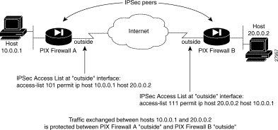

# PIX-PIX VPN

These are some notes on setting up a PIX to PIX IPSec VPN. Much of the text in this document is quoted from other sources, note the references section or the footnotes by the end of the section for credits to the work. Quoted text appears like this.

So far there are two different ways to create a point to point VPN. The first is the more complex, which uses IKE (IPSec Phase 1) to secretly pass keys for further encryption. The second example uses manual created, static keys replacing the normal, dynamic Phase 1 process.

## Configuring IPSec with IKE

The following steps cover minimal IPSec configuration where the IPSec security associations will be established via IKE. IKE is a key management protocol standard that is used in conjunction with the IPSec standard.

IPSec can be configured without IKE, but IKE enhances IPSec by providing additional features, flexibility, and ease of configuration for the IPSec standard.

IKE is a hybrid protocol, which implements the Oakley key exchange and Skeme key exchange inside the ISAKMP framework. (ISAKMP, Oakley, and Skeme are security protocols implemented by IKE.) IKE automatically negotiates IPSec security associations and enables IPSec secure communications without manual pre-configuration.

Specifically, IKE provides these benefits:

- Eliminates the need to manually specify all the IPSec security parameters in the crypto maps at both peers.
- Allows you to specify a lifetime for the IPSec security association.
- Allows encryption keys to change during IPSec sessions.
- Allows IPSec to provide anti-replay services.
- Permits CA support for a manageable, scalable IPSec implementation.
- Allows dynamic authentication of peers.




Configuring IPSec with IKE
```
1a01  conf t
1a02    ! --  Create an access list to define the traffic to protect
1a03    access-list 101 permit ip 10.0.0.0 255.255.255.0 10.1.1.0 255.255.255.0
1a04    !
1a05    ! --  Configure a transform set that defines how the traffic will be protected
1a06    crypto ipsec transform-set myset1 esp-des esp-sha-hmac
1a07    crypto ipsec transform-set myset2 ah-sha-hmac esp-3des esp-sha-hmac
1a08    !
1a09    ! --  Create a crypto map entry
1a10    crypto map mymap 10 ipsec-isakmp
1a11    crypto map mymap 10 match address 101
1a12    crypto map mymap 10 set peer 192.168.1.100
1a13    crypto map mymap 10 set transform-set myset1 myset2
1a14    crypto map mymap 10 set security-association lifetime seconds 2700
1a15    crypto map mymap 10 set pfs group2
1a16    !
1a17    ! --   (Optional) Create a crypto dynamic map
1a24    crypto map mymap 200 ipsec-isakmp dynamicdyn1
1a18    crypto dynamic-map dyn1 10
1a19    crypto dynamic-map dyn1 10 match address 101
1a20    crypto dynamic-map dyn1 10 set peer 192.168.1.102
1a21    crypto dynamic-map dyn1 10 set transform-set myset1 myset2
1a22    crypto dynamic-map dyn1 10 set security-association lifetime 2700 
1a23    crypto dynamic-map dyn1 10 set pfs group1 
1a25    !
1a26    ! --   Apply a crypto map set to the outside interface
1a27    !
1a28    isakmp enable outside
1a29    isakmp policy 20
1a30    isakmp policy 20 encryption des
1a31    isakmp policy 20 hash md5
1a32    isakmp policy 20 authentication rsa-sig
1a33    isakmp policy 20 group2
1a34    isakmp policy 20 lifetime 5000
1a35    !
1a36    crypto map mymap interface outside
1a37    exit
1a38  wr mem 
```

Looking at the above configs, we can describe them a bit better:
- (1a03) the permit keyword causes all traffic that matches the specified conditions to be protected by crypto. 
- (1a06-07) In this example, "myset1" and "myset2" are the names of the transform sets. "myset1" has two transforms defined, while "myset2" has three transforms defined.
- (1a10) a. Create a crypto map entry in IPSec ISAKMP mode: "mymap" is the name of the crypto map set. The map set's sequence number is 10, which is used to rank multiple entries within one crypto map set. The lower the sequence number, the higher the priority.
- (1a11) b. Assign an access list to a crypto map entry: In the example, access-list 101 is assigned to crypto map "mymap."
- (1a12) c. Specify the peer to which the IPSec protected traffic can be forwarded: The security association will be set up with the peer having an IP address of 192.168.1.100. Specify multiple peers by repeating this command.
- (1a13) d. Specify which transform sets are allowed for this crypto map entry. List multiple transform sets in order of priority (highest priority first). You can specify up to six transform sets. In this example, when traffic matches access list 101, the security association can use either "myset1" (first priority) or "myset2" (second priority) depending on which transform set matches the peer's transform set.
- (1a14) e. (Optional) Specify security association lifetime for the crypto map entry, if you want the security associations for this entry to be negotiated using different IPsec security association lifetimes other than the global lifetimes. This example shortens the timed lifetime for the crypto map "mymap 10" to 2,700 seconds (45 minutes). The traffic volume lifetime is not change.
- (1a15) f. (Optional) Specify that IPSec should ask for perfect forward secrecy (PFS) when requesting new security associations for this crypto map entry, or should require PFS in requests received from the peer: This example specifies that PFS should be used whenever a new security association is negotiated for the crypto map "mymap 10." The 1024-bit Diffie-Hellman prime modulus group will be used when a new security association is negotiated using the Diffie-Hellman exchange.
- (1a18) a. Create a dynamic crypto map entry: "dyn1" is the name of the dynamic crypto map set. The map set's sequence number is 10.
- (1a19) b. (Optional) Assign an access list to a dynamic crypto map entry, which determines which traffic should be protected and not protected: In the example, access list 101 is assigned to dynamic crypto map "dyn1."
- (1a20) c. (Optional) Specify the peer to which the IPSec-protected traffic can be forwarded. This is rarely configured in dynamic crypto map entries because dynamic crypto map entries are often used for unknown peers. The security association will be set up with the peer having an IP address of 192.168.1.102. Specify multiple peers by repeating this command.
- (1a21) d. Specify which transform sets are allowed for this dynamic crypto map entry. List multiple transform sets in order of priority (highest priority first). In this example, when traffic matches access list 101, the security association can use either "myset1" (first priority) or "myset2" (second priority) depending on which transform set matches the peer's transform sets.
- (1a22) e. (Optional) Specify security association lifetime for the crypto dynamic map entry, if you want the security associations for this entry to be negotiated using different IPsec security association lifetimes other than the global lifetimes: This example shortens the timed lifetime for dynamic crypto map "dyn1 10" to 2,700 seconds (45 minutes). The time volume lifetime is not changed.
- (1a23) f. (Optional) Specify that IPSec should ask for PFS when requesting new security associations for this dynamic crypto map entry, or should demand PFS in requests received from the peer:
- (1a24) g. Add the dynamic crypto map set into a static crypto map set. Be sure to set the crypto map entries referencing dynamic maps to be the lowest priority entries (highest sequence numbers) in a crypto map set. So first, IKE trys to setup with the crypto map mymap 10, if that doesn't match, then it tries crypto map mymap 200, which is a dynamic mapping. (note that the dynamic mapping only comes to play if the static map will not work; because client does not have a static configured, or not configured properly.)
- (1a29) Identify the policy to create. Each policy is uniquely identified by the priority number you assign.
- (1a30) Specify the encryption algorithm. DES specifies the symmetric encryption algorithm used to protect user data transmitted between two IPSec peers. The default is 56-bit DES-CBC, which is less secure and faster than the alternatives. AES, the Advanced Encryption Standard is introduced with PIX Firewall version 6.3 and supports three different key lengths of 128, 192, 256 bytes. Note NIST Proposes Abandoning DES (.pdf) for stronger encryption techniques.
- (1a31) Specify the hash algorithm used to ensure data integrity. The default is SHA-1. MD5 has a smaller digest and is considered to be slightly faster than SHA-1. There has been a demonstrated successful (but extremely difficult) attack against MD5; however, the HMAC variant used by IKE prevents this attack.
- (1a32) Specify the authentication method used to establish the identity of each IPSec peer. The default, RSA signatures, provide non-repudiation for the IKE negotiation (you can prove to a third party after the fact that you had an IKE negotiation with a specific peer). Pre-shared keys do not scale well with a growing network but are easier to set up in a small network.
- (1a33) Specify the Diffie-Hellman group identifier, which is used by the two IPSec peers to derive a shared secret without transmitting it to each other. The default, Group 1 (768-bit Diffie-Hellman) requires less CPU time to execute but is less secure than Group 2 (1024-bit Diffie-Hellman). Support for Diffie-Hellman Group 5 is introduced with PIX Firewall Version 6.3.1
- (1a34) Specify the security association's lifetime. The default is 86,400 seconds or 24 hours. As a general rule, a shorter lifetime (up to a point) provides more secure IKE negotiations. However, with longer lifetimes, future IPSec security associations can be set up more quickly.
- (1a36) Apply a crypto map set to the outside interface: In this example, the PIX Firewall will evaluate the traffic going through the outside interface against the crypto map "mymap" to determine whether it needs to be protected.


## Configuring Manual IPSec
A manual configuration is nice because it's so easy to setup. Since you are manually defining the keys, we don't need to configure Phase 1 IKE, and thus it reduces the configs. The bad side to this is that it is not as secure, nor is it as easy to scale if needed. Since the keys do not *ever* change (they are defined staticky in the config), if they are guessed or cracked, then the entire encrypted tunnel is now unencryptable. This is different then a standard IKE setup, because the keys are always, automatically, being changed.

The following procedure covers minimal IPSec configuration where the security associations will be established via pre-shared keys.


Configuring Manual IPSec
```
2a01  conf t
2a02    ! -- Create an access list to define the traffic to protect:
2a03    access-list 101 permit ip 10.0.0.0 255.255.255.0 10.1.1.0 255.255.255.0
2a04    !
2a05    ! -- Configure a transform set that defines how the traffic will be protected.
2a06    crypto ipsec transform-set myset3 esp-des esp-sha-hmac
2a07    !
2a08    ! -- Create a crypto map entry in IPSec manual mode:
2a09    crypto map mymaptwo 30 ipsec-manual
2a10    crypto map mymaptwo 30 match address 101
2a11    crypto map mymaptwo 30 set peer 192.186.1.103
2a12    crypto map mymaptwo 30 set transform-set myset3
2a13    crypto map mymaptwo 30 set session-key inbound esp 300 cipher lamekey authenticator opensasame
2a14    crypto map mymaptwo 30 set session-key outbound esp 300 cipher lamerkey authenticator opensasayou
2a15    !
2a16    ! -- Apply a crypto map set to the outside interface:
2a17    crypto map mymaptwo interface outside
2a18    isakmp enable outside
2a19    exit
2a20  wr mem
```

Looking at the above in more detail:

- (2a03) Create an access list to define the traffic to protect: In this example, the keyword permit causes all traffic that matches the specified conditions to be protected by crypto.
- (2a06) Configure a transform set that defines how the traffic will be protected. You can configure only one transform set for manually established security associations. The peer must also have the same transform set specified. In the example, "myset3" is the name of the transform set and two transforms have been defined.
- (2a09) Create a crypto map entry in IPSec manual mode:
- (2a10) Name an IPSec access list. The access list can specify only one permit entry when you are establishing manual security associations.
- (2a11) Specify the peer to which the IPSec protected traffic can be forwarded. Only one peer can be specified when you are establishing manual security associations.
- (2a12) Specify which transform set should be used. This must be the same transform set that is specified in the peer's corresponding crypto map entry.
- (2a13) If the specified transform set includes the ESP protocol, set the ESP SPIs and keys to apply to inbound protected traffic. If the transform set includes an ESP cipher algorithm, specify the cipher keys. If the transform set includes an ESP authenticator algorithm, specify the authenticator keys.
- (2a14) Set the ESP SPIs and keys to apply to inbound protected traffic. If the transform set includes an ESP cipher algorithm, specify the cipher keys. If the transform set includes an ESP authenticator algorithm, specify the authenticator keys.
- (2a17) Apply a crypto map set to the outside interface: In this example, the PIX Firewall will evaluate the traffic going through the outside interface against the "mymaptwo" crypto map to determine whether it needs to be protected.


## References

### Labs; 
- [Lab Example](pix-labbook-vpn-tests.md). Shows how you could test this with 3 routers, 2 pixes and one switch.
### Links: 
- [Configuring IPSec for the PIX Firewall](http://www.cisco.com/en/US/partner/products/sw/secursw/ps2120/products_configuration_guide_chapter09186a008008993c.html). Cicso Online Docs, Nov 05, 2002: 
- [Configuring IPSec and Certification Authorities. Cisco Online Docs](http://cisco.com/univercd/cc/td/doc/product/iaabu/pix/pix_sw/v_63/config/ipsecint.htm), Jul 22 2004: 
- [Configuring IPSec Network Security. Cisco Online Docs](http://www.cisco.com/univercd/cc/td/doc/product/software/ios120/12cgcr/secur_c/scprt4/scipsec.htm), Jul 27 1999.
- [Cisco PIX 500 Series Security Appliances](http://www.cisco.com/en/US/partner/products/hw/vpndevc/ps2030/prod_configuration_examples_list.html). Configuration Examples and TechNotes
- [Cisco PIX Firewall Command Reference, Version 6.3](http://www.cisco.com/en/US/partner/products/sw/secursw/ps2120/products_command_reference_book09186a008017284e.html)
- [Configuring a Simple PIX-to-PIX VPN Tunnel Using IPSec](http://www.cisco.com/en/US/partner/products/hw/vpndevc/ps2030/products_configuration_example09186a0080094761.shtml)
