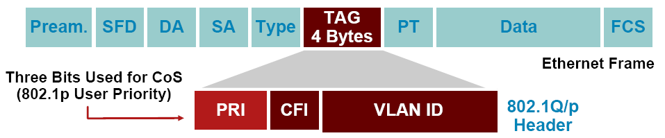
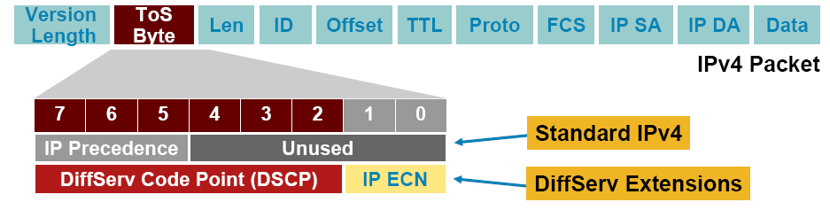

# QoS Theory and Review

- [QoS Theory and Review](#qos-theory-and-review)
  - [Traffic Characteristics that can be Modified by QoS:](#traffic-characteristics-that-can-be-modified-by-qos)
    - [Bandwidth:](#bandwidth)
      - [QoS Tools Affecting Bandwidth:](#qos-tools-affecting-bandwidth)
      - [Commands:](#commands)
    - [Delay:](#delay)
      - [QoS Tools Affecting Delay:](#qos-tools-affecting-delay)
    - [Jitter](#jitter)
      - [QoS Tools Affecting Jitter:](#qos-tools-affecting-jitter)
    - [Packet Loss](#packet-loss)
      - [QoS Tools Affecting Packet Loss](#qos-tools-affecting-packet-loss)
  - [Classification and Marking:](#classification-and-marking)
    - [Layer 2 Ethernet 802.1Q Class of Service](#layer-2-ethernet-8021q-class-of-service)
    - [Layer 3 IP Precedence and DiffServ Code Points](#layer-3-ip-precedence-and-diffserv-code-points)

## Traffic Characteristics that can be Modified by QoS:
"Money and sex, storage and bandwidth: Only too much is ever enough."  - [Arno Penzias](http://en.wikipedia.org/wiki/Arno_Allan_Penzias)

There are four basic traffic characteristics that IP QoS can affect:
1. Bandwidth
2. Delay
3. Jitter
4. Packet Loss

### Bandwidth:
Bandwidth, physical link speed, or clock rate describes how many bits you can jam through the link within an amount of time.  Note that you need to consider this from source to destination, so if you have gig speeds throughout your net, but then you travel across a T1 at the WAN, then your max bandwidth would be the T1.  (assuming that your the only one on the link.)

#### QoS Tools Affecting Bandwidth:

- Compression: Reduces either headers or overall packet, reducing the amount of data needing to be sent. (thus increasing overall bandwidth)
- CAC (Call Admission Control): Prevents traffic saturation by rejecting too many voice or video calls.  (thus preventing flatling, and ruining all traffic flows).
- Queuing: Giving priority to some flows, and thus providing more "apparent bandwidth" to specific applications.  While torquing everyone else.

#### Commands:

- `clock rate`: Defines the layer1 bit rate (in bps) on some serial links. 
- `bandwidth`:  Describes the bandwidth on an interface.  This does not affect the actual bandwidth directly, but can be used by other protocols, like EIGRP for routing decisions.

### Delay:
It's all about delay.  We enable QoS to prevent delay, but what QoS really does is ~smooth~ delay, while increasing it for some flows.  When a packet goes from one side of the network to the other, there are tons of different ways that that packet can be delayed.  Here is a list and explanation of them.

1. Serialization Delay (fixed): Time it takes the entire packet to be serialized onto a link.  (ie: time it takes to stick a packet on a link).  It can be computed as serialization_delay = (#bits_sent) / (link_speed).  Thus a 125-byte packet on a fastE interface takes .01ms to serialize, or on a 56k line it would take 17.86ms.
2. Propagation Delay (fixed): Time it takes to push a bit from one side of a link to another.  Speed_over_fiber = (length_in_meters)/(3.0x10^8 or Speed_over_Coper m/s) = (length_in_meters)/(2.1x10^8 m/s)
3. Queuing Delay (variable): Delay while a packet is in a router sitting in a queue, waiting for it's turn to be put on an interface. This could be longer based on how many queues are setup, and how deep they are. 
4. Forwarding/Processing Delay (variable): How long it takes a router/switch to process, or switch a packet from an input interface to an output queue.  This is not an interface-interface metric, and Queuing and Shaping would also affect this.
5. Shaping Delay (variable): Slows down traffic by buffering and preventing traffic spikes.  This will prevent dropped packets, which could increase overall network performance.
6. Network Delay (variable): The unknown delay over a "network".  Normally, this would be WAN or internet delays.  This would be considered the delay from the "big cloud" that is not within our control.
7. Codec Delay (fixed): Time it takes the signal to be encoded or decoded.
8. Compression Delay (variable): Time it takes to compress the data.  Normally you need to fill up a queue with data, and then squish or compress it.  

#### QoS Tools Affecting Delay:
- Queuing (scheduling): Order packets so that the time-sensitive traffic gets higher priority on the links.
- Link Fragmentation and Interleaving: Splits larger packets into smaller ones, reducing overall wait times in the queues.
- Compression: Squish the header or entire packet to reduce overall size
- Traffic Shaping: Increase delays and reduce traffic spikes, thus lowering drops within a WAN cloud.

### Jitter
Jitter is the delta of time between multiple packets being sent.  Ideally, all packets would arrive the same amount of time between each other.  When this is not the case, the difference in times is called the jitter.

#### QoS Tools Affecting Jitter:
- Queuing (scheduling): increase delay on other packets, so that jitter sensitive traffic can get priority on the link, thus reducing it's jitter.  (and increasing it for everyone else.)
- Link Fragmentation and Interleaving: Splits larger packets into smaller one, thus allowing more even queuing, and reducing the priority queued traffic's jitter.
- Compression: Squish the header or entire packet to reduce overall size, thus reducing packet size and getting the same affect as link fragmentation and interleaving.
- Traffic Shaping: Increasing overall delay, but leveling it such that the jitter is reduced.  (also preventing drops which would increase jitter.)

### Packet Loss
Routers drop packets for a bunch of different reasons, form filling queues to errors in the data.   QoS has the ability to reduce packet loss by controlling the amount of data loss in full queues.

When a large

#### QoS Tools Affecting Packet Loss
- RED (Random Early Detection):

## Classification and Marking:

### Layer 2 Ethernet 802.1Q Class of Service

Class of Service Markings:
CoS tag | Definition
---|----
7 | Reserved
6 | Routing
5 | Voice
4 | Video
3 | Call Signaling
2 | Critical Data
1 | Bulk Data
0 | Best Effort Data

### Layer 3 IP Precedence and DiffServ Code Points

- IPv4: Three most significant bits of ToS byte are called IP Precedence (IPP) other bits unused
- DiffServ: Six most significant bits of ToS byte are called DiffServ Code Point (DSCP) remaining two bits unused for flow control
- DSCP is backward compatible with IP precedence.

