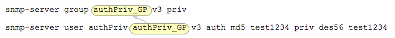
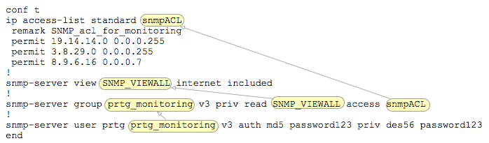

# Setting up SNMP

## SNMP v.2c
the "community" is the password, and you would poll it this way.  

```
cisco(config)# snmp-server community mtZtMfYktUY8 RO snmp-access
cisco(config)# no snmp-server community private RW
!
cisco(config)# ip access-list standard snmp-access
cisco(config-std-nacl)# remark SNMP_acl_for_monitoring
cisco(config-std-nacl)#  permit 10.50.32.0 0.0.0.255
cisco(config-std-nacl)#  permit 10.50.33.123
```

See [testing snmp via unix](../../OS/unix/snmp.md). 

## SNMP v3: 

### Basic setup: 
You create (1) an  ACL list to control access to the snmp daemon, then (2) a group with access to the entire mib, and then (3) a user 

```
! - 1. create ACL: 
ip access-list standard snmpACL
 remark SNMP_acl_for_monitoring
 permit 19.14.14.0 0.0.0.255
 permit 3.8.29.0 0.0.0.255
 permit 8.9.6.16 0.0.0.7
!
! - 2. define group: 
snmp-server group prtg_monitoring v3 priv 
!
! - 3. define user: 
snmp-server user prtg prtg_monitoring v3 auth md5 password123 priv des56 password123
snmp-server ifindex persist
```

Where: 
- `prtg` is the username
- `prtg_monitoring` is the group
- `password123` is my super secret password

Notice how the group name is linked between user and group: (where group is "`authPriv_GP`")



To test this setup run the following command: (note that you need to enter in the password twice (one for auth, one for encryption))

```
macLaptop ~ $ snmpwalk -v3 -u prtg -A password123 -l authPriv -a MD5 -x DES -X password123 19.14.14.24 | more

SNMPv2-MIB::sysDescr.0 = STRING: Cisco IOS Software, C2900 Software (C2900-UNIVERSALK9-M), Version 15.2(3)T4, RELEASE SOFTWARE (fc2)
Technical Support: http://www.cisco.com/techsupport
Copyright (c) 1986-2013 by Cisco Systems, Inc.
Compiled Wed 04-Sep-13 15:00 by prod_rel_team
SNMPv2-MIB::sysObjectID.0 = OID: SNMPv2-SMI::enterprises.9.1.1045
DISMAN-EVENT-MIB::sysUpTimeInstance = Timeticks: (1100267262) 127 days, 8:17:52.62
SNMPv2-MIB::sysContact.0 = STRING: 
SNMPv2-MIB::sysName.0 = STRING: LEX-LT-RTR1.imprivata.com
SNMPv2-MIB::sysLocation.0 = STRING: 
SNMPv2-MIB::sysServices.0 = INTEGER: 78
SNMPv2-MIB::sysORLastChange.0 = Timeticks: (0) 0:00:00.00
SNMPv2-MIB::sysORID.1 = OID: SNMPv2-SMI::enterprises.9.7.129
SNMPv2-MIB::sysORID.2 = OID: SNMPv2-SMI::enterprises.9.7.115
SNMPv2-MIB::sysORID.3 = OID: SNMPv2-SMI::enterprises.9.7.265
[...]
```

### Add a little more security: 
you can also add a view, and explicitly prevent write access.  This will also only allow the user to be able to view the oid tree "internet" and below

```
! - 1. create ACL: 
ip access-list standard snmpACL
 remark SNMP_acl_for_monitoring
 permit 19.14.14.0 0.0.0.255
 permit 3.8.29.0 0.0.0.255
 permit 8.9.6.16 0.0.0.7
!
! - 2. define the view "SNMP_VIEWALL"
snmp-server view SNMP_VIEWALL internet included
!
! - 3. define the group "prtg_monitoring"
snmp-server group prtg_monitoring v3 priv read SNMP_VIEWALL access snmpACL
!
! - 4. define the user "prtg"
snmp-server user prtg prtg_monitoring v3 auth md5 password123 priv des56 password123
```

Notice the group, view, and acl linkages: 




Same string for testing: 

```
macLaptop ~ $ snmpwalk -v3 -u prtg -A password123 -l authPriv -a MD5 -x DES -X password123 199.184.194.24 | more

SNMPv2-MIB::sysDescr.0 = STRING: Cisco IOS Software, C2900 Software (C2900-UNIVERSALK9-M), Version 15.2(3)T4, RELEASE SOFTWARE (fc2)
Technical Support: http://www.cisco.com/techsupport
Copyright (c) 1986-2013 by Cisco Systems, Inc.
Compiled Wed 04-Sep-13 15:00 by prod_rel_team
SNMPv2-MIB::sysObjectID.0 = OID: SNMPv2-SMI::enterprises.9.1.1045
DISMAN-EVENT-MIB::sysUpTimeInstance = Timeticks: (1100334664) 127 days, 8:29:06.64
SNMPv2-MIB::sysContact.0 = STRING: 
SNMPv2-MIB::sysName.0 = STRING: LEX-LT-RTR1.imprivata.com
SNMPv2-MIB::sysLocation.0 = STRING: 
SNMPv2-MIB::sysServices.0 = INTEGER: 78
SNMPv2-MIB::sysORLastChange.0 = Timeticks: (0) 0:00:00.00
SNMPv2-MIB::sysORID.1 = OID: SNMPv2-SMI::enterprises.9.7.129
SNMPv2-MIB::sysORID.2 = OID: SNMPv2-SMI::enterprises.9.7.115
SNMPv2-MIB::sysORID.3 = OID: SNMPv2-SMI::enterprises.9.7.265
SNMPv2-MIB::sysORID.4 = OID: SNMPv2-SMI::enterprises.9.7.112
SNMPv2-MIB::sysORID.5 = OID: SNMPv2-SMI::enterprises.9.7.106
```

## References: 
- [SNMPv3 Tutorial](http://blog.ine.com/2008/07/19/snmpv3-tutorial/): Petr Lapukhov, July 2008
- [SNMPv3 Configuration Basics on IOS](http://networking-notes.blogspot.com/2012/09/snmpv3-configuration-basics-on-ios-i.html): Jeff Andlorio, Sep 2012
- [SNMP Configuration Guide, Cisco IOS XE Release 3SE (Catalyst 3850 Switches)](http://www.cisco.com/c/en/us/td/docs/ios-xml/ios/snmp/configuration/xe-3se/3850/snmp-xe-3se-3850-book/nm-snmp-snmpv3.html): Cisco, Dec 2015
- [SNMP V3 USERS NOT SHOWN IN RUNNING-CONFIG](http://blog.ipspace.net/2008/08/snmp-v3-users-not-shown-in-running.html): Ivan Pepelnjak, Aug 2008