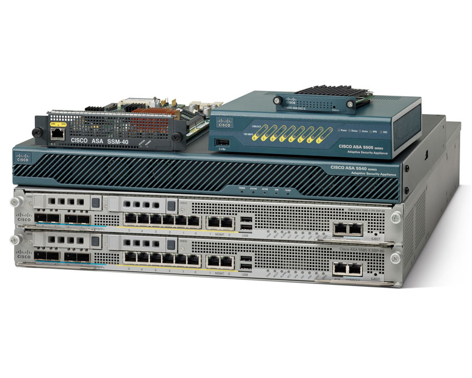

# Setting up VPN's on v 8.3 PIXes

## Firewall to Firewall VPN's
- [ASA to ASA VPN (>8.3)](asa-to-asa-vpn-8-3.md): How to setup a IPSec VPN between two firewalls
 
## Client to Firewall VPN's
- [IPSEC VPN Client Setup](ipsec-vpn-client-setup.md): How to get your (>8.3) asa to be a ipsec vpn concentrator for client connections.
- [SSLVPN Client Setup](sslvpn-client-setup.md): How to get your (>8.3) asa to be a sslvpn concentrator for client connections.
- [Client VPN with Radius Auth](client-vpn-with-radius-auth.md):  

## Debugging IPSec tunnels:
- [Debugging Client Sessions](debugging-client-sessions.md): How to track user access issues
- [Debugging Tunnels](debugging-tunnels.md): How to check the firewall to firewall vpn's
- [Capture Command](capture-command.md): How to do tcpdump on the firewall
- [Checking certs](checking-certs.md): How to check the certs and their validity.  

## References:
- [Cisco ASA 5500 Series Command Reference, 8.3](http://www.cisco.com/en/US/customer/docs/security/asa/asa83/command/reference/cmdref.html)   
- [Cisco ASA 5500 Series Configuration Guide using the CLI, 8.3](http://www.cisco.com/en/US/docs/security/asa/asa83/configuration/guide/config.html)  
  