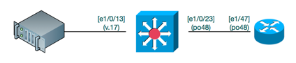

# Simple port troubleshooting

- [Simple port troubleshooting](#simple-port-troubleshooting)
  - [Overview:](#overview)
  - [Port Status:](#port-status)
    - [link up](#link-up)
    - [Sees a MAC](#sees-a-mac)
    - [Cable issues?](#cable-issues)
  - [uplink Status](#uplink-status)
    - [find the uplinks.](#find-the-uplinks)
    - [trunked vlans](#trunked-vlans)
    - [interfaces bound to port channel](#interfaces-bound-to-port-channel)
    - [Uplink interface](#uplink-interface)
    - [Vlans and Trunks](#vlans-and-trunks)
    - [Spanning Tree](#spanning-tree)


## Overview: 

 


## Port Status: 

### link up
the command `show interface status` shows a summary of all the ports and if they are connected or not.  

```
BOS-2960PDU-SW1#sh int statu

Port      Name               Status       Vlan       Duplex  Speed Type
Gi1/0/1   APC-PDU            connected    50         a-full  a-100 10/100/1000BaseTX
Gi1/0/2   APC-PDU            connected    50         a-full  a-100 10/100/1000BaseTX
Gi1/0/3   APC-PDU            connected    50         a-full  a-100 10/100/1000BaseTX
Gi1/0/4   APC-PDU            connected    50         a-full  a-100 10/100/1000BaseTX
Gi1/0/5   APC-PDU            connected    50         a-full  a-100 10/100/1000BaseTX
Gi1/0/6   APC-PDU            connected    50         a-full  a-100 10/100/1000BaseTX
Gi1/0/7   APC-PDU            connected    50         a-half  a-100 10/100/1000BaseTX
...
```

You can search for specific ports by piping the output to the "`include`" command, and regex'ing what you are looking for

```
BOS-2960PDU-SW1#sh int statu | in 1/0/1[3456]

Gi1/0/13  signLong001 [e0] connected    17         a-full a-1000 10/100/1000BaseTX
Gi1/0/14  signLong001 [e1] connected    17         a-full a-1000 10/100/1000BaseTX
Gi1/0/15  signLong002 [e0] connected    17         a-full a-1000 10/100/1000BaseTX
Gi1/0/16  signLong002 [e1] connected    17         a-full a-1000 10/100/1000BaseTX
```

confirm the following: 
- port is enabled (connected)
- vlan is correct
- speed/duplex is correct

### Sees a MAC
Check the switch's cam table (mac table), and confirm that you see anything at layer 2.  

The show mac address-table command will show you everything that the switch sees (which can be a lot).  Note that you see switch internal MACs as well as MACs that come in via trunks or uplinks.  

```
BOS-2960PDU-SW1#sh mac address-table 

          Mac Address Table
-------------------------------------------
Vlan    Mac Address       Type        Ports
----    -----------       --------    -----
 All    0100.0ccc.cccc    STATIC      CPU
 All    0100.0ccc.cccd    STATIC      CPU
 All    0180.c200.0000    STATIC      CPU
 All    0180.c200.0001    STATIC      CPU
 All    0180.c200.0002    STATIC      CPU
```

You can pipe | include just like with the interface status to find more specific matches

```
BOS-2960PDU-SW1#sh mac address-table | in 1/0/1[3456]

  17    0025.90a2.83da    DYNAMIC     Gi1/0/14
  17    0025.90a5.9215    DYNAMIC     Gi1/0/13
```

### Cable issues? 
check the switchport and make sure you do see traffic going in and out, and also make sure there are not a lot of errors on the interface.  

```
BOS-2960PDU-SW1#sh int g1/0/13

GigabitEthernet1/0/13 is up, line protocol is up (connected) 
  Hardware is Gigabit Ethernet, address is 3c0e.2327.ab8d (bia 3c0e.2327.ab8d)
  Description: onesignLong001 [e0]
  MTU 1500 bytes, BW 1000000 Kbit/sec, DLY 10 usec, 
     reliability 255/255, txload 1/255, rxload 1/255
  Encapsulation ARPA, loopback not set
  Keepalive set (10 sec)
  Full-duplex, 1000Mb/s, media type is 10/100/1000BaseTX
  input flow-control is off, output flow-control is unsupported 
  ARP type: ARPA, ARP Timeout 04:00:00
  Last input 00:00:16, output 00:00:00, output hang never
  Last clearing of "show interface" counters never
  Input queue: 0/75/0/0 (size/max/drops/flushes); Total output drops: 0
  Queueing strategy: fifo
  Output queue: 0/40 (size/max)
  5 minute input rate 0 bits/sec, 0 packets/sec
  5 minute output rate 0 bits/sec, 0 packets/sec
     3254 packets input, 538074 bytes, 0 no buffer
     Received 3254 broadcasts (3248 multicasts)
     0 runts, 0 giants, 0 throttles
     0 input errors, 0 CRC, 0 frame, 0 overrun, 0 ignored
     0 watchdog, 3248 multicast, 0 pause input
     0 input packets with dribble condition detected
     61243 packets output, 5311981 bytes, 0 underruns
     0 output errors, 0 collisions, 3 interface resets
     2657 unknown protocol drops
     0 babbles, 0 late collision, 0 deferred
     0 lost carrier, 0 no carrier, 0 pause output
     0 output buffer failures, 0 output buffers swapped out
```

## uplink Status

### find the uplinks.  
use the show interface status command, and look for trunks and port channels 

```
BOS-2960PDU-SW1#sh int statu

Port      Name               Status       Vlan       Duplex  Speed Type
...
Gi1/0/22  APC-PDU            notconnect   50           auto   auto 10/100/1000BaseTX
Gi1/0/23  bos-core-nx1 - e1/ connected    trunk      a-full   1000 10/100/1000BaseTX
Gi1/0/24  uplink: swa1m01 -  connected    trunk      a-full   1000 10/100/1000BaseTX
Gi1/0/25                     notconnect   1            auto   auto 1000BaseSX SFP
Gi1/0/26                     notconnect   1            auto   auto Not Present
Gi1/0/27                     notconnect   40           auto   auto 1000BaseSX SFP
Gi1/0/28                     notconnect   routed       auto   auto Not Present
Po1       uplink: swa1m01    connected    trunk      a-full a-1000 
Po48      uplink bos-core-sw connected    trunk      a-full a-1000 
Fa0                          notconnect   routed       auto   auto 10/100BaseTX
```

### trunked vlans
make sure that the port channel (or interface) allows the vlans that your device is connected to. 

```
BOS-2960PDU-SW1#sh run int po48

Building configuration...
Current configuration : 190 bytes
!
interface Port-channel48
 description uplink bos-core-sw1 [e1/47]
 switchport trunk native vlan 900
 switchport trunk allowed vlan 10,12,17,33-40,50,64-71,1001
 switchport mode trunk
end
```

### interfaces bound to port channel
If your uplink is  a port channel, make sure that the correct interface is bound to it with the show interface command.  Also make sure that the port is up, and that there are no weird errors on the line.  

```
BOS-2960PDU-SW1#sh int po48 

Port-channel48 is up, line protocol is up (connected) 
  Hardware is EtherChannel, address is 3c0e.2327.ab97 (bia 3c0e.2327.ab97)
  Description: uplink bos-core-sw1 [e1/47]
  MTU 1500 bytes, BW 1000000 Kbit/sec, DLY 10 usec, 
     reliability 255/255, txload 1/255, rxload 1/255
  Encapsulation ARPA, loopback not set
  Keepalive set (10 sec)
  Full-duplex, 1000Mb/s, link type is auto, media type is unknown
  input flow-control is off, output flow-control is unsupported 
  Members in this channel: Gi1/0/23 
  ARP type: ARPA, ARP Timeout 04:00:00
  Last input 00:00:00, output 00:00:01, output hang never
  Last clearing of "show interface" counters never
  Input queue: 0/75/0/0 (size/max/drops/flushes); Total output drops: 0
  Queueing strategy: fifo
  Output queue: 0/40 (size/max)
  5 minute input rate 28000 bits/sec, 28 packets/sec
  5 minute output rate 4000 bits/sec, 5 packets/sec
     1844153323 packets input, 236272918945 bytes, 0 no buffer
     Received 1346105408 broadcasts (1086896660 multicasts)
     0 runts, 0 giants, 0 throttles
     0 input errors, 0 CRC, 0 frame, 0 overrun, 0 ignored
     0 watchdog, 1086896660 multicast, 0 pause input
     0 input packets with dribble condition detected
     372262465 packets output, 58603297831 bytes, 0 underruns
     0 output errors, 0 collisions, 1 interface resets
     0 unknown protocol drops
     0 babbles, 0 late collision, 0 deferred
     0 lost carrier, 0 no carrier, 0 pause output
     0 output buffer failures, 0 output buffers swapped out
```

### Uplink interface
Confirm that the uplink interface is configured properly.  Make sure that the vlans allowed are the same as the port channel, that it's bound to the port channel, and that its a trunk interface.  

```
OS-2960PDU-SW1#sh run int g1/0/23

Building configuration...
Current configuration : 233 bytes
!
interface GigabitEthernet1/0/23
 description bos-core-nx1 - e1/47
 switchport trunk native vlan 900
 switchport trunk allowed vlan 10,12,17,33-40,50,64-71,1001
 switchport mode trunk
 speed 1000
 channel-group 48 mode passive
end
```

### Vlans and Trunks
Check the ports that are trunking vlans, and what vlans are being sent down which trunks.  

```
BOS-2960PDU-SW1#sh int trunk

Port        Mode             Encapsulation  Status        Native vlan
Po1         on               802.1q         trunking      900
Po48        on               802.1q         trunking      900
Port        Vlans allowed on trunk
Po1         10,64-71
Po48        10,12,17,33-40,50,64-71,1001
Port        Vlans allowed and active in management domain
Po1         10,64-71
Po48        10,12,17,33-40,50,64-71,1001
Port        Vlans in spanning tree forwarding state and not pruned
Po1         10,64-71
Po48        10,12,17,33-40,50,64-71,1001
```

### Spanning Tree
Make sure that your edge switch is seeing spanning tree traffic on the vlans that you want, AND that it's not the root for that vlan.  

In this example, the local edge switch is a root bridge for the vlan, which is bad and needs to be fixed.  

```
BOS-2960PDU-SW1#sh spanning-tree summary 

Switch is in rapid-pvst mode
Root bridge for: VLAN0012, VLAN0017
EtherChannel misconfig guard is enabled
Extended system ID           is enabled
Portfast Default             is disabled
PortFast BPDU Guard Default  is disabled
Portfast BPDU Filter Default is disabled
Loopguard Default            is disabled
UplinkFast                   is disabled
BackboneFast                 is disabled
Configured Pathcost method used is short
Name                   Blocking Listening Learning Forwarding STP Active
---------------------- -------- --------- -------- ---------- ----------
VLAN0010                     0         0        0          5          5
VLAN0012                     0         0        0          1          1
VLAN0017                     0         0        0          5          5
VLAN0033                     0         0        0          1          1
VLAN0034                     0         0        0          1          1
VLAN0035                     0         0        0          1          1
VLAN0036                     0         0        0          1          1
VLAN0037                     0         0        0          1          1
```

Do this as well on the core switch.  In this case, we see that we are being blocked by spanning tree because the vlan is being blocked "error-disabled".  

```
BOS-CORE-NX1# sh int trunk

--------------------------------------------------------------------------------
Port          Native  Status        Port
              Vlan                  Channel
--------------------------------------------------------------------------------
Eth1/47       900     trnk-bndl     Po48
Po48          900     trunking      --
--------------------------------------------------------------------------------
Port          Vlans Allowed on Trunk
--------------------------------------------------------------------------------
Eth1/47       10,12,17,33-40,50,64-71,1001
Po48          10,12,17,33-40,50,64-71,1001
--------------------------------------------------------------------------------
Port          Vlans Err-disabled on Trunk
--------------------------------------------------------------------------------
Eth1/47       12,17
Po48          12,17
--------------------------------------------------------------------------------
Port          STP Forwarding
--------------------------------------------------------------------------------
Eth1/47       none
Po48          10,33-40,50,64-71,1001
--------------------------------------------------------------------------------
Port          Vlans in spanning tree forwarding state and not pruned
--------------------------------------------------------------------------------
--------------------------------------------------------------------------------
Port          Vlans Forwarding on FabricPath
--------------------------------------------------------------------------------
Eth1/47       none
Po48          none
```


