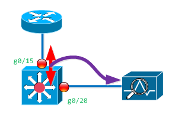
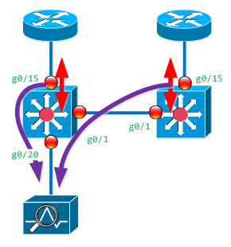

# Sniffing (span) on IOS

## Overview: 
Spanning a port (or VLAN) allows you to take all the traffic from that source, and send it to a sniffing device to be analysed.  (A sniffing device could simply be a utility box running tcpdump, or it could be an IDS system like SNORT.

This document covers how to set this up on an IOS device like any 2000, 3000 or 4000 series switches, but not the 6500 series switch.  (There is a reference below on how to work with them.)

## Basic: Local Span 



### Sniff an interface: 
If you simply want to take the traffic from one port (or vlan) on a switch, and send it to another port, you would simply do the following: 

```
cisco(config)# no monitor session 5 all
cisco(config)# monitor session 5 source interface g0/15 both 
cisco(config)# monitor session 5 destination interface g0/20 encap replicate 
cisco(config)# end
cisco# sh monitor session 5
```

Each span has an associated "session number" (1-66) for it to allow multiple spans to not walk over each other.  The first line ensures that there is no current config on the **#5** span session.  The next line grabs traffic on port g0/15 going in **both** directions (into and out of the switch) and then the following line sticks it on port g0/20.  The `encap replicate` part of the line is optional.  It tells the switch to include any Ethernet tagging from the input port to the output.  If you don't include it, the tagging is removed.  The final statement simply prints out the config and shows you how it was setup.  

### Sniff a VLAN: 
Same as above, but with the filter vlan {vlan#} command.  

```
cisco(config)# no monitor session 5 all
cisco(config)# monitor session 5 source interface g0/15 both 
cisco(config)# monitor session 5 filter vlan 500
cisco(config)# monitor session 5 destination interface g0/20 encap replicate 
cisco(config)# end
cisco# sh monitor session 5
```

## Advanced: Remote Span




With a remote span, you are sending sniffed traffic between switches because the collector is not on the same switch as the source.  

When doing this, there are configs that you will need to do on the local switch (the one with the collector), and on the remote switch.  

### Both Switches: 
To do this, the first thing you need to do is create a VLAN that will be used to transport the sniffed traffic. This will need to be done on both switches. 

```
cisco(config)# vlan 101
cisco(config-vlan)#  remote span
cisco(config-vlan)#  end       
```

### Remote Switch: 
The remote switch is the the switch that is only collecting the traffic off a port (or vlan), but it does not have a local sniffer to analyze the traffic.  Instead it needs to package up the sniffed traffic and send it to another switch.  The remote switch will transport the sniffed traffic by placing it on a VLAN that has been designated just for span traffic, and sharing that VLAN between switches. 

```
cisco(config)# no monitor session 6 all  
cisco(config)# monitor session 6 source int g0/15 both 
cisco(config)# monitor session 6 destination remote vlan 101 
cisco(config)# end 
cisco# sh monitor 6 
```

In this example, we are first clearing any current monitor on id #6, and then sniffing on port g0/15, and putting it onto VLAN 101.

If you want to snarf an entire VLAN instead of just one interface, you can modify the source command to be: 

```
cisco(config)# monitor session 6 source vlan 8 both   
```

### Local Switch: 
The local switch is the one that has a network analyzer (sniffer) directly connected to it.  In this example, it is receiving sniffed traffic from a remote switch over the VLAN #101, and a different span over it's local port g0/15.   It's then sending all the sniffed traffic to its local port g0/20 to be captured.  

```
cisco(config)# no monitor session 6 all  
cisco(config)# monitor session 6 source int g0/15 both
cisco(config)# monitor session 6 source remote vlan 101 
cisco(config)# monitor session 6 destination interface g0/20 
cisco(config)# end 
cisco# sh monitor 6  
```

## References: 
- [Catalyst 3750-X and 3560-X Switch Software Configuration Guide](http://www.cisco.com/en/US/docs/switches/lan/catalyst3750x_3560x/software/release/12.2_53_se/configuration/guide/swspan.html), Release 12.2(53)SE2
- [Catalyst 6500 Release 12.2SX Software Configuration Guide SPAN](http://www.cisco.com/en/US/docs/switches/lan/catalyst6500/ios/12.2SX/configuration/guide/span.html), RSPAN, and ERSPAN