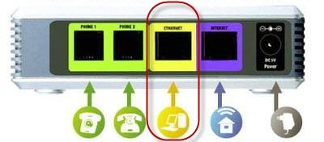
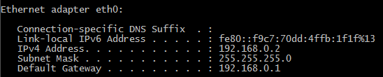
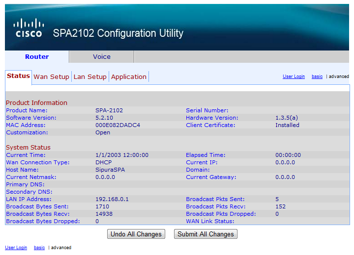
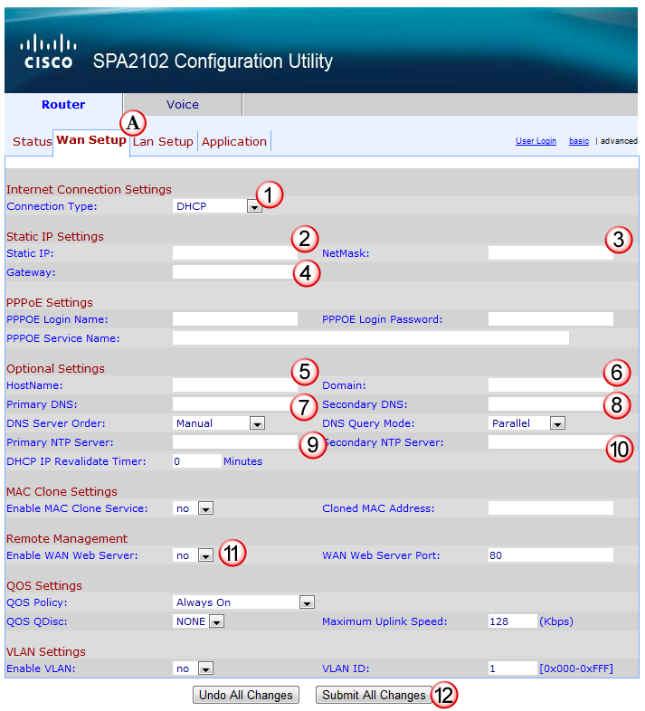
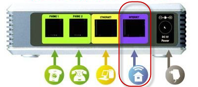

# SPA 2102 - Set IP

## Basic WAN Configuration:
This are the steps to get the device setup so that it is reachable on the network.

With the device freshly virginised, make sure your PC's interface is set to DHCP, and it into the Yellow Ethernet interface on the VG.  (not the blue internet connection)

 

Look at your devices IP address.  In this case we were given the IP of `192.168.0.2`, with the default gateway of `192.168.0.1`

 

With a web browser, go to the URL: `{default_gateway}/admin/advanced`  (in this example, it would be http://192.168.0.1/admin/advanced)

 

Select the Wan Setup (A) tab and enter in the following:

- Connection Type: Select Static
- Static IP:  IP address of the device
- NetMask:  Network mask of the device
- Gateway: The IP address of the default gateway for the device
- HostName: The DNS name of the VG (not fully qualified)
- Domain: The DNS Domain of the vg
- Primary DNS: DNS #1 (8.8.8.8)
- Secondary DNS: DNS #2 (8.8.4.4)
- Primary NTP Server: server 2.north-america.pool.ntp.org
- Secondary NTP Server: server 3.north-america.pool.ntp.org
- Enable WAN Web Server: Yes (So that you can manage it later.  Make sure you have a firewall securing this)
- Submit All Changes: Press this to save the changes you just made.

 

Then connect the VG's Internet network interface (BLUE) to your network and it should be accessible through the IP you set in the above step.

 
