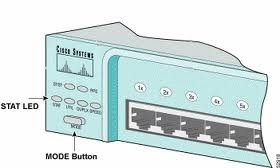

# Starting Fresh with a 3500

- [Starting Fresh with a 3500](#starting-fresh-with-a-3500)
  - [Resetting the Password:](#resetting-the-password)
    - [Rebooting without current startup config:](#rebooting-without-current-startup-config)
    - [Deleting the old Config](#deleting-the-old-config)
    - [Keeping the old Config and Changing the Password:](#keeping-the-old-config-and-changing-the-password)
  - [Virginising the Box:](#virginising-the-box)
  - [Upgrading the OS:](#upgrading-the-os)
  - [Enable SSH:](#enable-ssh)
  - [References:](#references)


## Resetting the Password:
If you don't remember (or don't know) the password, these are the simple steps for resetting it:

### Rebooting without current startup config:
The trick to getting into the box without the password, is to tell the switch to boot up on it's factory default settings.  To do this you do the following:

a) Power Cycle the switch and press and hold the mode button.



b) At the "switch" prompt

```
switch:
```

enter the following:

```
flash_init
load_helper
```

Make sure there isn't already a config.old file.  if so, change the following to config.old1 or something.

```
dir flash:
rename flash:config.text flash:config.old
```

Then reboot the switch to the factory default OS:

```
boot
```

### Deleting the old Config
If you want to completely "virginise" the switch follow these procedures.  **If NOT then skip this** and go on to the next section.

At the prompt, enable by simply entering <enter>

```
Switch>en
Switch#
```

Then delete the old config and simply use the current factory defaults 

```
delete flash:config.old
```

### Keeping the old Config and Changing the Password:
If you want to keep the old config, and simply re-enter in the new password, simply do the following:

At the prompt, enable by simply entering <enter>

```
Switch>en
Switch#
```

Then reload the old config into the current config by first renaming it, and then uploading it. 

```
rename flash:config.old flash:config.text
copy flash:config.text system:running-config
```
Finally, edit the config, and change whatever passwords are needed.

```
conf t
!--- To overwrite existing secret password
enable secret <new_secret_password>
!--- To overwrite existing enable password
enable password <new_enable_password>
!--- To overwrite existing vty password
line vty 0 15
   password <new_vty_password>
   login
!--- To overwrite existing console password
line con 0
   password <new_console_password>
write memory
```

## Virginising the Box:
If you simply want to start from scratch, delete the current config and reboot the switch.  To do this erase the current config, and reboot the box.

```
write erase
reload
```

## Upgrading the OS:
You will want a local tftp server to copy the files from.  On Linux this is easy, but for windows, you need some kind of app to install.  Once you have the tftpd server setup, get the correct os image from cisco and put it on your tftp server. 

From the switch grab the os off of the tftp server:

```
copy tftp flash
    10.50.32.218
    c3560-ipservicesk9-mz.122-58.SE2.bin
```

Make sure that the file is good:

```
verify flash:c3560-ipbasek9-mz.122-44.SE.bin
```

Configure to boot off new image:

```
conf t
boot system flash:/c3560-ipservicesk9-mz.122-58.SE2.bin
end
wr mem
```

Reboot the box using the new image

```
reload
```

After boot, confirm new image took:

```
sh boot
```


## Enable SSH: 
This will allow the switch to use ssh. 

```
mb2-sw1m01#conf t
Enter configuration commands, one per line.  End with CNTL/Z.
mb2-sw1m01(config)#crypto key generate rsa
The name for the keys will be: mb2-sw1m01.variantyx.com
Choose the size of the key modulus in the range of 360 to 2048 for your
  General Purpose Keys. Choosing a key modulus greater than 512 may take
  a few minutes.
How many bits in the modulus [512]: 2048
% Generating 2048 bit RSA keys, keys will be non-exportable...
mb2-sw1m01(config)#
mb2-sw1m01(config)#ip ssh time-out 120
mb2-sw1m01(config)#ip ssh authentication-retries 3
mb2-sw1m01(config)#end
mb2-sw1m01#
```

## References:
- [Working with the IOS File System, Configuration Files, and Software Images](http://www.cisco.com/en/US/docs/switches/lan/catalyst3550/software/release/12.1_12c_ea1/configuration/guide/swiosfs.htm): Cisco Press: Catalyst 3550 Multilayer Switch Software Configuration Guide, 12.1(12c)EA1