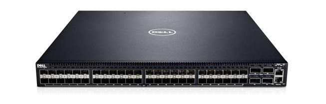

# Dell

Dell purchased Force 10, and unfortunately got rid of their name / brand.  

Their 10G+ switches are actually pretty good.  The only bad note is their interface is *exactly* like Cisco's so they lack some of the more advanced features you might find in something like junos
- [Basic Config](basic-config.md): Mgmt interfaces, host names, banners, sshd etc. 
- [normal switchport configs](normal-switchport-configs.md): 
- [port channel switchport configs](port-channel-switchport-configs.md): 
- [creating vlans and adding to interfaces](creating-vlans-and-adding-to-interfaces.md): 
- [system info](system-info.md): os, sn, etc. 
- [serial setting](serial-setting.md): baud rate

## References: 
- [Dell Configuration Guide for the S4048–ON System 9.10(0.1)](http://www.dell.com/support/manuals/us/en/04/force10-s4048-on/s4048-on-9.10.0.1-config-pub/):  
  