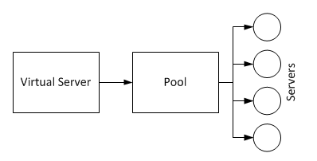
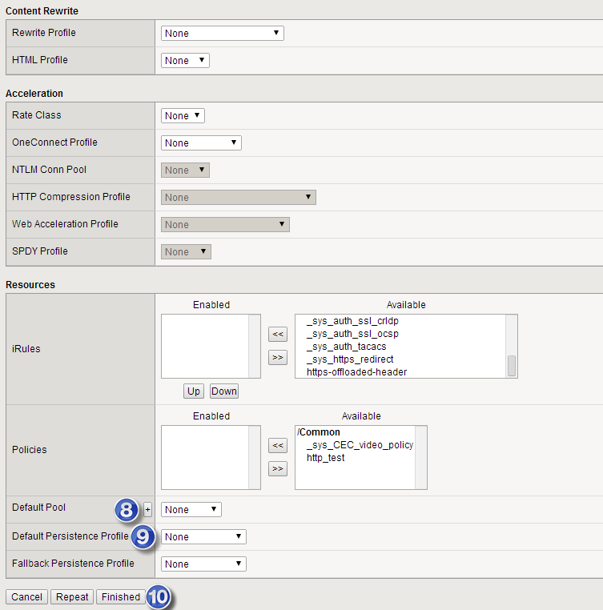

# Basic VIPs

## Overview: 
There are three main players when working with the F5's.  The Virtual Server is the VIP or external IP address that traffic goes to.  It in turn points to a Pool (or multiple pools) that in turn has multiple servers or Members.

 

## Create A Pool: 
The pool is simply a collection of real servers, how to monitor those servers, and the method to spray traffic over those servers.  

To create a new pool, under 

**Main :: Local Traffic :: Virtual Servers :: Pools :: Pool List**

Select the "+" to create a new pool.  

 

Then in the new pool window, fill in the following fields: 
1. Name: Enter a name for the pool
2. Description: Add some description so you can remember what this is over any of the other pools
3. LB Method: There are a bunch of different methods for balancing traffic.  For now, simply enter Round Robin.  
4. New Members: For each real server, provide a description and either its IP or DNS name, 
5. Add: Select the add button to save each defined New Member
6. Finished: When you are done entering in all the New Members, enter Finished.  

 

## Create a Virtual Server
A Virtual Server is the front end VIP that external traffic will go to.  The VS handles SSL certs, protocol conversion (ie: https to http), compression and any scripting like iRules.  

To create a new server, under 

**Main :: Local Traffic :: Virtual Servers :: Virtual Servers List**

select the "+" icon to create a new VS

 

In the New Virtual Server window, enter in the following fields

1. Name: Name of the Virtual Server
2. Description: Description to remind you what this is used for
3. Type: Standard.  Should be a normal web VS.  The other types are noted in sol14163.  
4. Destination: The IP address of the VIP that external traffic should point to
5. Service Port: The port that should be listening on the Destination IP.  (ie: 80=http, 443=https)
6. HTTP Profile: Select HTTP Profile for basic web traffic 
7. SNAT Pool: For internal routing.  Enable this if you want traffic to the servers to be sourced from the F5.  See more on this here. 
8. Default Pool: Select the pool name you created in the "Create a Pool" section above
9. Default Persistence Profile: Select if you want to enable stickiness.  See more here. 
10. Finished: Select the finished button to save your changes. 

 

 

## References: 
- [BIG-IP Local Traffic Manager Implementations](http://support.f5.com/content/kb/en-us/products/big-ip_ltm/manuals/product/ltm-implementations-11-2-1/_jcr_content/pdfAttach/download/file.res/BIG-IP_Local_Traffic_Manager__Implementations.pdf): v11.2.1 (Aug 31, 2012)
- [Configuring Virtual Servers](http://support.f5.com/kb/en-us/products/big-ip_ltm/manuals/product/ltm_configuration_guide_10_1/ltm_virtual.html): (v10.1-10.2)
- [Overview of BIG-IP virtual server types (11.x)](http://support.f5.com/kb/en-us/solutions/public/14000/100/sol14163.html): SOL14163, (2/3/14)