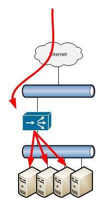
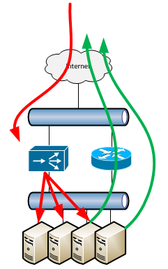
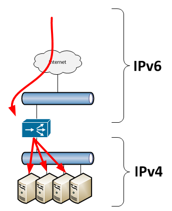
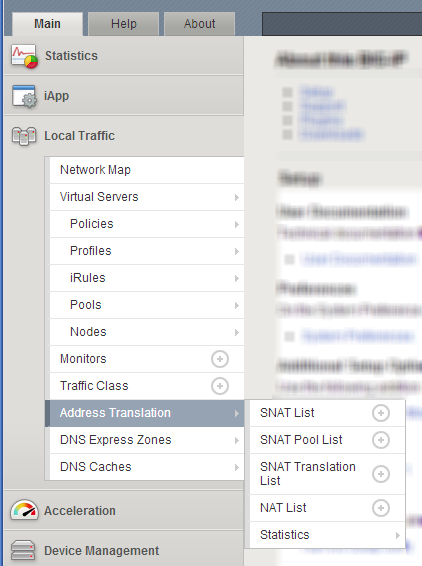
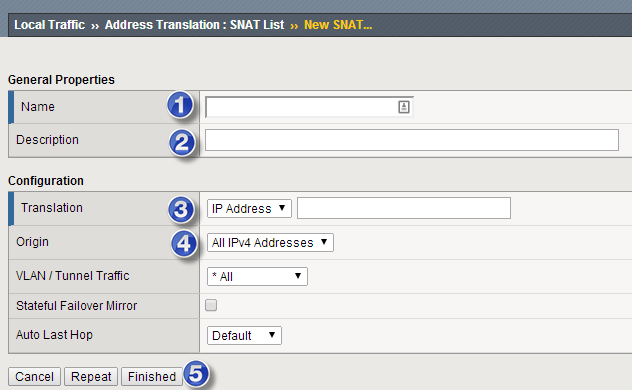
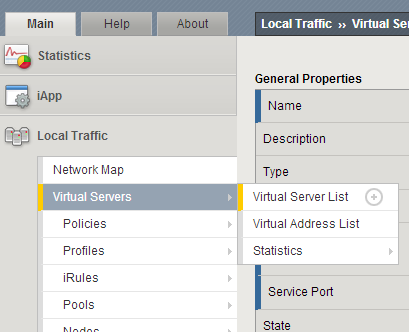

# SNAT

## Overview: 
At its most basic setup, the internet connects to one side of your load balancer, and your servers connect to the other end with your servers set with their default route being the back-end of the LB.  

 

This works well for many deployments, but some times, the servers default route is not the back-end of the LB, and thus traffic destined to the internet (and return traffic to customers) will not naturally go though the LB.  

 

In situations like this, its helpful to enable Source Network Address Translation, or SNATing.  SNATing changes the packets leaving the load balancer such that their source address is the back-end of the LB.  When servers reply back from the messages, they don't route them out their default gateway, but directly back to the load balancer who then sends them back to the client.  

The only challenge with enabling SNATing is that the server logs see all the traffic only coming from one source (the back end of the LB).  To fix this, you need to enable X-forward-for logging on the servers so that they can then view the source of the traffic.  

Note that SNATs are also useful for converting IPv6 to IPv4. 

 

## Defining SNATs

**Main :: Local Traffic  :: Address Translation :: SNAT List**

Then select the "+" button or in the SNAT List page, select the "create" button.  

 

In the New SNAT window, enter in the following fields

1. Name: Name of the SNAT
2. Description: A note on what this is used for
3. Translation:  The IP address that the traffic should be masked to.
4. Origin: What source IPs this should work with.  
5. Finished: Select the finished button to save your work.  

 

## Enabling Virtual Servers to use a SNAT
Traffic for Virtual Servers can utilize SNAT pools that were previously setup.  To modify a Virtual Server, go to: 

**Main :: Local Traffic :: Virtual Servers :: Virtual Server List**

and select the VS whose traffic you want to SNAT. 

 

Under the Configuration section of the Virtual Server, make the following modifications: 

1. Source Address Translation: Set to SNAT which will enable the next field.  
2. SNAT Pool: Select the pool name that you have just created in the previous section. 

## References: 
- [Configuring SNATs](http://support.f5.com/kb/en-us/products/big-ip_ltm/manuals/product/ltm_configuration_guide_10_0_0/ltm_snat.html) (v 10.0)
- [Overview of SNAT features](http://support.f5.com/kb/en-us/solutions/public/7000/800/sol7820.html): 12/10/13 (v 9.0-11.4)