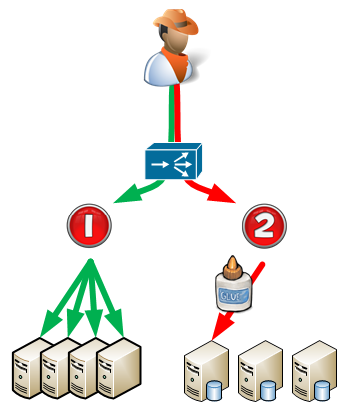
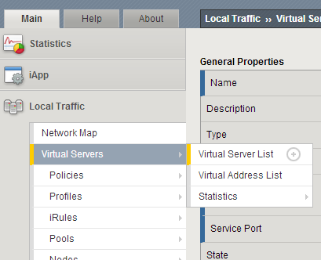
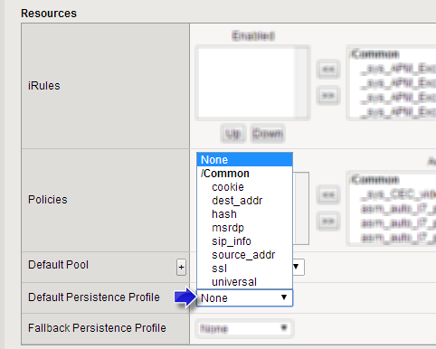

# Stickyness

## Overview: 
In the following diagram below, users traffic to a website might originally go to static pages that can be equally balanced between multiple servers (see path 1 / green).  Each connection to the page could be served by any server.  But maybe when the user wants to pay for purchases, the code is such that the one customer needs to stick to the same transaction server (see path 2 / red).  There might be multiple transaction servers to choose from, and customers are balanced between them, but once they land on a server, the are stuck there and because of stickiness, all return traffic from them will stay on the same server.  

 

## Setting Stickiness: 
Stickiness (persistence) is defined within the Virtual Servers setting.  To modify a Virtual Server, go to: 

**Main :: Local Traffic :: Virtual Servers :: Virtual Server List**

and select the VS that you want to enable stickiness for. 

 

Select the Virtual Server you want to modify, and then in the **Resources** section of the configuration, select the **Default Persistence Profile** pull down, and select the appropriate option.  Usually this is cookie. 

 

The persistence types that you can enable using a persistence profile are: (copied from F5)

- Cookie persistence uses an HTTP cookie stored on a clients computer to allow the client to reconnect to the same server previously visited at a web site.
- Destination address affinity persistence: Also known as sticky persistence, destination address affinity persistence supports TCP and UDP protocols, and directs session requests to the same server based solely on the destination IP address of a packet.
- Hash persistence allows you to create a persistence hash based on an existing iRule.
- Microsoft Remote Desktop Protocol (MSRDP) persistence tracks sessions between clients and servers running the Microsoft Remote Desktop Protocol (RDP) service.
- SIP persistence is a type of persistence used for servers that receive Session Initiation Protocol (SIP) messages sent through UDP, SCTP, or TCP.
- Source address affinity persistence, also known as simple persistence, source address affinity persistence supports TCP and UDP protocols, and directs session requests to the same server based solely on the source IP address of a packet.
- SSL persistence is a type of persistence that tracks non-terminated SSL sessions, using the SSL session ID. To enable persistence for terminated SSL sessions, see Chapter 9, Managing SSL Traffic, Chapter 17, Writing iRules, and the F5 Networks DevCentral web site, http://devcentral.f5.com.
- Universal persistence allows you to write an expression that defines what to persist on in a packet. The expression, written using the same expression syntax that you use in iRulesTM, defines some sequence of bytes to use as a session identifier.

## Reference: 
- [Enabling Session Persistence](http://support.f5.com/kb/en-us/products/big-ip_ltm/manuals/product/ltm_configuration_guide_10_0_0/ltm_persist_profiles.html) (LTM 10.0)
- [Configuring HTTP Load Balancing with Cookie Persistence](http://support.f5.com/kb/en-us/products/big-ip_ltm/manuals/product/ltm-implementations-11-1-0/17.html): (LTM: 11.1)