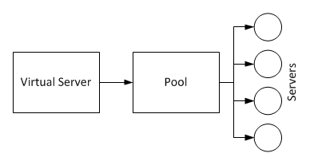
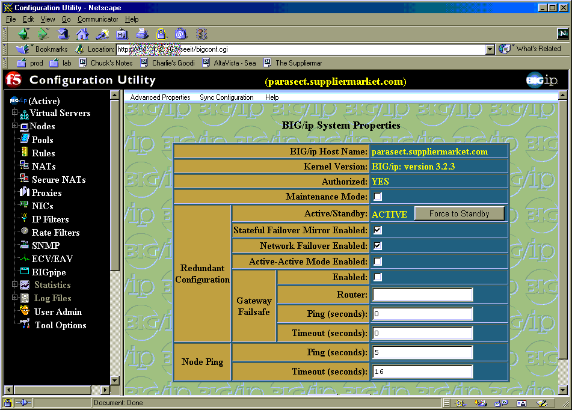
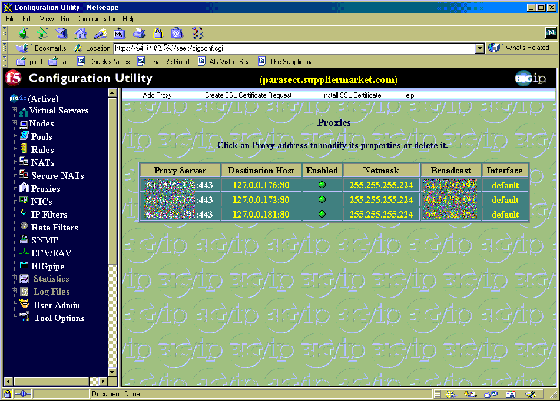
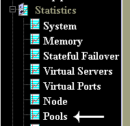
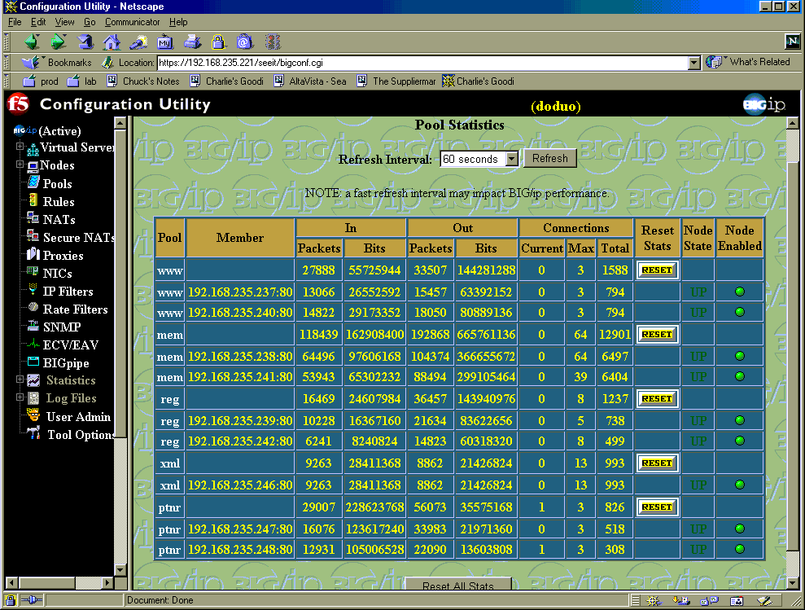
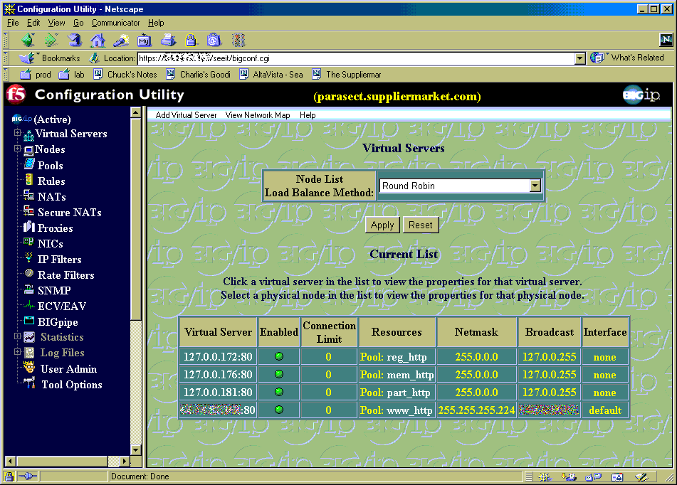

# Working with Pools, Proxy's and Virtual Servers

## Overview: 
There are three different "groups" that are used to used to properly setup load balanced servers like we use.  They are Proxies, Virtual Servers, and Pools.  

 

For our situation, proxy's accept the incoming traffic and decrypt it.  The virtual servers accept the traffic and point it to a pool.  And the pools send the traffic to one of their servers depending on predefined rules.

### Proxies
 
Are set up to handle encrypting and decrypting  traffic flow.  

A proxy is setup to decrepit traffic to an ip address and port (10.100.25.100:443).  All traffic to that ip/port is automatically decrypted, and then redirected to another ip/port (10.100.25.100:80).   The normal situation here would be to accept traffic to an ip (say 10.100.25.100:443) then decrepit it and send the resulting plain text to the ip (10.1.1.1:80).  A twist to this is to redirect the traffic not to an outside port, but instead to a loop-back port to be handled internally by the F5 (10.100.25.100:443 -> 127.0.0.100:80).  An important thing to note, if you setup the F5 to decrepit the traffic and then only switch the ports, (10.100.25.100:443 -> 10.100.25.100:80) then traffic to the http port would also be allowed through.  You you did not want this, you would need to put in a filter to prevent outside traffic from getting to the port 80 address.

### Virtual Servers: 
 
Is the same idea as a virtual IP.  It is an IP address that the F5 owns, that it accepts traffic for, and then redirects that traffic to a specific pool.

We use the Virtual Servers redirect an ip and port to a pool (127.0.0.100:80 -> foofoo-pool).  Specifically, after the proxy's un-encrypt the traffic and send them to a loop-back address, the virtual servers accept that loop-back address and then redirect that traffic to a pool.  

While a Virtual Server can be used instead of a pool, it doesn't allow as much control, thus we normally want to point a VS to a pool instead of a server or group of servers.

### Pools:  
 
Give us the ability to group a bunch of servers, and apply rules to them.  These rules help us control load balancing across a collection of servers, and to control stickiness on those servers.

## Setting up Services

### Create A Proxy
Within the main window, 

 

click on the Proxy'sside button

 

### Create a SSL Certificate Request:

- Select SSL Certificate Request and make a Certificate Request for the new proxy.  For this example we are going to want a site "www.gwu.edu" to be encrypted.  When you fill out the Request, the Keyfile Name, Domain, and Challenge Password should be the url, (www.gwu.edu), and make sure that the State is fully typed out (no abbreviations).  When you are finished, click the button at the bottom of the page to Generate a Certificate Request. (note our key lengths are 512)
- The SSL Certificate Request is now created, and printed out on the screen.  At the bottom of the page is a button to generate a Self-Signed Certificate, Click this and then copy the certificate (the Certfile Contents) and save it to a text file.  (It is also kept on the F5, but it's good to have a backup, incase we want to move the url to another server.) Afterwards, click the Write Certificate File to write this to the F5.  Go to Verisign's Web Page and paste the Certfile in their page.  Anywhere from two hours to three days later you will get an Email back with the valid SSL Certificate.

### Add A Proxy:

- Click on the Add Proxy Button at the Proxy Main Page
- Enter the Proxy Address and the Proxy Port.  This is the ip address and port that the F5 will listen for, and then decode it's traffic.
- Enter the Destination Address and Port.  This should be and original loopback address.  My convention is 127.0.0.x, where the x is the last octet of the Proxy Address.
- The SSL Certificate and Key should be the ones that you just created when creating a SSL Certificate Request.
- Click the Add button to enable this proxy.

### Install SSL Certificate: (LATER, after the keys arrive)

- Click on the Install SSL Certificate Button at the >Proxy Main Page
- Click on the Certfile Name Pull-down, and choose the Certfile that you have just created.  Then paste the SSL Certificate that was mailed to you in the Certfile Contents window.
- Click on the Write Certificate File button to activate the changes.

### Add Pool: 
Within the main window, click on the Pools side button

Click Add Pool Button.
- Give the pool a name
- Set the Load Balancing Method to Priority (Node Address)
- Add the servers in the Pool under the Resources section.  Note that since the Proxy is converting the traffic to plain text (port 80), the servers will only have listeners on port 80.
- Click Add to create the Pool

### Add Virtual Server:
Within the main window, click on the Virtual Servers side button

Click Add Virtual Server

- Under Virtual Server, Add the Servers IP and Port.  Note that this will be the loop-back address given as the output from the proxy's output.
- Under Resources, Click Pool, and then choose the pools name.
- Click Add to create this Virtual Server

## Monitoring Your System: 

### For a good, overall view of traffic: 

Go to the Statistics,

 

Then Pools Section.  

 

Here you will be able to see all the servers grouped under their pools.  You can reset the stats to get a better idea on the traffic flowing at a specific moment.

### To see what servers are up under a Virtual Service:  
Go to the Virtual Servers section, 

 

Then choose View Network Map.  This will show you all the nodes individually, and then the Virtual Servers, the pools that they are bound to, and each node under them, with their service status (up or down).

