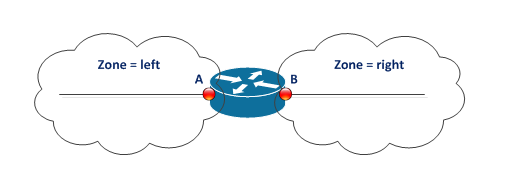

Allowing connections though and to the router




Define the interfaces and link them to zones

## Configs for Interface A
```
# define the interface "A"
interface {
   A {
     unit 0 {
       family inet {
         address 1.1.1.1/24;
       }
     }
   }
 }
# define the zone, assign the
# interface, and allow that
# interface to be pinged
 security {
   zones {
     security-zone left
       interfaces {
         A {
           host-inbound-traffic {
             system-services {
               all;
             }
           }
         }
       }
     }
   }
 }
```   

## Configs for Interface B
```
# define the interface "B"
interface {
   B {
     unit 0 {
       family inet {
         address 2.2.2.2/24;
       }
     }
   }
 }
# define the zone, assign the
# interface, and don't allow
# it to respond to pings
 security {
   zones {
     security-zone right
       interfaces {
         B;
       }
     }
   }
 }
```

## Policy
Create a policy to allow traffic between the zones. 

```
# allow traffic originating from left zone to go to the
# right zone
security {
  policies {
    from-zone left to-zone right {
      policy rule1 {
        match {
          source-address any;
          destination-address any;
          application any;
        }
        then {
          permit;
        }
      }
    }
  }
}
# allow traffic originating from right zone to go to the
# left zone
security {
  policies {
    from-zone right to-zone left {
      policy rule1 {
        match {
          source-address any;
          destination-address any;
          application any;
        }
        then {
          permit;
        }
      }
    }
  }
}
```

