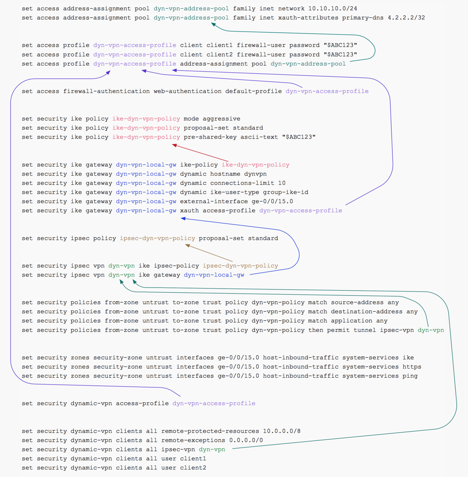

# Client VPNs

- [Client VPNs](#client-vpns)
  - [Overview:](#overview)
  - [Configure Authentication and IPs for Remote Clients:](#configure-authentication-and-ips-for-remote-clients)
    - [Define address(dhcp) pool](#define-addressdhcp-pool)
    - [Define users:](#define-users)
    - [Enable web auth.](#enable-web-auth)
  - [Configure P1 & P2 for the VPN Tunnel](#configure-p1--p2-for-the-vpn-tunnel)
    - [Ike policy (phase1)](#ike-policy-phase1)
    - [Ike gateway (phase1)](#ike-gateway-phase1)
    - [Ipsec (phase2)](#ipsec-phase2)
  - [Create Security Policies and ACLs for inbound traffic](#create-security-policies-and-acls-for-inbound-traffic)
    - [configure security policy](#configure-security-policy)
    - [config host inbound traffic](#config-host-inbound-traffic)
  - [Associate the Dynamic VPN with remote clients](#associate-the-dynamic-vpn-with-remote-clients)
    - [define the access profile to use with dynamic vpn](#define-the-access-profile-to-use-with-dynamic-vpn)
    - [list clients who can connect with dynamic vpn](#list-clients-who-can-connect-with-dynamic-vpn)
  - [Map of the interlinks](#map-of-the-interlinks)
  - [References:](#references)

## Overview: 
These steps are required to enable a vpn between your laptop and the juniper srx firewall.  

## Configure Authentication and IPs for Remote Clients: 

### Define address(dhcp) pool
what IP range to give vpn'ed users, and what dns they should get
```
set access address-assignment pool dyn-vpn-address-pool family inet network 10.10.10.0/24
set access address-assignment pool dyn-vpn-address-pool family inet xauth-attributes primary-dns 4.2.2.2/32
```

Where
- `10.10.10.0/24` is the pool of IPs given to the vpn clients
- `4.2.2.2/32` is the dns server to be given to the vpn clients

### Define users: 
define users, their passwords, and what dhcp pool they should use
```
set access profile dyn-vpn-access-profile client client1 firewall-user password "$ABC123"
set access profile dyn-vpn-access-profile client client2 firewall-user password "$ABC123"
set access profile dyn-vpn-access-profile address-assignment pool dyn-vpn-address-pool
```

Where
- "`client1`" is the username of a vpn client

### Enable web auth. 
allow a group of users to web auth in for vpn
```
set access firewall-authentication web-authentication default-profile dyn-vpn-access-profile
```

## Configure P1 & P2 for the VPN Tunnel

### Ike policy (phase1) 
define phase1 shared key
```
set security ike policy ike-dyn-vpn-policy mode aggressive
set security ike policy ike-dyn-vpn-policy proposal-set standard
set security ike policy ike-dyn-vpn-policy pre-shared-key ascii-text "$ABC123"
```

### Ike gateway (phase1)
link p1 gateway to policy, what interface it should listen on, and what users should be allowed on it.  
```
set security ike gateway dyn-vpn-local-gw ike-policy ike-dyn-vpn-policy
set security ike gateway dyn-vpn-local-gw dynamic hostname dynvpn
set security ike gateway dyn-vpn-local-gw dynamic connections-limit 10
set security ike gateway dyn-vpn-local-gw dynamic ike-user-type group-ike-id
set security ike gateway dyn-vpn-local-gw external-interface ge-0/0/15.0
set security ike gateway dyn-vpn-local-gw xauth access-profile dyn-vpn-access-profile
```

### Ipsec (phase2)
define p2, link it to an interface (gateway), and p1 policy
```
set security ipsec policy ipsec-dyn-vpn-policy proposal-set standard
set security ipsec vpn dyn-vpn ike gateway dyn-vpn-local-gw
set security ipsec vpn dyn-vpn ike ipsec-policy ipsec-dyn-vpn-policy
```

## Create Security Policies and ACLs for inbound traffic

### configure security policy
create acl, and allow match to p2 gateway 
```
set security policies from-zone untrust to-zone trust policy dyn-vpn-policy match source-address any
set security policies from-zone untrust to-zone trust policy dyn-vpn-policy match destination-address any
set security policies from-zone untrust to-zone trust policy dyn-vpn-policy match application any
set security policies from-zone untrust to-zone trust policy dyn-vpn-policy then permit tunnel ipsec-vpn dyn-vpn
```

### config host inbound traffic
allow ike, https, and ping on the outside interface of the firewall.  
```
set security zones security-zone untrust interfaces ge-0/0/15.0 host-inbound-traffic system-services ike
set security zones security-zone untrust interfaces ge-0/0/15.0 host-inbound-traffic system-services https
set security zones security-zone untrust interfaces ge-0/0/15.0 host-inbound-traffic system-services ping
```

## Associate the Dynamic VPN with remote clients

### define the access profile to use with dynamic vpn
allow users to use dynamic vpn: 
```
set security dynamic-vpn access-profile dyn-vpn-access-profile
```

### list clients who can connect with dynamic vpn
allow users to vpn in.  
```
set security dynamic-vpn clients all ipsec-vpn dyn-vpn
set security dynamic-vpn clients all user client1
set security dynamic-vpn clients all user client2
set security dynamic-vpn clients all remote-protected-resources 10.0.0.0/8
set security dynamic-vpn clients all remote-exceptions 0.0.0.0/0
```

## Map of the interlinks




## References: 
- [Dynamic VPN Feature Guide for SRX Series Devices](http://www.juniper.net/techpubs/en_US/junos12.1x47/information-products/pathway-pages/security/security-vpn-dynamic.html#overview): overview of all the different methods for setting up a juniper vpn
- [Example: Configuring Dynamic VPN](https://www.juniper.net/documentation/en_US/junos12.1x47/topics/example/vpn-security-dynamic-example-configuring.html): JunOS v12.4x47, July, 2016
