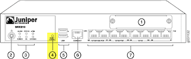

# Password Reset

## If password recovery was permitted. 
You can RECOVER the devices's configs by logging in around the old password.  This is possible if the command 
```
set system ports console insecure
```
was not set.  

Powercycle the firewall and press the spacebar at the prompt in the boot process.  
```
U-Boot 1.1.6-JNPR-2.0 (Build time: Nov 17 2010 - 07:04:52)

SRX_100_HIGHMEM board revision major:0, minor:0, serial #: AT0213AF1088
OCTEON CN5020-SCP pass 1.1, Core clock: 500 MHz, DDR clock: 266 MHz (532 Mhz data rate)
DRAM:  1024 MB
Starting Memory POST...
Checking datalines... OK
Checking address lines... OK
Checking 512K memory for U-Boot... OK.
Running U-Boot CRC Test... OK.
Flash:  4 MB
USB:   scanning bus for devices... 3 USB Device(s) found
       scanning bus for storage devices... 1 Storage Device(s) found
Clearing DRAM........ done
BIST check passed.
Boot Media: nand-flash usb
Net:   pic init done (err = 0)octeth0
POST Passed
Press SPACE to abort autoboot in 1 seconds
```

Type `boot -s` at the loader prompt
```
Type '?' for a list of commands, 'help' for more detailed help.
loader>
loader> boot -s
```

at the shell prompt, type recovery
```
***** FILE SYSTEM MARKED CLEAN *****
System watchdog timer disabled
Enter full pathname of shell or 'recovery' for root password recovery or RETURN 
for /bin/sh: recovery
```

This puts you back to the command line, where you can enter in the normal commands to set the admin account.  Here you can do the following: 
- [define a new root password](initial-login.md) with the 1st time startup process
- [factory reset the system](virginising-the-device.md)
- [zeroise the box](virginising-the-device.md), erasing all logs and everything else.  

## If password reset was not allowed: 
Press the `RESET CONFIG` button on the box for 15 seconds or more (until the status LED turns red).  

  

  

  

## References: 
- [SRX password reset/recovery](http://rtoodtoo.net/srx-password-resetrecovery/): 
- [SRX Getting Started - Factory Reset (on SRX and J Series devices)](http://kb.juniper.net/InfoCenter/index?page=content&id=KB15725#reset_config_button): KB15725, Jan29, 2014
