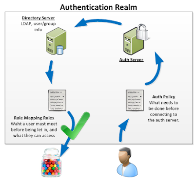
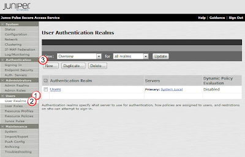
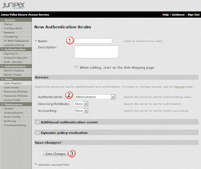
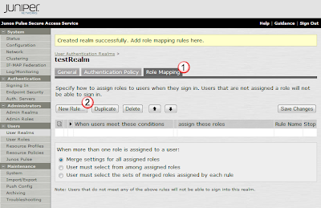
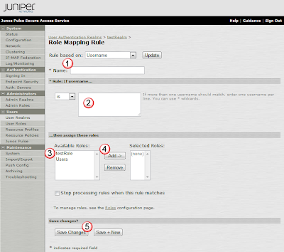

# Building a basic Auth Realm

## Overview:
An Auth Realm is a grouping of the following resources:
- Auth Server: something to verify a users identity
- Auth policy: something to define what auth server to send the user to so it can be verified
- Directory Server: something (like LDAP) that defines what user and group attributes the user should be granted
- Role Mapping Rules: rules that allow a user to be linked to specific roles.  (ie: to be allowed to go here, you need your pc scanned)

## Create a Test Realm:

### Create the Realm and select an Auth server:
Under the Users(1) section, select User Realms(2), and then select the New(3) button. 

In the New Authentication Realm window, for the Name(1) field, enter testReam, and in the Authentication(2) pulldown, select the new auth server we previously defined: testServer.  Then select Save Changes(3) to enable this change.

### Bind a Role and User to it:
In the new Realms config page, under the Role Mapping(1) tab, select the New Rule(2) button. 

Within the Role Mapping Rule page, provide the new role the Name(1) of testUser2, make sure that the rule(2) has a * to allow any username and link the Role testRole(3) to it by selecting it and the Add(4) button.  Then create the rule by selecting the Save Changes(5) button.

