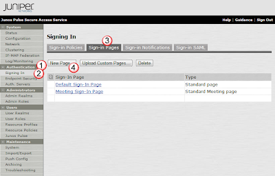
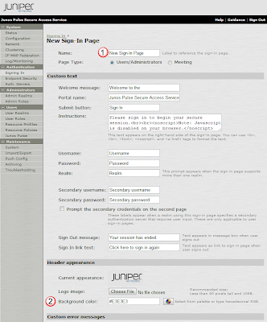
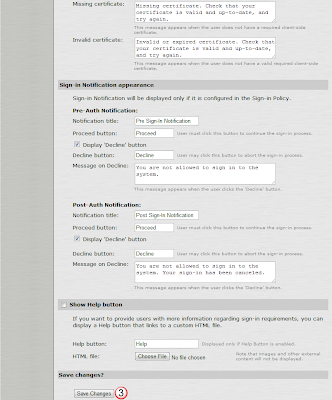
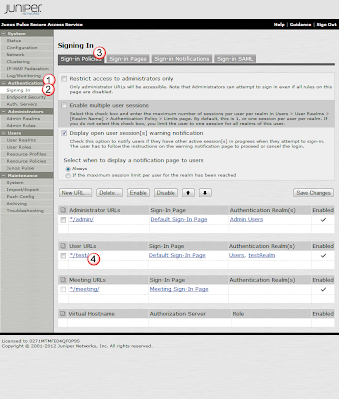
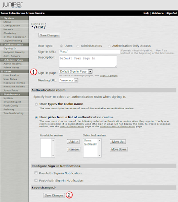
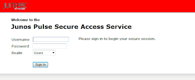

# Customize the Login Page


## Overview:
You can create custom login pages, with their own colors, images, etc.  and assign them to different Sign On Policies. 

## New Login Page Example:
In this example, we are creating a sign in page with it's own color, and then assigning it to a previously created sign on policy. 

### Create the new Login page:
From the Authentication(1) section, under Signing In(2), select the Sign-In Pages(3) tab, and select the New Page(4) button. 



## Modify the Login Page:
In the New Sign-In Page creation page, Name(1) the new page testSigninPage, modify the background color to red by entering #FF0000 in the Background color box(2), and then create the page by selecting the Save Change(3) button. 


<p>



### Link the Page to a URL:
Select the page you want to modify under Authentication(1) and Signing In(2), and the Sign-In Policies(3) tab.  Then select the URL(4) that you want to link the new page to.



In the URLs config page, select testSigninPage under the Sign-in Page(1) pulldown, and save the modification with the Save Changes(2) button. 



### Login to see new Login Page:
From the changes we have made eirlier, we set this page up to load via the url
```
https://{ip_address}/test
```

When you go there, you get the following login page.   By selecting the proper Realm in the pulldown, you can login with the testUser2 user you created earlier. 

