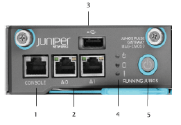
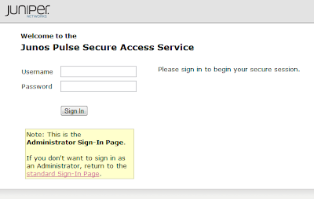
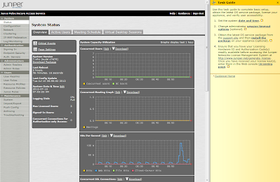

# First time power on

## Overview: 
When first get the pulse, you need to set its internal IP address this discusses how to achieve this over the console connection. 

## Wiring: 
The Pulse has three connectors.

The first (1) is the RS232 console cable, and the second (2) is the external WAN link, that you will want to plug into to access the device after this setup.  



## Setup: 

With a console connection (rollover will work) set your terminal to 9600/8/1, no-flow.
```
Please choose from among the following factory-reset personality images:
[1] Junos Pulse Secure Access Service 7.1 R1 (Build 17675)
[2] Junos Pulse Access Control Service 4.1 R1 (Build 17057)
Choice:1   
```

If you don't get the following, enter this at the command prompt.  
```
ezsetup
```

Agree to run the ezsetup procedure: 
```
Starting system software version 7.1R1 (build 17675)


Using driver: e1000e
......

Licensing Hardware ID: 0271MTMFE04QF0P9S


About to boot as a stand-alone Junos Pulse Secure Access Service.
Hit TAB for clustering options, wait or hit Enter to continue.....
Starting Core Services

Welcome to the initial configuration of your server!
NOTE: Press 'y' if this is a stand-alone server or the first
machine in a clustered configuration.
If this is going to be a member of an already running cluster
press n to reboot. When you see the 'Hit TAB for clustering options'
message press TAB and follow the directions.
Would you like to proceed (y/n)?: y
```

Agree to who knows what
```
Note that continuing signifies that you accept the terms
of the Juniper license agreement. Type "r" to read the
license agreement (the text is also available at any time
from the License tab in the Administrator Console).
Do you agree to the terms of the license agreement (y/n/r)?: y
```

Provide basic IP stack info: 
```
Please provide ethernet configuration information
  IP address:      10.33.192.15
  Network mask:    255.255.255.0
  Default gateway: 10.33.192.1   
Please provide DNS nameserver information:
  Primary DNS server:   8.8.8.8  
  Secondary (optional): 8.8.4.4  
  DNS domain(s):    cmed.us  
Please provide Microsoft WINS server information:
  WINS server (optional):
```

Confirm the settings: 
```
Please confirm the following setup:
  IP address:         10.33.192.15
  Network mask:       255.255.255.0
  Gateway IP:         10.33.192.1
  Link speed:         Auto
  Primary DNS server: 8.8.8.8
  Secondary DNS:      8.8.4.4
  DNS domain(s):     cmed.us
  WINS server:
Correct? (y/n): y
Initial network configuration complete.
```

Create root user/pass: 
```
Internal NIC: .............................................................

Please create an administrator username and password.
Admin username: root
Password:
Could not change password. New password must be at least 6 characters long.
Password:
Confirm password:

The administrator was successfully created.
```

setup the self sign ssl cert
```
Please provide information to create a self-signed Web server
digital certificate.
  Common name (example: secure.company.com): vpn.cmed.us
  Organization name (example: Company Inc.): cmed

Please enter some random characters to augment the system's
random key generator.  We recommend that you enter approximately
thirty characters.

Random text (hit enter when done): ZnCwHWDQZXpU9uCR4BT9jUv498VjxgmhkMqm  


Creating self-signed digital certificate - this may take several minutes...
The self-signed digital certificate was successfully created.
```

get your attaboy message
```
Congratulations!  You have successfully completed the
initial set up of your server.


    To administer the system, please browse to an appropriate URL:

    https://<Device-IP-Address>/admin (note the 's' in https://)
    Example: https://10.10.22.34/admin

    If a DNS name already exists for this device, you can also use:

    https://<Device-Host-Name>/admin
    Example: https://Junos Pulse Secure Access Service.mycompany.com/admin
```

If you need to make any changes, select enter to go back to a modification page: 
```
Press Enter to modify system settings.


Welcome to the Juniper Networks Junos Pulse Secure Access Service Serial Console!


Current version: 7.1R1 (build 17675)
Reset version: 4.1R1 (build 17057) Junos Pulse Access Control Service
               7.1R1 Junos Pulse Secure Access Service

Licensing Hardware ID: 0271JFPW3S
Serial Number: 0271032010301820

Please choose from among the following options:
   1. Network Settings and Tools
   2. Create admin username and password
   3. Display log/status
   4. System Operations
   5. Toggle password protection for the console (Off)
   6. Create a Super Admin session.
   7. System Snapshot
   8. Reset allowed encryption strength for SSL
Choice:
```

## Testing: 
If you want to confirm that you have a good network connection, you can run a ping test.  

From the console, select "1" for Network Settings and Tools: 
```
Please choose from among the following options:
   1. Network Settings and Tools
   2. Create admin username and password
   3. Display log/status
   4. System Operations
   5. Toggle password protection for the console (Off)
   6. Create a Super Admin session.
   7. System Snapshot
   8. Reset allowed encryption strength for SSL
Choice: 1
```

Then select 5 for Ping, or another tool that you need to use.  
```
Please choose from among the following options:
 1. View/Set IP/Netmask/Gateway/DNS/WINS Settings
 2. Print Routing Table
 3. Print ARP Cache
 4. Clear ARP Cache
 5. Ping to a Server
 6. Trace route to a Server
 7. Remove Routes
 8. Add ARP entry
 <return to go back to main menu>
Choice: 5
Enter hostname/IP address: 10.33.192.1

Sending six ping packets to 10.33.192.1 via internal (10.33.192.15) port
press ctrl-c to stop the ping
PING 10.33.192.1 (10.33.192.1) from 10.33.192.15 : 56(84) bytes of data.
64 bytes from 10.33.192.1: icmp_seq=0 ttl=255 time=1.77 ms
64 bytes from 10.33.192.1: icmp_seq=1 ttl=255 time=0.471 ms
64 bytes from 10.33.192.1: icmp_seq=2 ttl=255 time=0.610 ms

--- 10.33.192.1 ping statistics ---
3 packets transmitted, 3 received, 0% packet loss, time 1999ms
rtt min/avg/max/mdev = 0.471/0.950/1.770/0.582 ms, pipe 2
```

## Web Login: 
Connect to the /admin url of the pulse.  
```
https://{ip_address}/admin
```

So in this example, the device's IP address is https://10.33.192.15/admin  

This brings up the admin login page: 



And after logging in, you will get the main System status page: 

