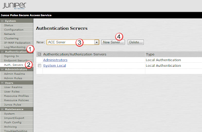
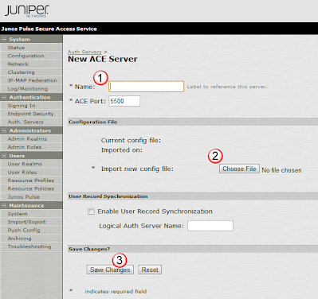
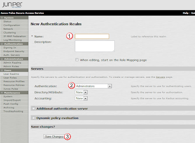
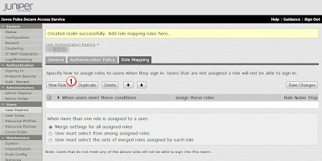
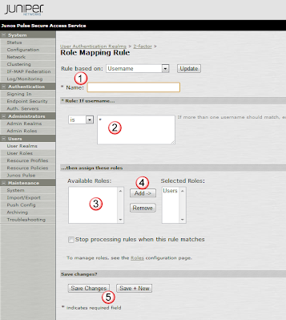

# Linking to a RSA SecurID server

## Specify the SecureID Server
Upload the sdconf.rec file from the SecurID server to tell the MAG how to communicate with the SecureID server. 

In the Authentication(1) section, select Auth. Servers(2).    Then from the pulldown, select ACE Server(3) and press the New Server(4) button.

In the New ACE Server window, List the host Name(1) of the RSA SecurID server, and then select the Choose File(2) button to upload the sdconf.rec file that you previously created from the RSA SecurID server.   When you are ready, select Save Changes(3) to upload the configs. 

## Bind the SecurID server to a Authentication Realm:
If needed, create user roles under Users and the User Roles sub tab. 

Then under Users(1) select User Realms(2) and select the New(3) button. 

In the New Authentication Realm window, add the name(1) of the new Realm (like "securid" or something), and under Authentication(2) select the name of the ACE Server you entered above.  Then select Save Changes(3) to make these changes. 

In the User Authentication Realms window, under Role Mapping, select the New Rule(1) button

Then name(1) the new rule, define what users should be affected by the rule(2), and then select the role(3) defined above and add(4) it to this rule.  Then select Save Changes(5) to commit this new role. 

## References:
- [How to integrate RSA ACE Server SecurID  Authentication with Juniper Networks Secure  Access SSL VPN (SA) with Single Node or Cluster  (A/A or A/P)](http://www.juniper.net/techpubs/software/ive/guides/howtos/How_to_RSA_SecureID_with_IVE_Single_Node_or_Cluster.pdf) 
