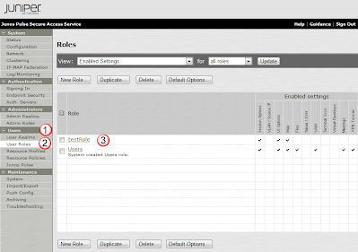

# Session Timeout

## Overview:
User Roles also allow you to modify the maximum amount of time a vpn is opened, or the amount of time a connection is opened while it is unused.  Here we review how to modify the default settings.

## Select the Role you want to modify:
Under Users(1), select User Roles(2), and then select the Role(3) you would like to modify. 

## Modify the Session Options:
Under the General(1) Tab, and the Session Options(2) sub tab, are all the variables controlling how the MAG maintains the connections between itself and the user. 

Some of the sections below control the following:

### 3. Session Lifetime
This is related to the VPN tunnel between the user and the MAG.  There are three main variables to this link:
Idle Timeout: The number of minutes that a session can be unused.  (if you are away from the PC)
Max Session Length: How long until you are prompted to re-enter in your password.  Note that you are given some amount of time to re-enter your password before all your current sessions are dropped. 
Reminder Time: When asked to re-enter your password, this is how long they have to enter in a correct password. 
Enable Session Extension: Enables a message to tell the user they are about to run out of time.  (ie: idle timeout)

### 4. Enable Session Timeout Warning
Enabling this pops up a message to the user to re-log in before the session times out. 

### 5. Roaming Session
This allows a session to stay up, even if your source IP address changes.  (for example, if your office had two WAN links with their own ip addresses, and the user was trying to connect to a remote MAG, if the link failed from one to the other, the user's source IP would change, but the MAG would keep the VPN session up, and the open connections would not drop.)

### 6. Persistent Session
Enabling this keeps the session logged in, even if the browser is restarted. 

### 7. Persistent Password Caching
This caches windows and http passwords between sessions, preventing a user from needing to reenter them. 

### 8. Browser Request Follow Through
If a session has expired, and you make a request.  If this is enabled, you are requested for your password, and then the request is made.  (otherwise you simply reenter your password, and then need to re make the request.)

### 9. Save Changes to update your role. 

